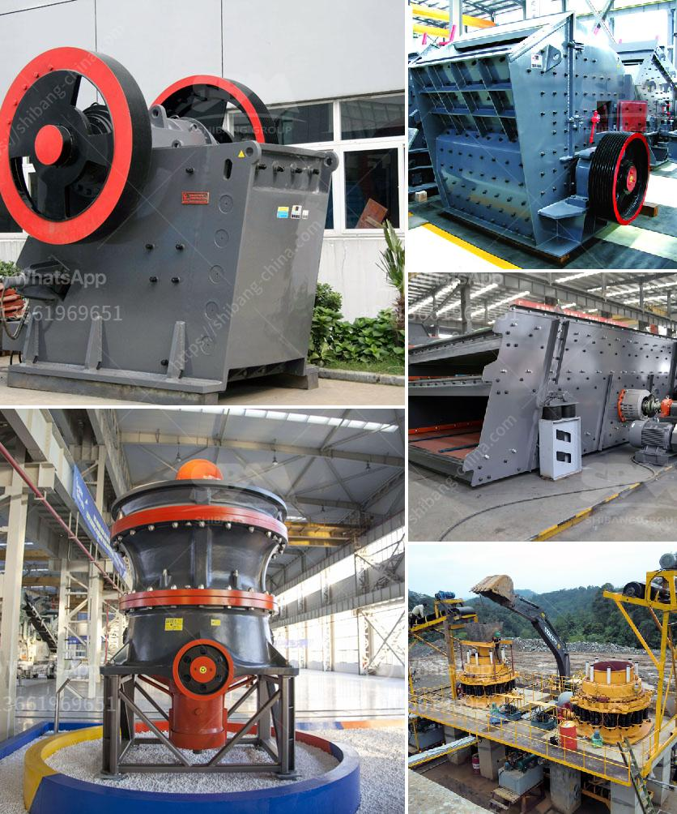

<h3>coal pulveriser manufacturer</h3>
Coal pulverisers play a critical role in the coal-fired power generation process. It is responsible for grinding coal into fine particles which help in efficient combustion of coal, ensuring higher efficiency in power plants. These pulverisers are manufactured by specialised companies that understand the intricate nature of the equipment and the demands of the industry.

One such company is a leading coal pulveriser manufacturer, offering robust and reliable machines for the efficient grinding of coal. With years of experience in the field, the manufacturer has gained a reputation for delivering cutting-edge technology and high-quality products to the global market.

The coal pulveriser manufacturer understands the importance of delivering equipment that can withstand the harsh conditions present in coal-fired power plants. These machines are subjected to extreme temperatures, high pressure, and heavy wear and tear. Therefore, the manufacturer employs advanced engineering techniques to design and manufacture coal pulverisers with exceptional durability and performance.

The manufacturer's coal pulverisers are engineered with precision and are equipped with state-of-the-art features that allow for efficient and safe coal grinding. These machines are designed to deliver consistent and uniform coal particle size, ensuring optimal combustion and reduced emissions. The manufacturer's expertise lies in developing pulverisers that offer high grindability, low maintenance, and improved operational efficiency.

Furthermore, the manufacturer understands the importance of environmental sustainability. As a result, their coal pulverisers are designed to meet stringent emission standards and help power plants adhere to environmental regulations. By providing efficient grinding solutions, the manufacturer aids power plants in reducing their carbon footprint and contributing to a cleaner and greener future.

In addition to designing and manufacturing coal pulverisers, the manufacturer also provides comprehensive technical support and after-sales services. Their team of experts ensures that the equipment is installed and commissioned properly, and they offer ongoing maintenance and troubleshooting assistance. This commitment to customer satisfaction sets the manufacturer apart from its competitors, making them a trusted partner for power plants across the globe.

The coal pulveriser manufacturer remains dedicated to continuous innovation and improvement. They invest in research and development to stay ahead of industry trends and incorporate the latest technologies into their equipment. This allows them to adapt to the evolving needs of the power generation industry and cater to the growing demand for efficient, reliable, and environmentally friendly coal grinding solutions.

In conclusion, coal pulverisers are a crucial component of coal-fired power plants, and the manufacturer plays a vital role in supplying high-quality, durable, and efficient machines. Their commitment to engineering excellence, environmental sustainability, and customer satisfaction has earned them a reputable position in the industry. The manufacturer's coal pulverisers contribute to the efficient combustion of coal, leading to higher power plant efficiency and reduced emissions, making them an indispensable partner for the global power generation sector.
<h3>Contact us</h3><ul><li><strong>Whatsapp:&nbsp;<a href="https://wa.me/8613661969651">+8613661969651</a></strong></li><li><a href="https://swt.shibang-china.com/?git&amp;zhl&amp;coal pulveriser manufacturer"><strong>Online Service(chat now)</strong></a></li></ul><h3>Related</h3><ul><li><a href='stone crusher mesh size.md'>stone crusher mesh size</a></li><li><a href='sand and gravel exploration equipment.md'>sand and gravel exploration equipment</a></li><li><a href='ball milling method in tamil.md'>ball milling method in tamil</a></li><li><a href='gravel crushing equipment.md'>gravel crushing equipment</a></li><li><a href='gravel and sand supply business plan pdf.md'>gravel and sand supply business plan pdf</a></li></ul>