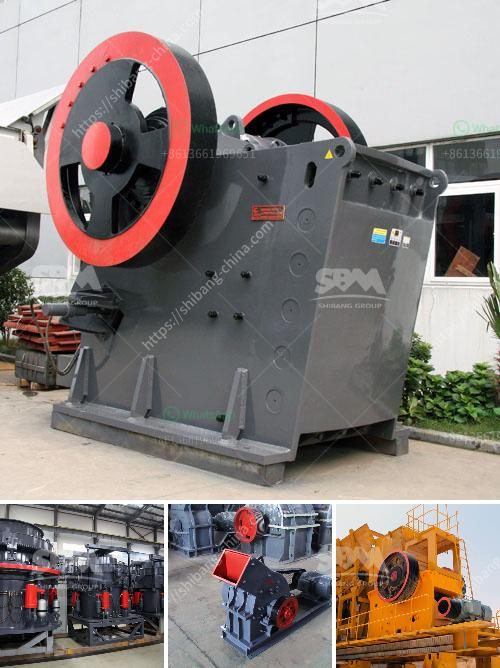

<h3>coal pulverizer design</h3>
Coal pulverizer design plays an essential role in the efficient and safe operation of coal-fired power plants. The main functions of a pulverizer are crushing, drying, and classifying the coal particles before combustion. There are two types of pulverizers: low-speed and medium-speed pulverizers.

Low-speed pulverizers consist of a rotating drum with grinding balls that crush the coal by impact and attrition. These pulverizers are commonly called ball tube mills. The rotating drum provides a constant cascading motion of the grinding balls, which contributes to the pulverization of the coal.

Medium-speed pulverizers, also known as vertical spindle mills, grind the coal between rollers and a rotating table. These pulverizers have an integrated classifier, which controls the size of the pulverized coal particles. The rotating table maintains a uniform grinding surface, resulting in efficient coal pulverization.

Coal pulverizer designs have evolved over the years to meet the demanding requirements of the power generation industry. Modern pulverizers feature advanced technologies, such as enhanced grinding surfaces, wear-resistant materials, and improved classifier performance. These advancements ensure high pulverizer availability, reliability, and efficient coal combustion.

Furthermore, coal pulverizers are designed to handle a wide range of coal types and moisture contents. Different coal types have varying grindability, which affects the pulverizer's performance. The pulverizer design takes into account the specific characteristics of the coal to ensure optimal pulverization.

Another crucial aspect of coal pulverizer design is the safety features. Pulverizers operate under high temperature and pressure conditions and handle a highly combustible material. Therefore, they are equipped with various safety devices, including explosion-proof enclosures, fire detection and suppression systems, and overpressure protection mechanisms.

In conclusion, coal pulverizer design is a critical aspect in ensuring the efficient and safe operation of coal-fired power plants. The design features should address the pulverization requirements of different coal types, guaranteeing high availability and reliability. Moreover, emphasizing safety precautions is vital to prevent potential hazards associated with handling and combusting coal. Continuous advancements and innovation in pulverizer design contribute to the overall improvement and sustainability of the power generation industry.
<h3>Contact us</h3><ul><li><strong>Whatsapp:&nbsp;<a href="https://wa.me/8613661969651">+8613661969651</a></strong></li><li><a href="https://swt.shibang-china.com/?git&amp;zhl&amp;coal pulverizer design"><strong>Online Service(chat now)</strong></a></li></ul><h3>Related</h3><ul><li><a href='kaolin mill machine 400 mesh.md'>kaolin mill machine 400 mesh</a></li><li><a href='equipment required for producing lime for new plant.md'>equipment required for producing lime for new plant</a></li><li><a href='price of stone crusher from china.md'>price of stone crusher from china</a></li><li><a href='grinding mill for sale.md'>grinding mill for sale</a></li><li><a href='used crusher plants canada.md'>used crusher plants canada</a></li></ul>