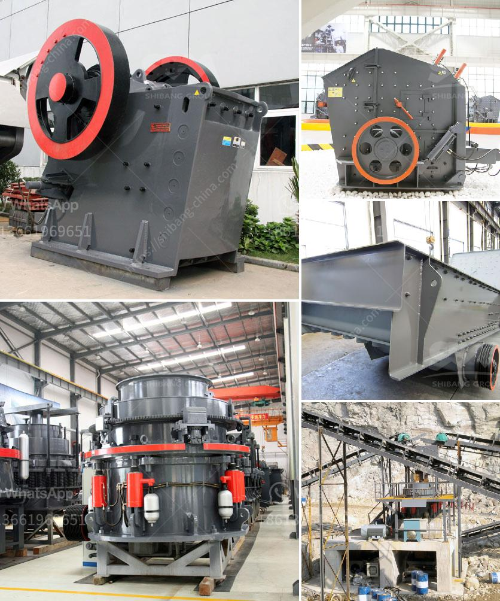

<h3>coal screening chrushing machines</h3>
Coal screening and crushing machines are essential equipment in the mining industry. They help separate valuable coal from waste materials, making it easier to process and transport coal to different locations. Some machines perform the entire screening and crushing process, while others focus on a specific task within the process. These machines are designed to maximize efficiency, reduce downtime, and improve overall productivity.

One of the primary machines used for coal screening is the vibrating screen. It has a robust and durable design that can handle large volumes of coal and withstand harsh working conditions. The vibrating screen uses a series of vibrating motors to generate vibrations, which help separate coal particles based on their size and shape. This helps ensure that only the desired coal particles pass through the screen, while larger materials such as rocks and debris are removed.

Another important machine used in coal screening is the roller screen. It consists of a series of rollers with teeth or discs that rotate and crush the coal against a rigid surface. The roller screen efficiently breaks down coal chunks into smaller sizes, helping to facilitate further processing. This machine is particularly effective in separating coal from unwanted impurities, such as rocks and shale, which can reduce the quality of the final coal product.

Crushing machines are also crucial in the coal screening process, as they help break down large chunks of coal into smaller, more manageable sizes. These machines use mechanical force, such as pressure or impact, to reduce the size of coal particles. One common type of crushing machine is the impact crusher. It uses high-speed rotating hammers to strike and shatter coal, resulting in smaller particle sizes. This machine is highly efficient and can process a large volume of coal in a short period.

In addition to vibrating screens and crushing machines, other equipment, such as conveyors, feeders, and magnets, are also used in coal screening and crushing operations. Conveyors transport coal between different stages of the screening and crushing process, ensuring a smooth and continuous flow of coal. Feeders control the rate at which coal is fed into the screening and crushing machines, preventing overload and ensuring optimal performance. Magnets remove ferrous materials, such as iron and steel, from the coal stream, preventing damage to downstream equipment.

Overall, coal screening and crushing machines play a crucial role in the mining industry. They help separate valuable coal from waste materials, ensuring that only high-quality coal is processed and transported. These machines are designed to maximize efficiency, reduce downtime, and improve overall productivity. Operators should regularly maintain and inspect these machines to ensure their optimal performance and longevity. With proper usage and maintenance, coal screening and crushing machines can provide reliable and efficient operation for many years to come.
<h3>Contact us</h3><ul><li><strong>Whatsapp:&nbsp;<a href="https://wa.me/8613661969651">+8613661969651</a></strong></li><li><a href="https://swt.shibang-china.com/?git&amp;zhl&amp;coal screening chrushing machines"><strong>Online Service(chat now)</strong></a></li></ul><h3>Related</h3><ul><li><a href='grinding machine for salt in pakistan.md'>grinding machine for salt in pakistan</a></li><li><a href='limestone powder making plant ireland.md'>limestone powder making plant ireland</a></li><li><a href='gravel crushing equipment.md'>gravel crushing equipment</a></li><li><a href='marble powder mill machinery.md'>marble powder mill machinery</a></li><li><a href='small stone crusher for sale.md'>small stone crusher for sale</a></li></ul>