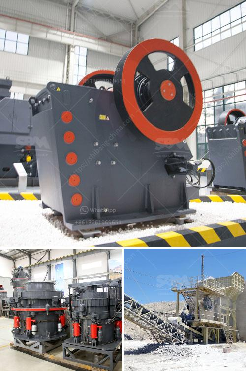

<h3>coal screening equipment price</h3>
Coal screening equipment plays a crucial role in the mining industry as it helps separate impurities from coal before it is used for various applications. While the primary objective is to ensure the quality and purity of coal, the cost of acquiring and maintaining screening equipment is a significant consideration for coal mining companies. This article explores the factors that influence the price of coal screening equipment.

One of the primary factors affecting the price of coal screening equipment is the type and capacity of the equipment. There are various types of screening equipment available in the market, such as vibrating screens, trommel screens, and flip flop screens, each with its unique features and advantages. The capacity of the equipment (measured in tons per hour) also plays a crucial role in determining its price. Higher capacity equipment generally demands higher investment.

Advancements in technology have led to the development of more efficient and user-friendly coal screening equipment. State-of-the-art equipment is equipped with advanced control panels, auto-maintenance features, and remote monitoring capabilities, which improves operational efficiency and reduces downtime. However, such technological advancements often come at a higher cost, which reflects in the equipment's price. The higher the efficiency and technological advancement, the higher the price tag.

When it comes to screening equipment, quality and durability are two essential aspects that greatly influence the price. High-quality equipment is built to withstand the harsh working conditions of the mining industry, reducing the need for frequent repairs or replacements. It is crucial to invest in reliable equipment as the long-term savings from reduced maintenance and downtime often outweigh the initial investment cost.

Brand reputation and after-sales support are two critical factors influencing the price of coal screening equipment. Established and reputable brands may charge a premium for their products due to their proven track record and reliability. Moreover, reputable manufacturers often offer comprehensive after-sales support, including technical assistance, spare parts availability, and service warranties, which justifies the higher price of the equipment.

Market demand and competition also impact the pricing of coal screening equipment. In a highly competitive market, manufacturers may offer competitive pricing to attract customers, driving prices lower. Conversely, during periods of high demand, such as during booms in the coal industry, prices may increase due to limited availability and high demand for quality equipment.

The price of coal screening equipment is influenced by a multitude of factors. Equipment type and capacity, technological advancements, quality and durability, brand reputation, and the market demand are some of the critical factors that determine the equipment's price. Balancing the initial investment cost with the long-term benefits and performance is vital for mining companies to make an informed decision while choosing the most suitable coal screening equipment for their operations.
<h3>Contact us</h3><ul><li><strong>Whatsapp:&nbsp;<a href="https://wa.me/8613661969651">+8613661969651</a></strong></li><li><a href="https://swt.shibang-china.com/?git&amp;zhl&amp;coal screening equipment price"><strong>Online Service(chat now)</strong></a></li></ul><h3>Related</h3><ul><li><a href='powdered limestone making places.md'>powdered limestone making places</a></li><li><a href='stone crusher kapasitas.md'>stone crusher kapasitas</a></li><li><a href='stone crusher plant tph layout.md'>stone crusher plant tph layout</a></li><li><a href='conveyor belts china.md'>conveyor belts china</a></li><li><a href='price for stone crusher plant.md'>price for stone crusher plant</a></li></ul>