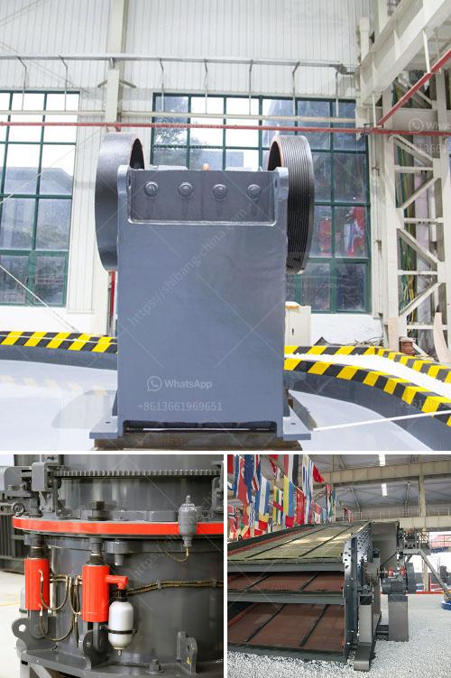

<h3>coal screening machine suppliers</h3>
Coal is one of the most widely used energy sources in the world. It is responsible for generating electricity, heating homes, and powering industries. However, before coal can be used in these applications, it needs to go through a screening process to ensure its quality and suitability.

Coal screening machines play a crucial role in this process. They are designed to separate impurities from the coal, ensuring that only high-quality coal is used. These machines use various techniques, including vibration, gravity, and centrifugal force, to achieve effective and efficient screening.

Finding a reliable coal screening machine supplier is of utmost importance for coal companies and power plants. These suppliers not only provide the necessary equipment but also offer support and expertise to maximize the screening process's effectiveness. Here, we will discuss some key factors to consider when choosing coal screening machine suppliers.

First and foremost, it is essential to assess the supplier's reputation and experience in the industry. Look for suppliers that have a long history of serving the coal industry and a track record of delivering exceptional screening machines. This information can be obtained through online research, testimonials, or by reaching out to other industry professionals for recommendations.

Another aspect to consider is the quality and reliability of the screening machines offered. The supplier should provide cutting-edge technology that meets industry standards and can effectively perform under heavy-duty conditions. A robust and durable machine will minimize downtime and ensure uninterrupted coal screening operations.

The supplier's after-sales service and support are equally important. A reputable supplier should offer comprehensive assistance, including installation, maintenance, and troubleshooting. They should have a dedicated team of experts who can provide guidance and address any technical issues promptly.

Cost is another crucial aspect for coal companies to consider. While it is essential to find an affordable solution, quality should never be compromised. Look for suppliers that offer competitive prices without compromising on the machine's performance or durability. It may be beneficial to obtain quotes from multiple suppliers to ensure you get the best value for your investment.

Additionally, it is essential to consider the supplier's location and logistical capabilities. Ideally, the supplier should be located in close proximity to the coal mine or power plant to streamline the delivery and installation process. This can help reduce transportation costs and minimize lead time.

In conclusion, coal screening machine suppliers play a vital role in the coal industry. They provide the necessary equipment to ensure the coal used in power generation and industrial processes is of high quality. When choosing a supplier, it is crucial to assess their reputation, experience, product quality, after-sales service, and cost-effectiveness. By carefully considering these factors, coal companies can find reliable suppliers that meet their screening needs and contribute to the efficient use of coal as an energy source.
<h3>Contact us</h3><ul><li><strong>Whatsapp:&nbsp;<a href="https://wa.me/8613661969651">+8613661969651</a></strong></li><li><a href="https://swt.shibang-china.com/?git&amp;zhl&amp;coal screening machine suppliers"><strong>Online Service(chat now)</strong></a></li></ul><h3>Related</h3><ul><li><a href='feasibility study of cement plant.md'>feasibility study of cement plant</a></li><li><a href='mini cement plant grinding project report.md'>mini cement plant grinding project report</a></li><li><a href='super orion ball mill for mael powder.md'>super orion ball mill for mael powder</a></li><li><a href='mobile crusher malaysia for sell.md'>mobile crusher malaysia for sell</a></li><li><a href='mining process of mica crusher.md'>mining process of mica crusher</a></li></ul>