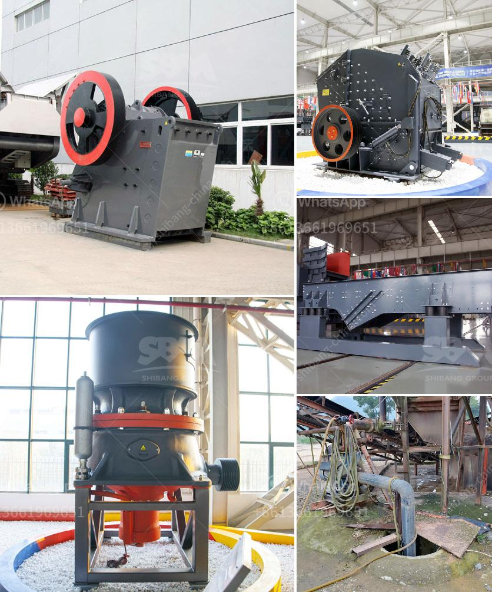

<h3>coal vertical mill</h3>
The coal vertical mill, also known as coal mill, is an important industrial equipment for grinding coal into fine powder. It is widely used in thermal power plants, cement plants, steel plants and other industries. The coal vertical mill has the advantages of large production capacity, low energy consumption, easy maintenance and so on.

Compared with the traditional coal mill, the coal vertical mill has a more compact structure and occupies a smaller area, making it possible to be installed in areas with limited space. In addition, the coal vertical mill adopts a new grinding principle, which reduces the energy consumption by 20-30% compared with the traditional ball mill.

The coal vertical mill consists of a rotating grinding disc, a separator, a hydraulic device and a feeding and discharging device. The raw coal is fed into the grinding disc through the coal feeder, and the grinding disc rotates rapidly, generating a strong grinding force. The coal is crushed and ground by the grinding disc until it passes through the separator, and the qualified fine coal powder is collected by the dust collector.

The coal vertical mill also has the functions of drying, grinding and powder selecting. It can dry the raw coal with a moisture content of 15% or more, and grind it into different fineness of coal powder to meet the needs of different users. It is an ideal equipment for pulverized coal preparation.

In summary, the coal vertical mill is a specialized equipment for grinding coal. It has the advantages of large production capacity, low energy consumption, easy maintenance, etc. It is an important equipment in the coal pulverizing system of thermal power plants and is widely used in cement, metallurgy, and chemical industries.
<h3>Contact us</h3><ul><li><strong>Whatsapp:&nbsp;<a href="https://wa.me/8613661969651">+8613661969651</a></strong></li><li><a href="https://swt.shibang-china.com/?git&amp;zhl&amp;coal vertical mill"><strong>Online Service(chat now)</strong></a></li></ul><h3>Related</h3><ul><li><a href='low cost jaw crusher for sale in ethiopia.md'>low cost jaw crusher for sale in ethiopia</a></li><li><a href='crusher manufacturers in south africa.md'>crusher manufacturers in south africa</a></li><li><a href='grinding mill for bentonite.md'>grinding mill for bentonite</a></li><li><a href='equipment required for producing lime for new plant.md'>equipment required for producing lime for new plant</a></li><li><a href='gold wash plants for sale in south africa.md'>gold wash plants for sale in south africa</a></li></ul>