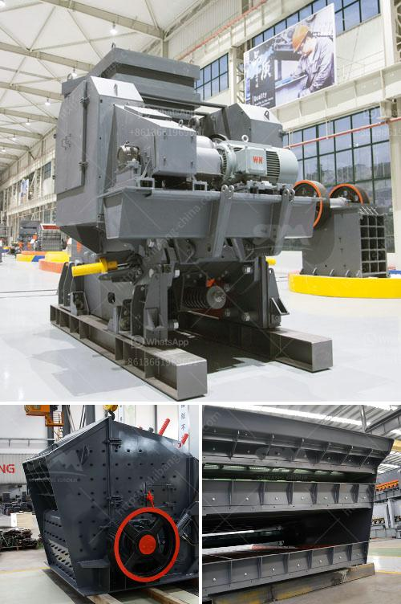

<h3>coal wash plant for sale in malaysia</h3>
Coal is a crucial resource for powering the world's economies, particularly in countries where natural gas and oil are in short supply. Malaysia is one such nation heavily reliant on coal for electricity generation. Therefore, an investment in coal wash plants for sale in Malaysia would prove to be a profitable venture.

Coal wash plants are facilities that make use of water-based separation techniques to clean impurities from coal. This results in a higher-quality product that is more effective in energy production, reducing pollutants and maximizing coal's energy efficiency. A well-functioning wash plant is essential for a smooth coal mining operation and achieving the desired level of coal quality.

In Malaysia, the growing demand for coal, coupled with its abundant coal reserves, makes it an attractive destination for investors looking to set up a coal wash plant. The technology and expertise required for setting up a wash plant can be readily sourced from international suppliers, ensuring that the plant operates at peak efficiency. Additionally, Malaysia's strategic location allows for easy access to major coal markets in the Asia-Pacific region, providing a competitive advantage in terms of export opportunities.

The sale of coal wash plants in Malaysia presents a significant opportunity for companies involved in the mining and energy sectors. Firstly, it allows them to tap into Malaysia's booming coal market and capitalize on the increasing demand for coal products. With a well-established customer base and a steady stream of orders, investors can expect a quick return on their investment.

Furthermore, a coal wash plant sale in Malaysia is not only beneficial for businesses but also for the environment. By incorporating water-based separation techniques, the wash plant would help reduce pollutants released into the air during coal combustion. This would contribute to Malaysia's efforts to reduce its carbon footprint, aligning with global initiatives to combat climate change.

Investing in a coal wash plant also promotes sustainable mining practices. By ensuring that coal is thoroughly cleaned before being utilized, the plant helps optimize the use of this non-renewable resource. Additionally, modern wash plants incorporate advanced technologies that minimize water usage and recycle wastewater, reducing the environmental impact associated with the coal cleaning process.

In conclusion, a coal wash plant for sale in Malaysia presents a promising opportunity for investors. The country's growing demand for coal, coupled with its strategic location and abundant coal reserves, creates a favorable environment for setting up a wash plant. Moreover, such an investment aligns with Malaysia's goals of reducing pollutants and promoting sustainable mining practices. By seizing this opportunity, companies can contribute to Malaysia's energy sector, improve coal quality, and protect the environment.
<h3>Contact us</h3><ul><li><strong>Whatsapp:&nbsp;<a href="https://wa.me/8613661969651">+8613661969651</a></strong></li><li><a href="https://swt.shibang-china.com/?git&amp;zhl&amp;coal wash plant for sale in malaysia"><strong>Online Service(chat now)</strong></a></li></ul><h3>Related</h3><ul><li><a href='list the equipment use in diamond mining.md'>list the equipment use in diamond mining</a></li><li><a href='cpc 75 tph stone crusher price in ranchi.md'>cpc 75 tph stone crusher price in ranchi</a></li><li><a href='caterpillar stone crusher.md'>caterpillar stone crusher</a></li><li><a href='coal conveyor manufacturer germany.md'>coal conveyor manufacturer germany</a></li><li><a href='quartz stone dust equipment.md'>quartz stone dust equipment</a></li></ul>