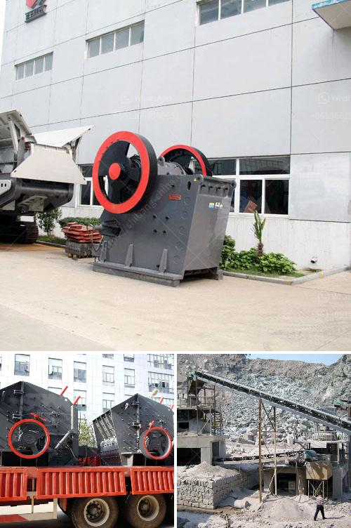

<h3>coal washing plant spirals pdf</h3>
Coal washing plant spirals pdf are a vital component in the coal processing industry. These spirals have found universal acceptance in coal preparation plants all over the world due to their efficiency, versatility, and low operating costs. They are the preferred choice when it comes to coal washing in the heavy media separation process.

The coal washing plant spirals are constructed from high-quality materials that are resistant to wear and corrosion, ensuring a long service life. They are designed to separate coal particles based on their size, density, and shape, utilizing the principle of gravity separation.

The spirals consist of a helical conduit with several turns, creating a spiral profile. Coal slurry is fed into the top of the spiral, and it flows downward due to gravity. As it descends, the slurry is subjected to centrifugal forces caused by the spiral's rotation. These forces separate the coal particles based on their density, with the lighter particles moving towards the center of the spiral and the heavier particles collecting towards the outer edge.

The separated coal particles are collected from different points along the spiral, depending on their density. This allows for effective separation of coal from gangue materials, such as shale, clay, and rock, which have lower densities than coal. The gangue materials are discarded as waste while the clean coal is extracted for further processing or direct use.

One of the major advantages of coal washing plant spirals is their ability to handle a wide range of coal sizes. They can effectively process both fine and coarse coal, making them suitable for various coal beneficiation applications. The spirals can achieve high separation efficiencies, even with feed materials that have a high proportion of near-gravity components.

Another significant benefit of coal washing plant spirals is their ability to minimize the loss of clean coal to the rejects. By allowing for multiple outlets along the spiral, the separation of different density components can be controlled, reducing the amount of quality coal that is discarded. This results in higher overall recovery rates and increased profitability for coal processing operations.

Moreover, coal washing plant spirals require minimal maintenance and have low operating costs. They have a simple design and are easy to install, making them an attractive choice for coal processing plants. Additionally, they have low power requirements and can be operated with minimal water, reducing operational expenses.

In conclusion, coal washing plant spirals are an integral part of the coal preparation industry due to their efficiency, versatility, and cost-effectiveness. They offer effective gravity separation of coal from gangue materials, resulting in high recovery rates and improved profitability. With their ability to handle various coal sizes and minimal maintenance requirements, coal washing plant spirals are the preferred choice for coal processing plants worldwide.
<h3>Contact us</h3><ul><li><strong>Whatsapp:&nbsp;<a href="https://wa.me/8613661969651">+8613661969651</a></strong></li><li><a href="https://swt.shibang-china.com/?git&amp;zhl&amp;coal washing plant spirals pdf"><strong>Online Service(chat now)</strong></a></li></ul><h3>Related</h3><ul><li><a href='mica powder making.md'>mica powder making</a></li><li><a href='dolomite crusher manufacturer in usa.md'>dolomite crusher manufacturer in usa</a></li><li><a href='cement mobile laying block making machine.md'>cement mobile laying block making machine</a></li><li><a href='crusher stone plant limpopo.md'>crusher stone plant limpopo</a></li><li><a href='portable machine stone crusher machine for sale.md'>portable machine stone crusher machine for sale</a></li></ul>