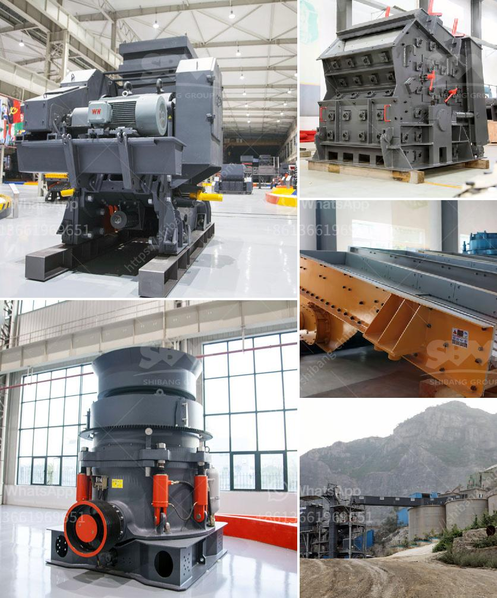

<h3>coarse ash grinding mill equipment</h3>
Coarse ash, also known as fly ash, is a byproduct of burning pulverized coal in power plants. It is generally considered as waste material and is primarily disposed of in landfills. However, recent advancements in technology have led to the development of coarse ash grinding mill equipment that can effectively utilize this material for various applications.

The coarse ash grinding mill equipment is designed to grind coarse ash particles into fine powder, which can be used in a wide range of industries. This equipment utilizes a mechanical grinding action to break down the coarse ash particles and reduce their size.

One of the primary benefits of utilizing coarse ash grinding mill equipment is the reduction in waste disposal. By grinding the coarse ash into fine powder, it can be used as a valuable resource in industries such as concrete production, cement manufacturing, and agriculture.

In the construction industry, coarse ash powder can be used as a partial replacement for cement in concrete production. The fine particles fill the gaps between the cement particles, enhancing the strength and durability of the concrete structures. This not only reduces the amount of cement used but also reduces greenhouse gas emissions associated with cement production.

In the cement manufacturing industry, coarse ash powder can be used as an additive to improve the quality and performance of cement. The fine particles help in reducing the porosity of the concrete, resulting in increased strength and durability. Additionally, the coarse ash powder can act as a filler, reducing the need for additional raw materials.

The agricultural industry can also benefit from utilizing coarse ash powder as a soil amendment. The fine particles help in improving the soil structure and fertility, promoting better plant growth and crop yield. Additionally, the coarse ash powder can help in reducing soil erosion and nutrient runoff, contributing to sustainable agriculture practices.

Apart from these industries, coarse ash powder can also be used in the manufacturing of building materials, ceramics, and specialty products. The versatility of this material makes it a valuable resource that can be utilized in various applications.

When selecting a coarse ash grinding mill equipment, it is essential to consider factors such as the production capacity, energy consumption, and fineness of the final product. Additionally, the equipment should be efficient and durable, capable of handling the abrasive nature of the coarse ash particles.

In conclusion, coarse ash grinding mill equipment offers a sustainable solution to utilize waste material generated from power plants. By converting coarse ash into fine powder, it can be used as a valuable resource in various industries. This not only reduces waste disposal but also contributes to sustainable practices and enhances the performance of different materials and products.
<h3>Contact us</h3><ul><li><strong>Whatsapp:&nbsp;<a href="https://wa.me/8613661969651">+8613661969651</a></strong></li><li><a href="https://swt.shibang-china.com/?git&amp;zhl&amp;coarse ash grinding mill equipment"><strong>Online Service(chat now)</strong></a></li></ul><h3>Related</h3><ul><li><a href='process of making silica sand.md'>process of making silica sand</a></li><li><a href='movable conveyor belt.md'>movable conveyor belt</a></li><li><a href='hammer mill for coal in india.md'>hammer mill for coal in india</a></li><li><a href='sand core machine manufacturers.md'>sand core machine manufacturers</a></li><li><a href='artificaial sand machine germany.md'>artificaial sand machine germany</a></li></ul>