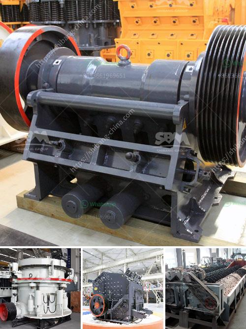

<h3>cobble stone machine nigeria</h3>
Nigeria, the most populous country in Africa, is no stranger to infrastructural challenges. Inadequate road networks and dilapidated buildings have been a major hindrance to the country's progress. However, a revolutionary development in the construction industry is set to change this scenario - the introduction of cobblestone machines in Nigeria.

Cobblestones, known for their durability and aesthetic appeal, have been extensively used in road paving and building construction across the world. Despite their numerous advantages, cobblestones were not widely utilized in Nigeria due to limited availability and expensive importing costs. However, with the advent of cobblestone machines in the country, Nigeria is experiencing a new wave of construction practices.

Cobblestone machines are specially designed machines that shape and compress cobblestones into desired sizes and shapes. These machines not only produce cobblestones but also enhance their productivity and quality compared to traditional manual methods. With the cobblestone machine, Nigeria can now locally produce cobblestones, reducing the country's dependence on expensive imports.

One of the main advantages of adopting cobblestone machines is the economic impact it brings to the country. Nigeria can now save resources spent on importing cobblestones, redirecting it towards other important sectors. Moreover, the introduction of these machines creates employment opportunities for the local population. Skilled artisans and machine operators are required to handle the cobblestone machines, thereby reducing unemployment rates significantly.

Another crucial advantage of cobblestone machines lies in their contribution to sustainable development. Cobblestones are environmentally friendly alternatives as they are natural products that require minimal maintenance and have a long lifespan. Furthermore, the production process of cobblestones emits fewer greenhouse gases compared to other construction materials such as concrete or asphalt. By using cobblestones produced by these machines, Nigeria can actively contribute to reducing carbon footprints and promoting sustainable infrastructure.

In addition to their durability and eco-friendliness, cobblestones also offer unique aesthetic value. They add a touch of elegance to any environment, enhancing the overall ambiance. Whether used for road construction or building facades, cobblestones provide a distinct charm that sets these environments apart from conventional cemented structures. The availability of cobblestone machines in Nigeria allows developers and architects to explore innovative designs, making a lasting impression on visitors and residents alike.

The use of cobblestones also improves road safety, as their rough surface provides better traction and reduces the risk of accidents. This is particularly relevant in Nigeria, where road accidents are alarmingly common. Cobblestone roads have been proven to reduce the occurrence of skidding and hydroplaning, providing drivers with increased stability and control. With the introduction of cobblestone machines, Nigeria can now enhance road safety and create a safer environment for its citizens.

In conclusion, the introduction of cobblestone machines in Nigeria is a transformative development for the local construction industry. It not only saves costs and creates job opportunities but also promotes sustainability, aesthetics, and road safety. With the availability of locally produced cobblestones, Nigeria can overcome infrastructural challenges and pave the way for a brighter future.
<h3>Contact us</h3><ul><li><strong>Whatsapp:&nbsp;<a href="https://wa.me/8613661969651">+8613661969651</a></strong></li><li><a href="https://swt.shibang-china.com/?git&amp;zhl&amp;cobble stone machine nigeria"><strong>Online Service(chat now)</strong></a></li></ul><h3>Related</h3><ul><li><a href='gypsum production equipments in philippines.md'>gypsum production equipments in philippines</a></li><li><a href='stone crusher pe price.md'>stone crusher pe price</a></li><li><a href='talcum powder supplier for production.md'>talcum powder supplier for production</a></li><li><a href='rent a portable conveyor belt system malaysia.md'>rent a portable conveyor belt system malaysia</a></li><li><a href='double deck bunch crusher.md'>double deck bunch crusher</a></li></ul>