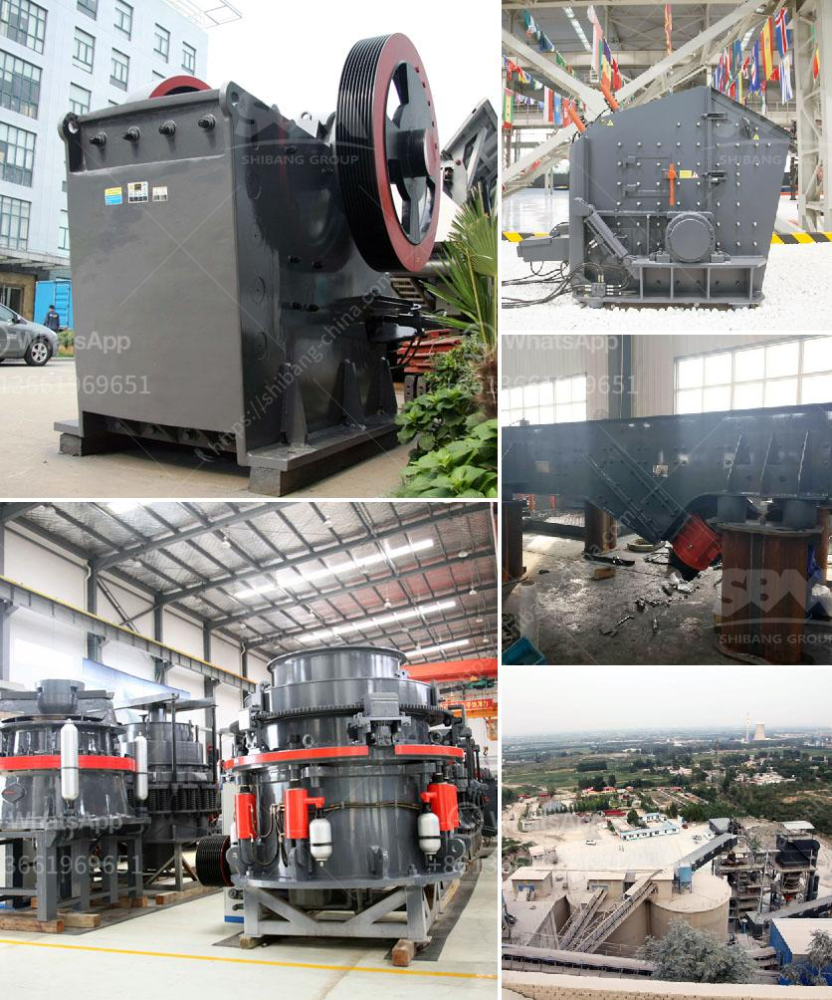

<h3>companies of conveyor belts in mexico</h3>
In the global industrial landscape, conveyor belt systems play a pivotal role in enabling seamless movement and transportation of goods across various sectors. Mexico, being one of the manufacturing powerhouses, has a thriving conveyor belt industry that caters to diverse industries. This article sheds light on some of the prominent companies in Mexico that specialize in conveyor belts and their contributions to the nation's industrial growth.

Mexico's strategic geographic location, coupled with a skilled workforce and robust infrastructure, has attracted several multinational companies to establish their manufacturing plants in the country. The conveyor belt industry, in this context, has experienced substantial growth owing to the high demand for efficient and reliable conveyor systems in manufacturing units. Various companies in Mexico have emerged as key suppliers of conveyor belts, revolutionizing the manufacturing sector by improving operation productivity.

ContiTech, a division of Continental AG, is a global leader in the manufacturing of rubber and plastic products. In Mexico, ContiTech Mexicana offers a wide range of conveyor belt solutions, catering to various industries. Their conveyor belts are known for their exceptional durability, resistance to impact, and temperature variations, making them ideal for heavy-duty applications in industries such as mining, cement, and steel.

Goodyear, a renowned name in the automotive industry, also specializes in rubber products, including conveyor belts. Goodyear Engineered Products Mexico provides a comprehensive range of conveyor belts designed for multiple applications, from industrial to agricultural sectors. The company's commitment to innovation and quality has positioned it as a trusted supplier for both national and international clients.

BANDAS Y SERVICIOS is a Mexican company that has gained recognition for its comprehensive conveyor belt solutions. With a focus on customer satisfaction, they offer tailor-made conveyor systems and comprehensive after-sales support. BANDAS Y SERVICIOS provides an extensive range of conveyor belt types, including PVC belts, nylon belts, and rubber belts, catering to the diverse needs of various industries.

Derco is a leading global supplier of conveyor belts with a strong presence in Mexico. The company provides innovative conveyor solutions for industries such as food processing, automotive, and packaging. Derco Mexico's product range includes modular belts, timing belts, thermoplastic belts, and more, offering their clients versatile and efficient conveyor systems.

Conveyor belt companies in Mexico play a significant role in the nation's manufacturing sector by providing reliable, efficient, and advanced conveyor systems. These systems aid in automating and streamlining processes, reducing labor costs, and maximizing productivity. The companies mentioned above are just a few examples of the diverse range of suppliers that contribute to Mexico's growing conveyor belt industry, helping industries achieve their goals of efficiency and innovation. With continuous advancements and the increasing need for seamless material flow, the conveyor belt sector in Mexico is poised for further growth and development.
<h3>Contact us</h3><ul><li><strong>Whatsapp:&nbsp;<a href="https://wa.me/8613661969651">+8613661969651</a></strong></li><li><a href="https://swt.shibang-china.com/?git&amp;zhl&amp;companies of conveyor belts in mexico"><strong>Online Service(chat now)</strong></a></li></ul><h3>Related</h3><ul><li><a href='aggregate washing machine.md'>aggregate washing machine</a></li><li><a href='ball mill grinding micronizer.md'>ball mill grinding micronizer</a></li><li><a href='coal mining processes and machinary required.md'>coal mining processes and machinary required</a></li><li><a href='vsi impact crusher.md'>vsi impact crusher</a></li><li><a href='sandstone sand making machine manufacturer.md'>sandstone sand making machine manufacturer</a></li></ul>