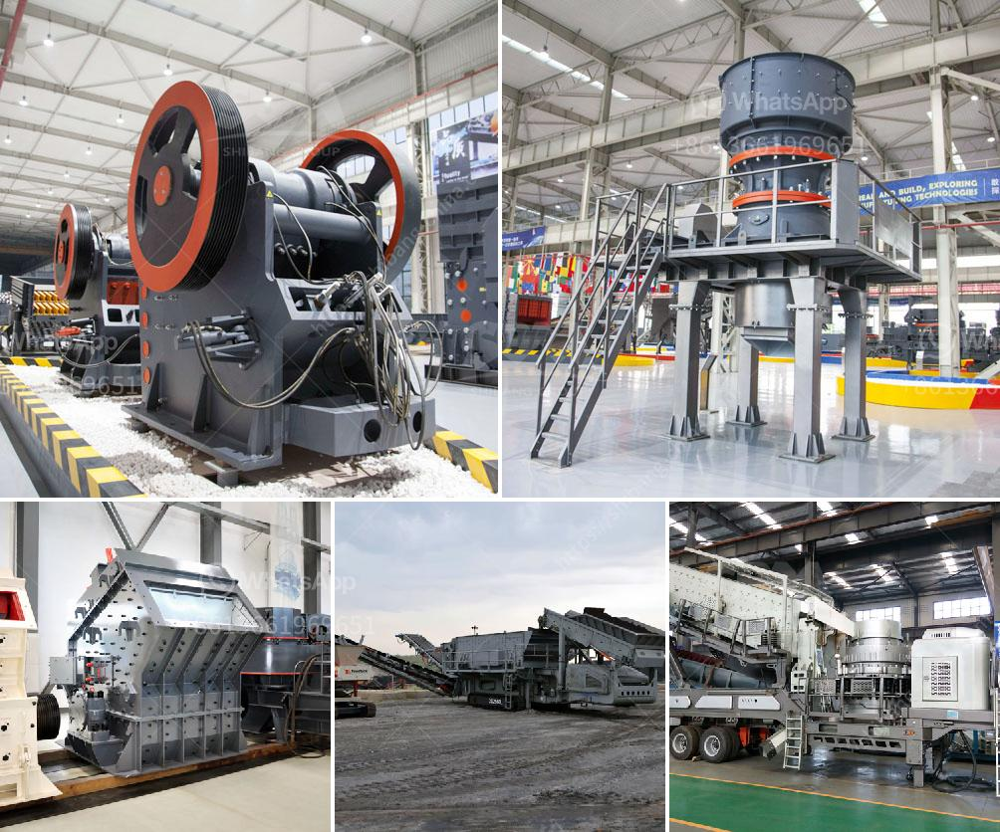

<h3>companies that sell industrial ball mills in malaysia</h3>
Industrial ball mills are a fundamental part of manufacturing and processing operations in many industries, such as construction, mineral processing, and pharmaceuticals. These powerful machines are used to grind materials into smaller particles, facilitating the extraction of valuable resources or the production of essential products. In Malaysia, several companies specialize in the sale and distribution of industrial ball mills, catering to the diverse needs of their clientele. Here, we explore some notable companies in Malaysia that sell these essential pieces of equipment.

One renowned company in Malaysia is YG-1 Tool Company. With over three decades of experience in the industry, YG-1 is a trusted manufacturer and supplier of cutting tools and machinery. The company offers a wide range of products, including industrial ball mills that are known for their durability and reliability. YG-1's ball mills are designed to handle various materials, from brittle minerals to tough industrial compounds.

Another significant player in the Malaysian market is Malaysia Cement Industries. As a leading cement manufacturer, Malaysia Cement Industries also offers industrial ball mills for their customers' grinding needs. Their ball mills come in different sizes to accommodate a range of applications, from small laboratories to large-scale manufacturing plants. Malaysia Cement Industries takes pride in delivering high-quality equipment that meets international standards, ensuring optimal performance and efficiency.

Supra Diagnostics Sdn Bhd is another company that sells industrial ball mills in Malaysia, specializing in the pharmaceutical and biotechnology industries. They offer ball mills designed for pharmaceutical applications, ensuring sanitary and contamination-free grinding processes. Supra Diagnostics' ball mills are made from high-quality materials, enabling efficient and precise mixing, blending, and grinding of drugs and other pharmaceutical compounds.

For companies in the mining and mineral processing sectors, Vortex Clear Action Engineering is a reliable supplier of industrial ball mills. With a focus on sustainable and energy-efficient solutions, Vortex Clear Action Engineering offers ball mills that are designed for optimized grinding performance. Their products are known for their robust construction, seamless operation, and low maintenance requirements, making them ideal for mining operations in Malaysia.

One-stop solutions provider Haritha Global Engineering is another company that offers industrial ball mills in Malaysia. They cater to a wide range of industries, including construction, chemical, and manufacturing. Haritha Global Engineering's ball mills are praised for their versatility and performance, enabling consistent grinding and particle size reduction. Their team of engineers also provides professional advice and support to help customers select the most suitable ball mills for their specific needs.

In conclusion, several companies in Malaysia specialize in the sale of industrial ball mills, catering to various industries and applications. These companies offer a wide range of products, each with its unique features and advantages. Whether you require ball mills for construction, mineral processing, pharmaceuticals, or mining, these companies are equipped to meet your specific needs. By investing in high-quality ball mills from reliable suppliers, businesses in Malaysia can enhance their manufacturing processes, improve operational efficiency, and maintain a competitive edge in the market.
<h3>Contact us</h3><ul><li><strong>Whatsapp:&nbsp;<a href="https://wa.me/8613661969651">+8613661969651</a></strong></li><li><a href="https://swt.shibang-china.com/?git&amp;zhl&amp;companies that sell industrial ball mills in malaysia"><strong>Online Service(chat now)</strong></a></li></ul><h3>Related</h3><ul><li><a href='hard rock aggregates plant.md'>hard rock aggregates plant</a></li><li><a href='kobelco trituradora de cono.md'>kobelco trituradora de cono</a></li><li><a href='price of a mobile crasher sri lanka.md'>price of a mobile crasher sri lanka</a></li><li><a href='machine for gypsum factory from philippines.md'>machine for gypsum factory from philippines</a></li><li><a href='how is calcite used to manufacture paper.md'>how is calcite used to manufacture paper</a></li></ul>