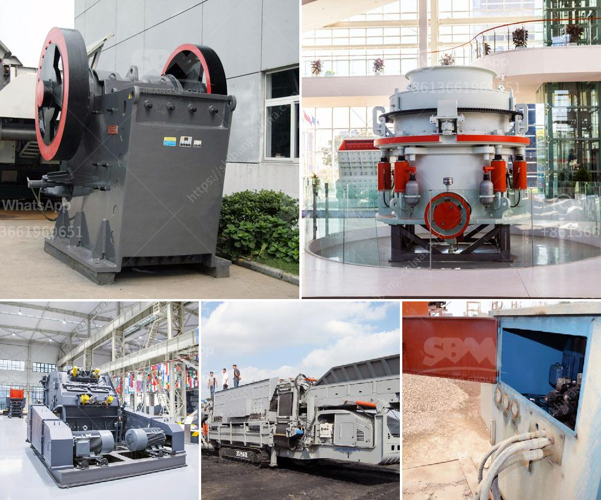

<h3>complete stone crusher plant manufacturer from italy</h3>
A typical jaw crusher plant is shown in Figure 10 and Figure 11 shows a typical underground jaw crusher layout stone crusher plant layout italy -concretegrindertrade stone crusher plant layout italy-stone crusher plant in Layout of Stone Crusher Plant. Complete Stone Crusher Plant Manufacturer From Italy For Sale. CRUSHING PLANT -ECO CRUSHER, Ltd, Experts in Manufacturing and Exporting Extec Crushers, Voghel Equipment: Search for Crushing Plants

The stone crusher plant mainly consists of vibrating feeder, jaw crusher, cone crusher or impact crusher, vibrating screen, belt conveyors and control system, etc. It is completely capable to crush and screen limestone, marble, granite, basalt, river stone and so on, and produce sand & gravels with various granularities for construction and building industry. We are able to design and manufacture complete crusher plants with capacity from 30tph to 500tph, and to provide optimum and most economical solutions according to customers’ specific requirements.

Our complete stone crusher plant from Italy is specially designed for output of 100-120 tph. In this crushing and screening plant, we choose vibrating feeder to feed jaw crusher PE600*900 whose capacity can be up to 70-150 tph. Secondary crushing equipment is impact crusher PF1214 whose capacity is 80-160 tph. For screening materials for different sizes, vibrating screen is playing its role.

As a professional mining and quarry equipment manufacturer, SBM can supply you all kinds of machinery for you all over the world.

The biggest advantage of portable stone crushing machine is their ability to maximize productivity and reduce operating costs. The mobile stone crushing machine can be positioned close to the working face and then relocated under its own power in as little as 20min. The potential cost savings arising from the use of a mobile crushing and conveying system based at the rock face can be significant. SBM is world leading stone crusher plant manufacturer and supplier. Fully mobile crushing plants working close to the excavation site onto the quarry floor can eliminate trucks and deliver the product directly to the processing plant. This saves mining operations multiple millions in USD every month since iron ore beneficiation increases significantly the costs per ton of ore.

SBM mobile stone crushing plant can be equipped with jaw crusher, impact crusher and cone crusher for different crushing applications. The mobile stone crushing equipment represents a guaranteed, state-of-the-art commitment to crushing and screening knowhow and quality. Return to Italy Construction Machinery.
<h3>Contact us</h3><ul><li><strong>Whatsapp:&nbsp;<a href="https://wa.me/8613661969651">+8613661969651</a></strong></li><li><a href="https://swt.shibang-china.com/?git&amp;zhl&amp;complete stone crusher plant manufacturer from italy"><strong>Online Service(chat now)</strong></a></li></ul><h3>Related</h3><ul><li><a href='bentonite crushing manufacturing process.md'>bentonite crushing manufacturing process</a></li><li><a href='cec rock crushers for sale.md'>cec rock crushers for sale</a></li><li><a href='iron ore magnetic separation from titanium process.md'>iron ore magnetic separation from titanium process</a></li><li><a href='graphite ore beneficiation.md'>graphite ore beneficiation</a></li><li><a href='mobile screen and crushing.md'>mobile screen and crushing</a></li></ul>