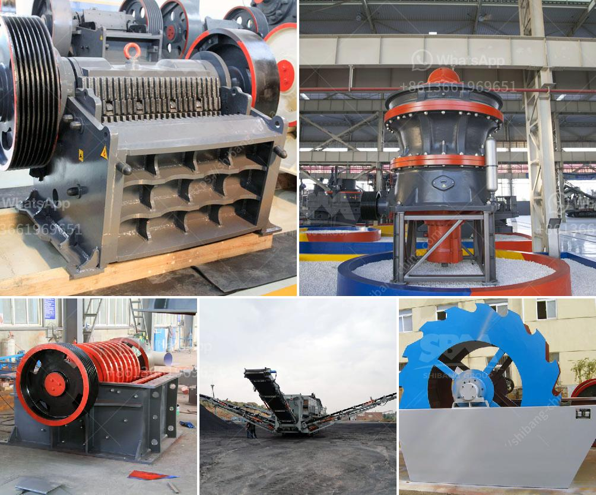

<h3>concrete crusher in kenya for sale</h3>
Concrete crusher in Kenya for sale is used to break the larger concrete rubble into smaller pieces in order to transport it for further processing. The concrete crusher for sale in Kenya is very convenient to operate, and it offers high efficiency compared to traditional crushers.

There are several benefits to using a concrete crusher for sale in Kenya. The machine is versatile and can be used to crush stones, concrete and other construction waste, as well as demolition materials such as bricks and asphalt. The concrete crusher in Kenya can provide the quality finished product required for various construction projects, such as road construction, building construction, and others.

One of the main advantages of using a concrete crusher for sale in Kenya is that it can produce uniform-sized particles. This allows for easy handling, transportation, and utilization of the crushed materials. It also reduces the need for further processing, minimizing the overall cost and time required for the project.

The concrete crusher in Kenya is designed to crush stone and concrete. It is effective in breaking concrete rubble and demolishing concrete structures. It is ideal for use in construction sites, such as highways, bridges, and buildings.

The concrete crusher for sale in Kenya has a wide range of applications. It is suitable for crushing all kinds of concrete and stones, such as limestone, granite, concrete rubble, and more. The machine is easy to operate and has a high crushing efficiency. It can crush materials into uniform particles, making it ideal for various construction projects.

The concrete crusher in Kenya for sale is eco-friendly, as it reduces waste and promotes recycling. The machine is designed to minimize dust and noise pollution, keeping the environment clean and healthy. It also has low energy consumption, saving on electricity costs.

In addition to its use in construction, the concrete crusher for sale in Kenya can also be used in other industries. For example, it can be used to crush rocks and ores in mining and quarrying operations. It can also be used to recycle concrete and other construction waste materials for reuse in other projects.

When looking for a concrete crusher for sale in Kenya, it is important to consider several factors. First, consider the capacity and output size requirements of your project. Choose a machine that can handle the desired amount of material and produce the required particle size.

Next, consider the power source and mobility options. Some concrete crushers are powered by electricity, while others are operated by diesel engines. Choose a machine that suits your power source availability and mobility requirements.

Lastly, consider the cost and maintenance requirements of the concrete crusher for sale in Kenya. Compare prices and choose a machine that offers the best value for your money. Also, consider the availability of spare parts and maintenance support to ensure long-term usability.

In conclusion, a concrete crusher for sale in Kenya is an excellent investment as it offers the ability to crush a variety of materials into uniform particles. It is versatile, easy to operate, and environmentally friendly. It is suitable for various construction projects and can also be used in other industries. Take the time to research and compare options to find the best machine for your specific needs.
<h3>Contact us</h3><ul><li><strong>Whatsapp:&nbsp;<a href="https://wa.me/8613661969651">+8613661969651</a></strong></li><li><a href="https://swt.shibang-china.com/?git&amp;zhl&amp;concrete crusher in kenya for sale"><strong>Online Service(chat now)</strong></a></li></ul><h3>Related</h3><ul><li><a href='200tph cone crusher.md'>200tph cone crusher</a></li><li><a href='small superfine grinder price malaysia.md'>small superfine grinder price malaysia</a></li><li><a href='rotary grinder machine thailand.md'>rotary grinder machine thailand</a></li><li><a href='used crusher plants canada.md'>used crusher plants canada</a></li><li><a href='limestone crusher in cement plant for environmental.md'>limestone crusher in cement plant for environmental</a></li></ul>