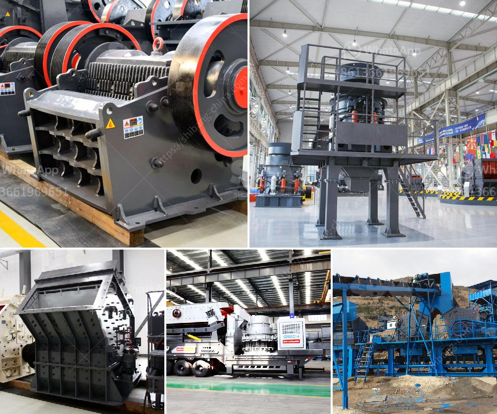

<h3>concrete crushing equipment price</h3>
Concrete crushing equipment is widely used in the demolition and recycling industry. With its compact, powerful, and maneuverable features, it enables the recycling of valuable construction materials such as concrete, bricks, asphalt, and natural stone. However, this heavy-duty machinery comes at a price.

The price of concrete crushing equipment can vary greatly depending on the specific model and features chosen. Generally, the price can range from tens of thousands of dollars to hundreds of thousands of dollars. What influences the price are factors such as the size and capacity of the equipment, the type of machine (jaw crushers, impact crushers, cone crushers), the brand, and the level of automation.

Investing in high-quality concrete crushing equipment offers numerous benefits in terms of efficiency and cost-effectiveness. Firstly, it reduces the need for transporting new materials, as the crushed concrete can be reused onsite in various applications. This not only saves money on material costs but also reduces fuel consumption and carbon emissions associated with transportation.

Secondly, concrete crushing equipment allows the efficient processing of large volumes of concrete and other materials, significantly reducing the time required for traditional demolition methods. Moreover, it minimizes the impact on the environment by reducing waste sent to landfills and results in a smaller carbon footprint for construction projects.

When considering the price of concrete crushing equipment, it is essential to look beyond the initial investment and consider long-term benefits. Quality equipment with a higher upfront cost tends to be more durable, reliable, and efficient, ensuring lower maintenance and operating costs over time.

To get the best price for concrete crushing equipment, it is advisable to research and compare different manufacturers and suppliers. Reading customer reviews and seeking recommendations from industry experts can provide valuable insights into the performance and durability of the equipment.

In conclusion, concrete crushing equipment plays a crucial role in the recycling industry, enabling the reuse of materials, reducing waste, and driving sustainability. Although the price may seem high at first, the long-term benefits and cost savings make it a worthwhile investment for construction companies and contractors.
<h3>Contact us</h3><ul><li><strong>Whatsapp:&nbsp;<a href="https://wa.me/8613661969651">+8613661969651</a></strong></li><li><a href="https://swt.shibang-china.com/?git&amp;zhl&amp;concrete crushing equipment price"><strong>Online Service(chat now)</strong></a></li></ul><h3>Related</h3><ul><li><a href='crushing plant thailand.md'>crushing plant thailand</a></li><li><a href='pe series jaw crusher and ton per.md'>pe series jaw crusher and ton per</a></li><li><a href='talcum powder grinding machine in kerala.md'>talcum powder grinding machine in kerala</a></li><li><a href='processing of bauxite crusher.md'>processing of bauxite crusher</a></li><li><a href='quarry stone for sale in malta.md'>quarry stone for sale in malta</a></li></ul>