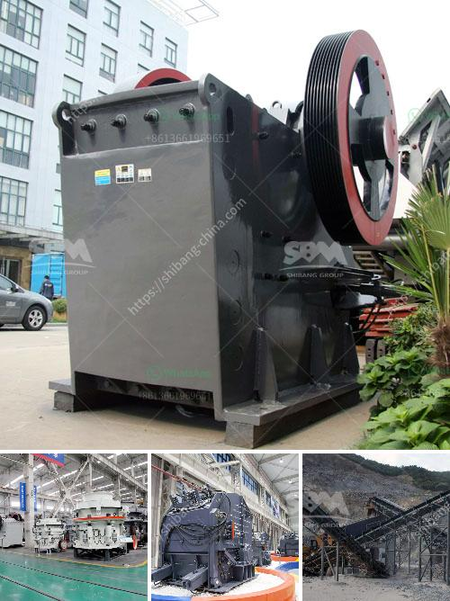

<h3>cone crusher instructions</h3>
Cone crushers are often used in the mining and aggregate industries to crush various materials, including rocks and ores. In order to achieve optimal performance, it is important to follow the correct procedures when operating and maintaining these machines. This article provides step-by-step instructions on how to maintain and operate a cone crusher.

Regular maintenance is the key to ensuring the reliable performance of a cone crusher. Here are some tips to keep in mind:

1. Lubrication: Proper lubrication is essential for the smooth operation of any machinery. Make sure to lubricate the bearings, gears, and other moving parts of the cone crusher regularly. Use the recommended lubricants and follow the manufacturer's instructions.

2. Inspect and replace worn parts: Regularly inspect the wear parts of the cone crusher, such as the mantle and liners. If any part is worn beyond its usable limit, it should be immediately replaced to avoid damaging other components.

3. Check the oil level and quality: The oil level in the cone crusher should be checked regularly. Additionally, the oil quality should be monitored to ensure it is clean and free from contaminants. Contaminated oil can cause premature wear and damage to the components.

4. Check the pressure and temperature: Monitor the pressure and temperature of the cone crusher regularly. Excessive pressure or temperature can indicate a problem with the machine and should be addressed promptly.

Proper operation of a cone crusher is crucial to ensure its efficiency and longevity. Here are some instructions to follow:

1. Follow the startup and shutdown procedures: Before starting the cone crusher, make sure to follow the startup procedures outlined in the manufacturer's manual. Similarly, when shutting down the machine, follow the shutdown procedures to protect the equipment.

2. Adjust the settings: Cone crushers are designed to produce the desired end product size. Adjust the settings as needed to achieve the desired particle size. Make sure to consult the manufacturer's instructions for the correct procedure.

3. Feed the crusher correctly: Proper feeding is essential for maximum efficiency and optimal performance. Avoid overloading the crusher by ensuring a consistent and controlled feed rate. Do not exceed the maximum recommended feed size.

4. Monitor the operation: Regularly monitor the operation of the cone crusher to ensure it is functioning properly. Keep an eye on the motor amps, crusher discharge, and other operational parameters. Any deviation from the normal operating range should be investigated.

Cone crushers play a crucial role in the mining and aggregate industries. To maintain their reliable performance, it is important to follow the correct maintenance and operation procedures. Regular maintenance, including proper lubrication, inspection of wear parts, and monitoring of oil quality, is crucial for the smooth operation of the machine. Additionally, proper operation, including adjusting the settings, feeding correctly, and monitoring the operation, is essential for achieving optimal performance. By following these instructions, cone crusher owners can ensure the longevity and efficiency of their equipment.
<h3>Contact us</h3><ul><li><strong>Whatsapp:&nbsp;<a href="https://wa.me/8613661969651">+8613661969651</a></strong></li><li><a href="https://swt.shibang-china.com/?git&amp;zhl&amp;cone crusher instructions"><strong>Online Service(chat now)</strong></a></li></ul><h3>Related</h3><ul><li><a href='nepal jaw crusher or sale.md'>nepal jaw crusher or sale</a></li><li><a href='cobble stone machine nigeria.md'>cobble stone machine nigeria</a></li><li><a href='clinker processing line in germany.md'>clinker processing line in germany</a></li><li><a href='price hammer mill capacity of made in china.md'>price hammer mill capacity of made in china</a></li><li><a href='suppliers of conveyor belts in south africa.md'>suppliers of conveyor belts in south africa</a></li></ul>