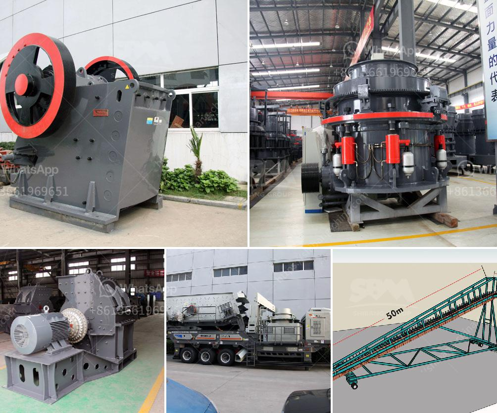

<h3>cone crusher manufacturer in south africa</h3>
Cone crusher manufacturer in South Africa is a leading global manufacturer of crushing and milling equipment (Cone crusher manufacturer in South Africa), also supply individual (Cone crusher manufacturer in South Africa...) crushers and mills as well as spare parts of them.

Offering the highest quality product range and an excellence in after sales service in the supply and maintenance of screening and crushing media, spare and wear parts to mining and aggregate processing industries, South African-based company IQR Systems has made a major commitment to helping the local industry streamline its operations and reduce overall costs.

IQR’s Johan Steyn, who previously worked in the crushing and screening industry for Pilot Crushtec for a number of years, warned that sub-standard components could result in a catastrophic event potentially causing the whole operation to shut down for extended periods.

“Investing in good quality equipment is crucial for the longevity of any mining operation,” he said. “By spending that little bit extra on selecting the right OEM parts, you can be sure that you will have less downtime due to unforeseen failures and will maximise the lifespan of your equipment.”

In addition to helping local mines lower their production costs through reduced operational downtime, IQR Systems is committed to providing expert training and support to ensure the best possible performance from its range of products.

With almost a century of experience and know-how in manufacturing original equipment Wear and Spare Components since 1876, you can be confident of buying at an affordable price and the peace of mind of a full equipment warranty and expert service.

There is a constant flow of OEM Spare and Wear components for our products in the market, which is extended to the events entitled to “the Million Dollar Challenge”, which is an incentive for customers to get the maximum economic benefit from their investment.

With the support of the original machinery manufacturer capabilities, people should direct their purchasing priorities accordingly. Customers can order and purchase their primary, secondary and tertiary crushing and so on. The crushing plants are supported by general demonstrations and roadshow events, were attended by potential customers with good results.

To reduce the need for crushed stone or gravel, the public work market primarily stress the importance for innovation in order to achieve more environmentally sustainable aggregates. IQR Systems further expressed their commitment to help make this happen.

The company's experienced team of professionals have the expertise to deliver innovation, service and support to the industry to ensure that customer requirements are met.

In conclusion, choosing the right cone crusher manufacturer in South Africa is essential for maximum efficiency and reliability while reducing downtime and overall operational costs. The right manufacturer will provide the necessary expertise to guide you through the purchasing process and recommend the best solution for your specific requirements. By investing in high-quality equipment and obtaining expert training and support, you can ensure the long-term success and profitability of your mining operation.
<h3>Contact us</h3><ul><li><strong>Whatsapp:&nbsp;<a href="https://wa.me/8613661969651">+8613661969651</a></strong></li><li><a href="https://swt.shibang-china.com/?git&amp;zhl&amp;cone crusher manufacturer in south africa"><strong>Online Service(chat now)</strong></a></li></ul><h3>Related</h3><ul><li><a href='cost of concrete batch plant.md'>cost of concrete batch plant</a></li><li><a href='vsi crusher for quartz.md'>vsi crusher for quartz</a></li><li><a href='marble grinder price in india.md'>marble grinder price in india</a></li><li><a href='project cost of clinker grinding unit.md'>project cost of clinker grinding unit</a></li><li><a href='list of the price of crushing plant turkey.md'>list of the price of crushing plant turkey</a></li></ul>