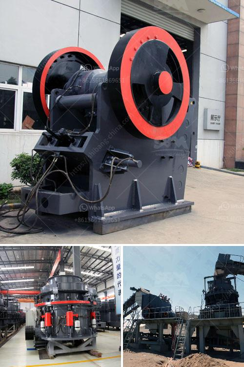

<h3>cone crusher manufacturers in usa</h3>
Cone crusher manufacturers in the United States are creating a boom in the industry for many reasons. The Cone crusher market is driven by infrastructure construction and the demand for mining machinery. It is highly competitive with many manufacturers striving to provide the most efficient equipment. Cone crusher manufacturers are also creating new products to meet the growing customer demand for more efficient options.

One of the leading cone crusher manufacturers in the United States is Metso, which has been in the business for over 100 years. They specialize in manufacturing not only cone crushers but also a wide variety of mining equipment including screens, feeders, and conveyors. They have been recognized for their high-quality products and outstanding customer service.

Another prominent cone crusher manufacturer is Telsmith. They offer a range of technologically advanced and innovative crushers for the mining industry. Telsmith's cone crushers are known for their high productivity and reliability, making them a preferred choice for customers worldwide.

Other notable cone crusher manufacturers in the United States include Terex, Cedarapids, and McCloskey. All these manufacturers have a reputation for producing top-quality machinery that is durable, efficient, and cost-effective.

The cone crusher market in the United States is highly competitive, with manufacturers constantly striving to improve their products to meet the evolving customer demands. This competition ultimately benefits the customers as they have access to a wide range of options and can choose the best equipment for their specific needs.

In conclusion, cone crusher manufacturers in the United States are playing a crucial role in the industry's growth. Their innovative products and dedication to customer satisfaction are driving the market forward. Whether it's mining, construction, or any other industry that requires efficient crushing equipment, cone crusher manufacturers in the United States are ready to meet the challenge and provide the best solutions.
<h3>Contact us</h3><ul><li><strong>Whatsapp:&nbsp;<a href="https://wa.me/8613661969651">+8613661969651</a></strong></li><li><a href="https://swt.shibang-china.com/?git&amp;zhl&amp;cone crusher manufacturers in usa"><strong>Online Service(chat now)</strong></a></li></ul><h3>Related</h3><ul><li><a href='slag grinding mill.md'>slag grinding mill</a></li><li><a href='used marble machinery turkey.md'>used marble machinery turkey</a></li><li><a href='trackmounted mobile crusher.md'>track-mounted mobile crusher</a></li><li><a href='silica sand washing process.md'>silica sand washing process</a></li><li><a href='mobile stone crusher 100 tph bangalore.md'>mobile stone crusher 100 tph bangalore</a></li></ul>