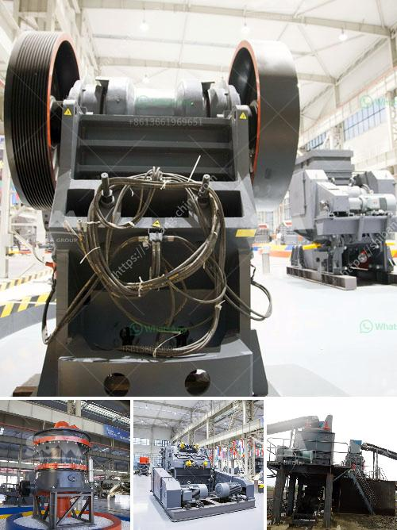

<h3>cone crusher that is a cone crusher</h3>
The cone crusher is a type of crushing equipment designed for crushing materials of different hardness. It is widely used in mining, metallurgy, construction, road construction, and other industries. The cone crusher has many advantages, such as large crushing ratio, high efficiency, low energy consumption, uniform product particle size, and suitable for medium and fine crushing of various ores and rocks.

The cone crusher consists of a crushing cone and a moving cone. When the cone crusher works, the motor drives the eccentric shaft sleeve to rotate through the belt pulley or the coupling. The moving cone does the rotating swing motion under the action of the eccentric sleeve, so that the crushing wall is sometimes close to and sometimes away from the surface of the rolling mortar wall. The material is squeezed and crushed in the crushing cavity, which is composed of the fixed cone and the moving cone.

The cone crusher has different models, such as spring cone crusher, hydraulic cone crusher, and compound cone crusher. The cone crusher has a large crushing ratio, high efficiency, low energy consumption, and uniform product particle size. It is suitable for medium and fine crushing of various ores and rocks. In modern industries, cone crushers are widely used in cement production, mining, metallurgy, construction, and other fields.

The cone crusher has many unique advantages compared with other crushers. First, it adopts a laminated crushing principle, which effectively reduces the wear of hammers and liners. Second, the cone crusher has a high degree of automation, which simplifies the operation process and greatly reduces the labor intensity of workers. Third, the cone crusher has a unique hydraulic protection system, which can effectively protect the equipment from overload and ensure the safety of operators. Fourth, the cone crusher can adjust the discharge opening by hydraulic adjustment, which facilitates the control of the product particle size. Finally, the cone crusher has a wide range of applications and can be used for crushing various ores and rocks with medium and above hardness.

The cone crusher is widely used in industrial sectors such as mining, metallurgy, construction, and highway construction. It has become the preferred equipment for crushing hard and medium-hard ores and rocks. With the continuous advancement of technology and the development of the industry, cone crushers with higher performance have emerged. For example, the single-cylinder hydraulic cone crusher and the multi-cylinder hydraulic cone crusher have made significant breakthroughs in crushing capacity, production efficiency, and energy saving. They are widely used in various production lines and have become the mainstream equipment in the mining industry.

In summary, the cone crusher is a versatile and efficient crushing equipment that plays a crucial role in the production process. Its unique advantages such as high crushing ratio, low energy consumption, and uniform product particle size make it the preferred choice for crushing various ores and rocks. With the continuous improvement of technology, cone crushers are constantly updating and evolving, providing better performance and higher efficiency for various industries.
<h3>Contact us</h3><ul><li><strong>Whatsapp:&nbsp;<a href="https://wa.me/8613661969651">+8613661969651</a></strong></li><li><a href="https://swt.shibang-china.com/?git&amp;zhl&amp;cone crusher that is a cone crusher"><strong>Online Service(chat now)</strong></a></li></ul><h3>Related</h3><ul><li><a href='the gold mining process in zimbabwe.md'>the gold mining process in zimbabwe</a></li><li><a href='jaw crusher machine supplier.md'>jaw crusher machine supplier</a></li><li><a href='crusher machine kenya.md'>crusher machine kenya</a></li><li><a href='silica water washing plant price.md'>silica water washing plant price</a></li><li><a href='malaysia gravel crusher machine.md'>malaysia gravel crusher machine</a></li></ul>