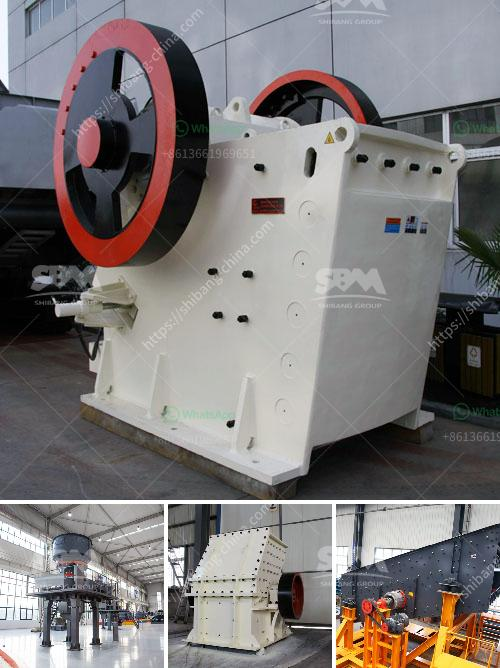

<h3>cone crushers for sale in philippines</h3>
Cone crushers are popular rock crushing machines in aggregates production, mining operations, and recycling applications. They are normally used in secondary, tertiary, and quaternary crushing stages. The new generation of cone crushers offer numerous advancements that provide increased performance, reliability, and convenience, offering users efficient and cost-effective solutions.

In the Philippines, cone crushers are widely used in various mining and quarrying operations. To meet crushing demands of different customers, the cone crushers for sale include different types and specifications such as, single-cylinder hydraulic cone crusher, multi-cylinder hydraulic cone crusher, Simmons cone crusher and so on.

The single-cylinder hydraulic cone crusher is an advanced piece of equipment. It crushes rocks and ores effectively with high crushing ratio and energy consumption. It is widely used in mining, metallurgy, chemical, building materials and other fields such as fine crushing or secondary crushing. The output product is cubic and the percentage of needles is low, which can meet different industry requirements.

A multi-cylinder hydraulic cone crusher is also suited for the secondary or tertiary stages of crushing plant by changing body liners and adaptors. In China, you have a free choice of a full range of model and type, standard head, short head, combination design, pick the right one according to your requirements. Hydrocone crusher is equipped with the automatic control and fingertip manipulation system and two hydraulic cylinders that have a protective effect that if one overload, then another one can fast react to clear choke merely by remote controlling.

Applications Simmons cone crusher is mainly used for crushing iron ore, nonferrous metal ore, granite, limestone, quartzite, sand rock, cobblestone, etc. It is widely used in metal and nonmetallic ore, cement factory, construction, metallurgy, transportation, sand and gravel aggregate production, etc.

No matter the standard type or the short head type, the operational principle is the same. When the eccentric sleeve rotates, the movable cone does the rotating swing movement along with the eccentric sleeve. The materials are continuously impacted, squeezed and crushed in the crushing cavity between the crushing wall and the rolling wall.

For inquiries about cone crushers used in the Philippines, reach out to us at MNL Heavy Equipment. We take pride in offering a wide selection of cone crushers for all your needs and preferences. Our range of cone crusher models varies from hydraulic cone crusher to spring cone crusher. All the crushers can be classified in terms of their equipment – mechanical hydraulic and pneumatic and signal relation – sensor-bearing, needle angle, and eccentric shaft speed, etc..

Whether you need a machine for secondary or tertiary crushing, or multi-functional machine with multiple features, we can provide you with various options to choose from, all of which aim to meet your different needs. With advanced technology, high-quality materials, and excellent technical support, MNL Heavy Equipment is a trusted name when it comes to cone crushers for sale in the Philippines.
<h3>Contact us</h3><ul><li><strong>Whatsapp:&nbsp;<a href="https://wa.me/8613661969651">+8613661969651</a></strong></li><li><a href="https://swt.shibang-china.com/?git&amp;zhl&amp;cone crushers for sale in philippines"><strong>Online Service(chat now)</strong></a></li></ul><h3>Related</h3><ul><li><a href='cost of stone crusher in nigeria.md'>cost of stone crusher in nigeria</a></li><li><a href='grinding mill for bentonite.md'>grinding mill for bentonite</a></li><li><a href='vibrating screen working principle.md'>vibrating screen working principle</a></li><li><a href='kaolin clay mining process.md'>kaolin clay mining process</a></li><li><a href='bal mill snsttlled capacity.md'>bal mill snsttlled capacity</a></li></ul>