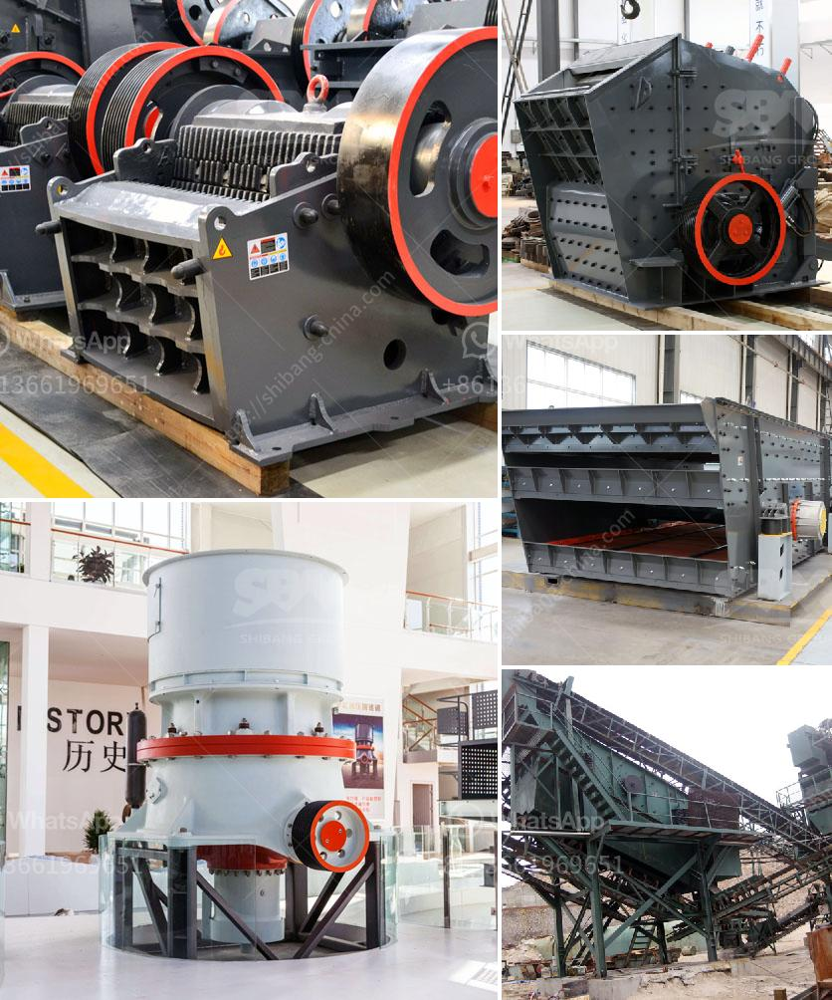

<h3>conical ball mill manufacturers in india</h3>
Conical ball mill manufacturers in India have carved a niche in the industry because of their excellent craftsmanship, meticulous design, and superior performance. They specialize in producing cylindrical-shaped ball mills that are widely used in industries like power generation, construction materials, metallurgy, and chemical industries.

One of the standout features of a conical ball mill is its ability to crush materials into smaller particles. This is achieved by gradually reducing the size of the feed material as the rotating cylinder moves downward. The unique design of the conical ball mill offers various advantages, including enhanced grinding efficiency, reduced power consumption, and improved product quality.

Conical ball mill manufacturers in India offer exceptional quality at affordable prices. The conical ball mills they provide are highly efficient, reliable, and commercially viable, making them one of the essential equipment in various industrial sectors. These mills are also known for their low maintenance costs and long lifespan, making them an excellent investment for any business.

Conical ball mill manufacturers in India utilize cutting-edge technology and premium quality materials to produce equipment that guarantees optimal performance. They use CNC machines for precision engineering and adhere to strict quality control measures in every manufacturing process. These measures ensure that the conical ball mills meet international standards and offer flawless performance.

In addition to their outstanding quality, conical ball mill manufacturers in India boast a wide range of products to cater to diverse customer requirements. They provide ball mills in different sizes, capacities, and specifications to suit various processing needs. Whether it's for small-scale or large-scale operations, conical ball mill manufacturers in India can tailor their products to fulfill specific demands, ensuring maximum customer satisfaction.

Moreover, conical ball mill manufacturers in India prioritize customer support and after-sales service. They ensure prompt assistance during installation and offer maintenance services to ensure the smooth functioning of the equipment. This commitment to customer satisfaction has earned them a reputation for being reliable and trustworthy partners.

To conclude, conical ball mill manufacturers in India have established themselves as leading players in the industry due to their exceptional craftsmanship, innovative design, and unrivaled performance. Their ability to produce high-quality mills that offer enhanced grinding efficiency and reduced power consumption has made them the go-to choice for many businesses in the country. When investing in a conical ball mill, choosing a reputed manufacturer ensures that you get reliable and long-lasting equipment that fulfills all your processing needs. So, if you're in the market for a high-quality ball mill, look no further than the conical ball mill manufacturers in India.
<h3>Contact us</h3><ul><li><strong>Whatsapp:&nbsp;<a href="https://wa.me/8613661969651">+8613661969651</a></strong></li><li><a href="https://swt.shibang-china.com/?git&amp;zhl&amp;conical ball mill manufacturers in india"><strong>Online Service(chat now)</strong></a></li></ul><h3>Related</h3><ul><li><a href='coal mill of cement plant.md'>coal mill of cement plant</a></li><li><a href='argentine hammer mill.md'>argentine hammer mill</a></li><li><a href='quarry machine and crusher plant sale in australia.md'>quarry machine and crusher plant sale in australia</a></li><li><a href='100tph stone crusher sale in south africa.md'>100tph stone crusher sale in south africa</a></li><li><a href='movable conveyor belt.md'>movable conveyor belt</a></li></ul>