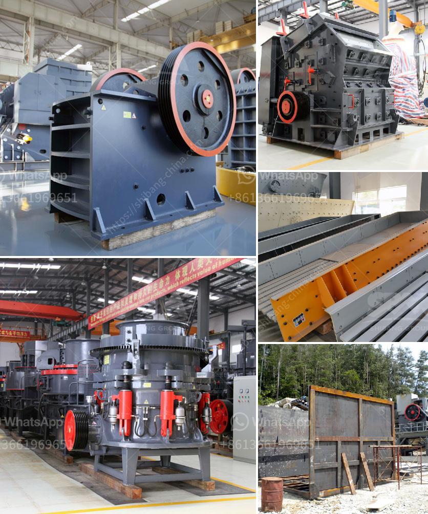

<h3>construction & demolition recycling</h3>
Construction and demolition (C&D) waste is a major contributor to landfills worldwide. However, with growing awareness of sustainability and environmentally responsible practices, the concept of C&D recycling is gaining traction. By reusing and recycling materials from construction and demolition projects, we can significantly reduce waste and conserve valuable resources.

In traditional construction practices, it is common to dispose of all waste materials, including concrete, bricks, wood, and metals, in landfills. This not only leads to environmental pollution but also depletes natural resources and exacerbates the problem of limited landfill space. However, by implementing recycling strategies, we can transform waste into valuable resources.

One of the primary materials to focus on in C&D recycling is concrete. Concrete is the most widely used construction material globally, and its production is responsible for a significant amount of CO2 emissions. Recycling concrete not only reduces landfill waste but also saves energy and reduces CO2 emissions associated with the manufacturing of new concrete. Crushed concrete can be reused as a base material for new construction, roadbeds, and even as an aggregate in new concrete production.

Similarly, recycling wood from construction and demolition sites can have numerous environmental benefits. Instead of being incinerated or dumped in landfills, wood waste can be repurposed for various applications. Recycled wood can be used for making furniture, constructing new buildings, or even converted into biomass fuels for energy production. By extending the lifespan of wood and reducing the demand for new timber, we prevent deforestation and promote sustainable forestry practices.

Metals like steel and aluminum are also key materials in construction projects and have high recycling value. By recycling these metals, we can conserve energy, reduce emissions, and save natural resources. Scrap metal from construction sites can be processed and used for manufacturing new building materials, appliances, and even automobiles. This not only decreases the demand for virgin metals but also reduces the environmental impact associated with their extraction and production.

In addition to these major materials, other components of construction and demolition waste, such as plastics, insulation materials, and roofing shingles, can also be recycled effectively. Recycling these materials reduces the need for new production, conserves resources, and reduces the energy associated with manufacturing new products.

To ensure effective C&D recycling, it is essential to implement proper waste management practices from the early stages of a project. This includes segregating materials on-site and partnering with recycling facilities that are equipped to process different types of waste. Education and training play a vital role in raising awareness among construction professionals and workers about the various recycling options available and the benefits they offer.

Moreover, governments can incentivize C&D recycling by offering tax benefits or imposing fees on landfill disposal. Building codes and regulations can also be amended to incorporate recycling requirements, thereby making it a standard practice in the construction industry.

In conclusion, C&D recycling is a crucial aspect of sustainable construction. By reusing and recycling materials, we can reduce waste, conserve resources, and minimize the environmental impact of construction and demolition projects. Embracing recycling practices in construction not only supports a healthier environment but also promotes the growth of a circular economy, where waste is minimized, and materials are continuously reused. Ultimately, the adoption of C&D recycling is essential to building a more sustainable future.
<h3>Contact us</h3><ul><li><strong>Whatsapp:&nbsp;<a href="https://wa.me/8613661969651">+8613661969651</a></strong></li><li><a href="https://swt.shibang-china.com/?git&amp;zhl&amp;construction  demolition recycling"><strong>Online Service(chat now)</strong></a></li></ul><h3>Related</h3><ul><li><a href='concrete crusher in kenya for sale.md'>concrete crusher in kenya for sale</a></li><li><a href='ballast crushing machine in kenya.md'>ballast crushing machine in kenya</a></li><li><a href='coal mill of cement plant.md'>coal mill of cement plant</a></li><li><a href='production of stone crusher.md'>production of stone crusher</a></li><li><a href='quartz grinding ball mill working.md'>quartz grinding ball mill working</a></li></ul>