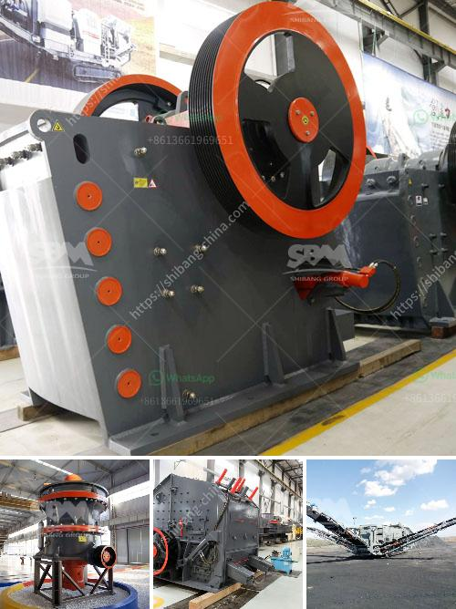

<h3>construction equipment feasibility study</h3>
The construction industry relies heavily on a wide range of specialized equipment and machinery to carry out various tasks effectively. From excavators and bulldozers to cranes and loaders, each type of construction equipment serves a specific purpose to ensure efficiency and productivity on construction sites. However, before investing in new equipment, construction companies often conduct feasibility studies to assess the viability and potential benefits of integrating new machinery into their operations. This article will discuss the importance of a construction equipment feasibility study and outline the essential factors that should be considered during the process.

A construction equipment feasibility study aims to evaluate the practicality and financial viability of acquiring and utilizing specific equipment. It involves assessing the potential costs, benefits, risks, and overall impact on a project. By conducting this study, construction companies can make informed decisions that align with their operational goals and objectives.

1. Project Requirements: Before examining different equipment options, it is crucial to understand the specific requirements of the project. This includes analyzing the tasks at hand, the scope of work, and the expected timeline. By clearly defining project needs, construction companies can identify suitable equipment options that align with the project's demands.

2. Cost Analysis: A comprehensive cost analysis is a critical component of a feasibility study. It involves evaluating the purchase price, maintenance expenses, fuel consumption, and potential repair costs associated with the equipment. Additionally, companies should consider any additional training or certification requirements for operators, as well as the expected lifespan of the machinery. By estimating the overall costs, it becomes easier to determine if the investment is financially justified.

3. Efficiency and Productivity: Another essential factor to consider when conducting a feasibility study is the impact on efficiency and productivity. New equipment can streamline the construction process, reducing manual labor and completing tasks at a faster pace. By evaluating the potential increase in productivity, construction companies can assess the overall impact on project timelines and budgets.

4. Safety Considerations: Safety should always be a top priority in the construction industry. During a feasibility study, it is crucial to assess any safety measures and considerations associated with the equipment under evaluation. This includes evaluating operator training requirements, ergonomic design features, and any potential risks to workers or the surrounding environment. By prioritizing safety, companies can mitigate potential hazards and create a secure working environment.

5. Environmental Impact: With growing concerns about sustainability, construction companies must consider the environmental impact of their operations. During a feasibility study, it is essential to evaluate the equipment's environmental performance, such as emissions, energy consumption, and noise levels. By opting for equipment that meets or exceeds regulatory standards, companies can contribute to a more sustainable construction industry.

A construction equipment feasibility study is crucial for making informed decisions about investing in new machinery. By considering project requirements, conducting cost analysis, evaluating efficiency and productivity, addressing safety concerns, and assessing the environmental impact, construction companies can determine the viability of integrating new equipment into their operations. With a well-executed feasibility study, companies can ensure efficient and successful construction projects while aligning with their financial and operational goals.
<h3>Contact us</h3><ul><li><strong>Whatsapp:&nbsp;<a href="https://wa.me/8613661969651">+8613661969651</a></strong></li><li><a href="https://swt.shibang-china.com/?git&amp;zhl&amp;construction equipment feasibility study"><strong>Online Service(chat now)</strong></a></li></ul><h3>Related</h3><ul><li><a href='philippines stone crusher.md'>philippines stone crusher</a></li><li><a href='marble powder 100 mesh grinding machine.md'>marble powder 100 mesh grinding machine</a></li><li><a href='gold screening equipment.md'>gold screening equipment</a></li><li><a href='belt conveyor belt suppliers in oman.md'>belt conveyor belt suppliers in oman</a></li><li><a href='crushing equipment south africa crusher quotes.md'>crushing equipment south africa crusher quotes</a></li></ul>