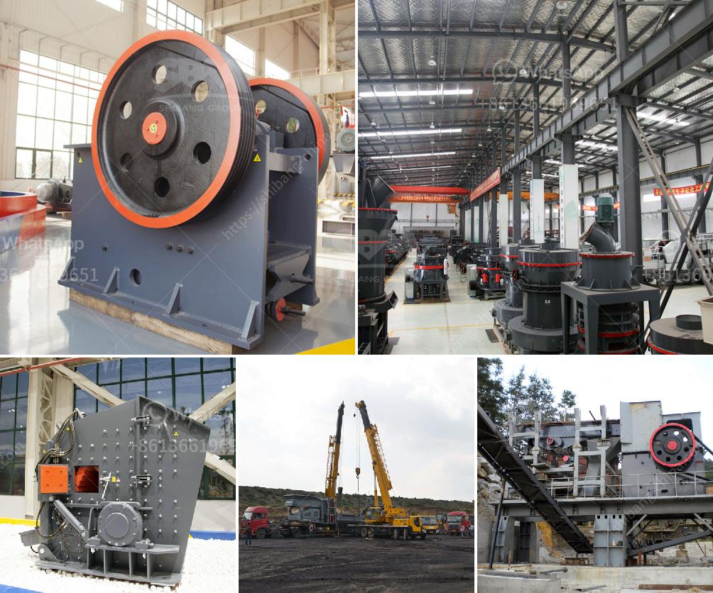

<h3>continous ball mill with cyclone suppliers in india</h3>
Continuous ball mill with cyclone suppliers in India have a vast range of products that are designed to meet different industrial needs. With these mills, continuous grinding is ensured, which allows for high-quality results and excellent performance. These mills are predominantly used for processing dry materials, and with the inclusion of a cyclone separator, they can also handle wet materials.

The continuous ball mill with cyclone is a type of grinder used to grind and blend materials for use in mineral dressing processes, paints, pyrotechnics, ceramics, and selective laser sintering. It works on the principle of impact and attrition, where the size reduction is done by impact as the balls drop from near the top of the shell. A continuous ball mill consists of a hollow cylindrical shell rotating about its axis. The axis of the shell may be either horizontal or at a small angle to the horizontal. The cylindrical shell is usually made of steel, stainless steel, ceramic, or rubber.

The continuous ball mill with cyclone is divided into several compartments with screens to separate the material particles based on their size. The size of the screens can be adjusted to control the product size. The material is fed into the first compartment of the mill through the inlet, and the ground material is discharged through an outlet.

The cyclone separator is an essential part of the continuous ball mill as it helps to separate the ground material from the air stream. The cyclone separator uses centrifugal force to separate the particles based on their size and density. The separated material can be collected in a separate container for further processing or disposal.

There are several reliable suppliers of continuous ball mills with cyclones in India. These suppliers offer a wide range of products that are suitable for different industrial applications. They provide high-quality mills that are designed to withstand the rigors of continuous operation and deliver consistent performance.

In conclusion, continuous ball mills with cyclone separators are essential equipment in various industries for grinding and blending materials. The suppliers in India offer a wide range of high-quality mills that are suitable for different industrial needs. With their expertise and experience, these suppliers can provide efficient solutions to meet diverse requirements.
<h3>Contact us</h3><ul><li><strong>Whatsapp:&nbsp;<a href="https://wa.me/8613661969651">+8613661969651</a></strong></li><li><a href="https://swt.shibang-china.com/?git&amp;zhl&amp;continous ball mill with cyclone suppliers in india"><strong>Online Service(chat now)</strong></a></li></ul><h3>Related</h3><ul><li><a href='small diesel engine crusher from tanzania.md'>small diesel engine crusher from tanzania</a></li><li><a href='tonnes aggregate crusher in south africa crusher.md'>tonnes aggregate crusher in south africa crusher</a></li><li><a href='stone crushers in belen.md'>stone crushers in belen</a></li><li><a href='equipment roller mill.md'>equipment roller mill</a></li><li><a href='vertical ultra fine pulverizer.md'>vertical ultra fine pulverizer</a></li></ul>