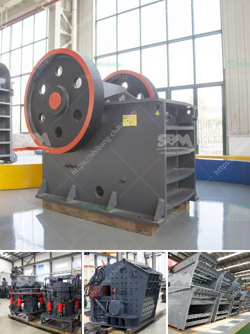

<h3>continuous ball mill manufactures in gujrat</h3>
Continuous ball mill manufacturers in Gujarat provide high-quality machinery with innovative design and advanced technology expertise. Continuous ball mills are widely used in various industries like mineral pulverizing, pesticides units, and others. This machine is easy to install, operate, and maintain, with a compact structure for transportation. Continuous ball mill manufacturers in Gujarat provide the versatile machine for grinding, mixing, and homogenizing of solids and liquids, respectively. These mills are used for wet grinding and dry grinding.

Continuous ball mill manufacturers in Gujarat offer grinding solutions for various industries, including mineral processing, cement production, paint application, fertilizer production, and pharmaceuticals. Continuous ball mill manufacturers in Gujarat are highly proficient and provide highly efficient grinding processes for paints, ensuring minimal wastage and high productivity.

Continuous ball mill manufacturers in Gujarat utilize high-quality stainless steel and the latest technology for the construction of these machines. Continuous ball mill manufacturers in Gujarat provide a sturdy structure for the mill, along with its main components, such as grinding head, grinding media, feeder, discharge, and electrical motor. These machines are assembled with the utmost precision to ensure optimum performance and long-term durability.

Continuous ball mill manufacturers in Gujarat strive to provide customers with a flexible machine that meets all their grinding requirements. The mill comes with different specifications and sizes, allowing for customization based on individual needs. Customers can choose between different types of mill liners, such as rubber, steel, and ceramic, to suit their grinding needs.

Continuous ball mill manufacturers in Gujarat also provide customized design options for specific applications. They understand the unique requirements of different industries and offer tailored solutions to meet those needs. These mills can be equipped with automatic feeding systems and control panels to enhance efficiency and ease of operation.

Continuous ball mill manufacturers in Gujarat focus on quality and reliability. They perform strict quality checks at every stage of the manufacturing process to ensure that the final product meets international standards. Regular maintenance and inspection are conducted to keep the machines in optimal condition.

Continuous ball mill manufacturers in Gujarat also provide comprehensive after-sales support to their customers. They offer installation assistance, operational training, and troubleshooting services to ensure smooth operation of the mills. Technical experts are available to address any queries or issues that customers may have.

In conclusion, continuous ball mill manufacturers in Gujarat offer high-quality machines with innovative design and advanced technology. These mills are highly versatile, providing efficient grinding solutions for various industries. With their sturdy construction and customized design options, these mills ensure optimal performance and longevity. Additionally, continuous ball mill manufacturers in Gujarat strive to provide excellent after-sales support, ensuring customer satisfaction.
<h3>Contact us</h3><ul><li><strong>Whatsapp:&nbsp;<a href="https://wa.me/8613661969651">+8613661969651</a></strong></li><li><a href="https://swt.shibang-china.com/?git&amp;zhl&amp;continuous ball mill manufactures in gujrat"><strong>Online Service(chat now)</strong></a></li></ul><h3>Related</h3><ul><li><a href='stone crusher machine price list in bangladesh.md'>stone crusher machine price list in bangladesh</a></li><li><a href='limestone rock crushing.md'>limestone rock crushing</a></li><li><a href='stone crushing machine in zambia.md'>stone crushing machine in zambia</a></li><li><a href='second hand cement mill in india.md'>second hand cement mill in india</a></li><li><a href='gypsum mill production.md'>gypsum mill production</a></li></ul>