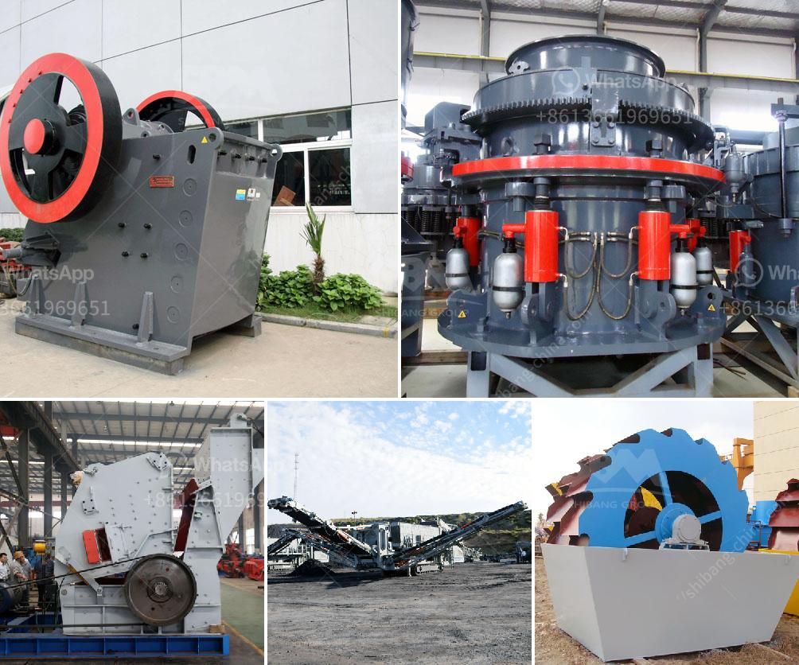

<h3>contnious ball mill drawing</h3>
Continuous ball mills are widely used in various industries like mining, building materials, and chemistry industries. They are efficient grinding devices that offer continuous operation, improved particle size distribution during grinding, and higher grinding efficiency. Continuous ball mills are particularly suited for grinding and blending materials such as cement, lime, chemicals, fertilizers, and ores. Within these industries, continuous ball mill drawing is an important step in designing and optimizing this type of grinding equipment for milling material into fine powders.

The continuous ball mill drawing helps to visualize the structure of the mill and its potential operating capacities. The continuous grinding operation ensures that even the smallest particles are ground down to the required size, making them suitable for subsequent processing. 

One of the key benefits of continuous ball mills is their versatility and adaptability to different applications. The continuous ball mill drawing allows engineers and designers to explore various design options and choose the most suitable configuration for the given application. Whether it is a closed circuit grinding system or an open circuit grinding system, the continuous ball mill drawing provides the necessary insights to optimize the milling process.

The continuous ball mill drawing typically consists of several components including a motor, gearbox, feeding system, discharge system, and a control system. The motor provides the necessary power to rotate the mill, while the gearbox ensures smooth and stable operation. The feeding system is responsible for delivering the material to be ground into the mill, while the discharge system removes the finely ground material from the mill. The control system regulates the speed of the mill and maintains the desired level of grinding efficiency.

Furthermore, the continuous ball mill drawing also takes into consideration the wear and tear on the grinding media. The selection of appropriate grinding media and their arrangement within the mill play a crucial role in achieving the desired grinding efficiency. The continuous ball mill drawing helps engineers and designers visualize the optimal arrangement of grinding media within the mill to maximize the grinding efficiency and minimize wear on the mill's internal components.

In conclusion, the continuous ball mill drawing is an essential tool in designing and optimizing the operation of continuous ball mills. It allows engineers and designers to explore various design options and choose the most suitable configuration for the given application. By visualizing the structure and operation of the mill, the drawing helps optimize the grinding process, ensure efficient particle size distribution, and minimize wear on the mill's components. Continuous ball mills are valuable assets in various industries, and the continuous ball mill drawing is a vital step in their successful implementation.
<h3>Contact us</h3><ul><li><strong>Whatsapp:&nbsp;<a href="https://wa.me/8613661969651">+8613661969651</a></strong></li><li><a href="https://swt.shibang-china.com/?git&amp;zhl&amp;contnious ball mill drawing"><strong>Online Service(chat now)</strong></a></li></ul><h3>Related</h3><ul><li><a href='used roller mill in kenya.md'>used roller mill in kenya</a></li><li><a href='supplier of vibrating screen in philippines.md'>supplier of vibrating screen in philippines</a></li><li><a href='dubai stone crushing auction.md'>dubai stone crushing auction</a></li><li><a href='calcium carbonate plant industry.md'>calcium carbonate plant industry</a></li><li><a href='small jaw crusher supplier.md'>small jaw crusher supplier</a></li></ul>