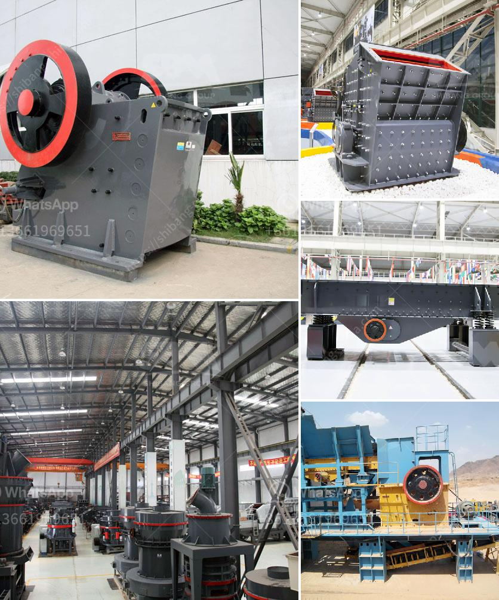

<h3>conventional hammer mills</h3>
When it comes to size reduction equipment, hammer mills have remained a popular choice among manufacturers and industries for decades. These machines are widely used in various applications, ranging from agriculture and forestry to mining and construction. In this article, we will dive into the world of conventional hammer mills, exploring their construction, working principles, and notable advantages.

Conventional hammer mills are designed to be robust and efficient, capable of handling a wide range of materials. They consist of a rotating shaft fitted with multiple hammers, which strike the material being fed into the machine. As the hammers rotate, the material is pulverized, breaking it down into smaller particles. The reduced size allows for easier processing, transportation, and utilization.

One of the primary benefits of conventional hammer mills is their versatility. These machines are capable of grinding, crushing, and pulverizing a vast array of materials, including grains, biomass, minerals, and non-metallic ores. This versatility makes them suitable for a wide range of applications. Agricultural uses include grinding grains for animal feed or processing biomass for renewable energy production. In the mining industry, hammer mills are commonly used to crush and grind minerals before further processing.

The construction of conventional hammer mills is another notable aspect. These machines are typically built with heavy-duty materials, ensuring durability and long-term operation. The hammers are made from hardened steel or alloy steel to withstand the impact of repeated strikes, prolonging their lifespan. Additionally, the machine's housing is often made from robust materials to withstand heavy use and protect the internal components.

Conventional hammer mills operate on the principle of impact crushing. The materials are fed into the machine through a feed hopper and falls into the grinding chamber. The rotating hammers strike the material with significant force, causing it to break apart. The pulverized material is then discharged through a screen, allowing for the desired particle size to be achieved.

In terms of advantages, conventional hammer mills offer several notable benefits. Firstly, they provide consistent and efficient particle size reduction, ensuring uniformity in the processed material. This is crucial for applications where particle size control is essential, such as in animal feed production or bulk material handling.

Secondly, conventional hammer mills are relatively low maintenance machines, requiring minimal operational upkeep. The simplicity of their design and fewer moving parts contribute to their overall reliability. Regular maintenance, such as blade sharpening or screen replacement, helps maintain optimal performance and extends the lifespan of the machine.

Lastly, conventional hammer mills are cost-effective solutions compared to alternative size reduction equipment. Their initial cost is often lower than other crushers or grinders, making them a viable choice for small to medium-scale operations. Moreover, their efficient energy consumption helps reduce operational expenses, further enhancing their cost-effectiveness.

In conclusion, conventional hammer mills remain a reliable and versatile choice for various industries and applications. Their robust construction, efficient crushing capabilities, and cost-effectiveness make them suitable for a wide range of materials and operations. Whether grinding grains for animal feed or processing minerals in the mining industry, hammer mills continue to be a go-to solution for size reduction needs.
<h3>Contact us</h3><ul><li><strong>Whatsapp:&nbsp;<a href="https://wa.me/8613661969651">+8613661969651</a></strong></li><li><a href="https://swt.shibang-china.com/?git&amp;zhl&amp;conventional hammer mills"><strong>Online Service(chat now)</strong></a></li></ul><h3>Related</h3><ul><li><a href='portable crusher plant crusher plant price.md'>portable crusher plant crusher plant price</a></li><li><a href='iron processing plant manufacturer machine line.md'>iron processing plant manufacturer machine line</a></li><li><a href='granite stone quarrying equipment.md'>granite stone quarrying equipment</a></li><li><a href='used ball mill for sale india.md'>used ball mill for sale india</a></li><li><a href='small ball mill for sale in india.md'>small ball mill for sale in india</a></li></ul>