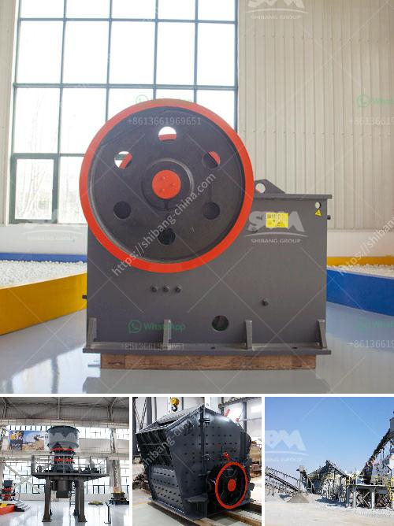

<h3>conveyor belt design manual pdf</h3>
Conveyor belts are used in multiple industries for moving goods from one place to another. They serve as a vital component in the transportation process, providing convenience and efficiency in the handling of goods. With so many different types of conveyor belts available on the market, it is essential to have a comprehensive understanding of their design principles and specifications.

A conveyor belt design manual is a valuable tool for engineers and technicians involved in conveyor belt selection and design. The manual provides information on various aspects of conveyor belt systems, including the design, specification, and calculation of conveyor belts. It also discusses the material handling requirements and the different types of conveyor belts available.

One of the key advantages of using a conveyor belt design manual is that it provides standardized guidelines for belt selection and design. This ensures that the belts are designed to meet specific application requirements and industry standards. The manual presents various factors that need to be considered during the design process, such as the belt tension, load capacity, and speed requirements.

Additionally, the manual provides information on the types of materials used in conveyor belts. Depending on the application and environmental conditions, the manual outlines the suitable belt materials, including rubber, PVC, nylon, and more. It also discusses the advantages and disadvantages of each material, helping users make informed decisions.

Another important aspect covered in the conveyor belt design manual is the conveyor belt system's safety considerations. The manual provides guidelines for ensuring the safety of operators, maintenance personnel, and other individuals working with or around conveyor belts. These guidelines include recommendations for proper guarding, emergency stop systems, and maintenance procedures.

Furthermore, the manual discusses the different types of conveyor systems available, such as flat belt conveyors, troughed belt conveyors, and curved belt conveyors. Each system has its unique design considerations and applications, and the manual provides insights into their strengths and limitations. This information is crucial for engineers and technicians to select the most suitable conveyor system for their specific needs.

In conclusion, a conveyor belt design manual serves as a comprehensive guide for engineers and technicians involved in conveyor belt selection and design. The manual provides valuable information on various aspects, including the design principles, material selection, safety considerations, and different types of conveyor systems. By using the guidelines provided, users can ensure that their conveyor belts are designed to meet application requirements and industry standards. With the availability of a conveyor belt design manual in PDF format, engineers and technicians can access this valuable resource easily and conveniently.
<h3>Contact us</h3><ul><li><strong>Whatsapp:&nbsp;<a href="https://wa.me/8613661969651">+8613661969651</a></strong></li><li><a href="https://swt.shibang-china.com/?git&amp;zhl&amp;conveyor belt design manual pdf"><strong>Online Service(chat now)</strong></a></li></ul><h3>Related</h3><ul><li><a href='grinder mill in bolivia.md'>grinder mill in bolivia</a></li><li><a href='dolomite grinding mill for sale in india.md'>dolomite grinding mill for sale in india</a></li><li><a href='cost 100tph stone crusher in india.md'>cost 100tph stone crusher in india</a></li><li><a href='sand washing plant saudi arabia.md'>sand washing plant saudi arabia</a></li><li><a href='hammer mill for coal in india.md'>hammer mill for coal in india</a></li></ul>