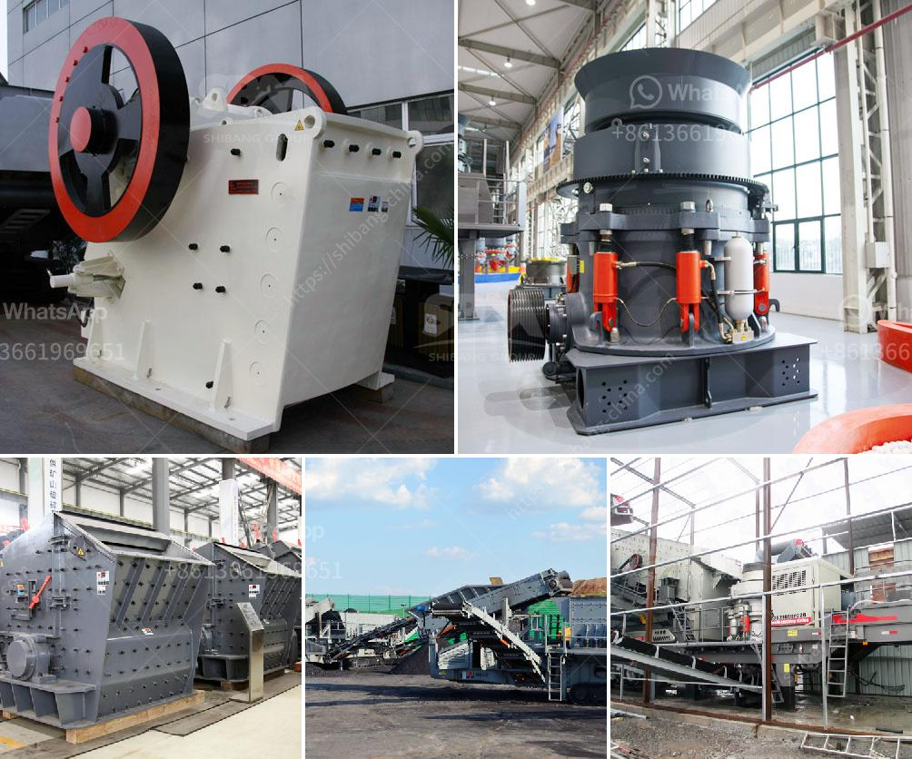

<h3>conveyor belt indonesia</h3>
Conveyor belt Indonesia is a leading supplier and exporter of conveyor belts in the country. In recent years, the company has been able to provide innovative solutions to power transmission, material handling and industrial automation systems in Indonesia.

With extensive experience in the mining industry, the company is proficient in supplying premium quality conveyor belts, such as rubber conveyor belts, plastic conveyor belts, steel cord conveyor belts and PVC conveyor belts. These belts are designed to withstand the harsh conditions in mines and provide durability, flexibility and efficiency in transporting heavy materials.

Conveyor belt Indonesia also produces a wide range of rubber products such as rubber flooring, rubber sheets, rubber matting, rubber flooring and rubber lining. These products are used for various applications in mining, construction, automotive, food processing, and other industries.

The growth of the industrial sector has boosted the demand for conveyor belts in Indonesia, and the company has emerged as a prominent player in the market. To meet the increasing demand, the company has set up a state-of-the-art manufacturing plant in Indonesia with advanced technology and machinery.

Conveyor belt Indonesia provides efficient material handling solutions for a wide range of industries, from automotive to mining. The company provides a wide range of conveyor belts, such as PVC, rubber, steel cord, and more, designed to withstand the harshest conditions and provide long-lasting durability.

In addition to manufacturing conveyor belts, the company also offers belt splicing and installation services, allowing customers to customize their requirements and ensure efficient operations. With a dedicated team of experts, Conveyor belt Indonesia ensures timely delivery and customer satisfaction.

In conclusion, Conveyor belt Indonesia is a leading supplier and exporter of conveyor belts in the country. The company provides innovative solutions to various industries, including mining, automotive, and construction. With a wide range of conveyor belt options, the company ensures efficient material handling and long-lasting durability.
<h3>Contact us</h3><ul><li><strong>Whatsapp:&nbsp;<a href="https://wa.me/8613661969651">+8613661969651</a></strong></li><li><a href="https://swt.shibang-china.com/?git&amp;zhl&amp;conveyor belt indonesia"><strong>Online Service(chat now)</strong></a></li></ul><h3>Related</h3><ul><li><a href='kaolin process flow diagram.md'>kaolin process flow diagram</a></li><li><a href='laying of conveyor belting.md'>laying of conveyor belting</a></li><li><a href='rock crushing machine suppliers.md'>rock crushing machine suppliers</a></li><li><a href='cone crusher that is a cone crusher.md'>cone crusher that is a cone crusher</a></li><li><a href='silica sand washing machine in south africa.md'>silica sand washing machine in south africa</a></li></ul>