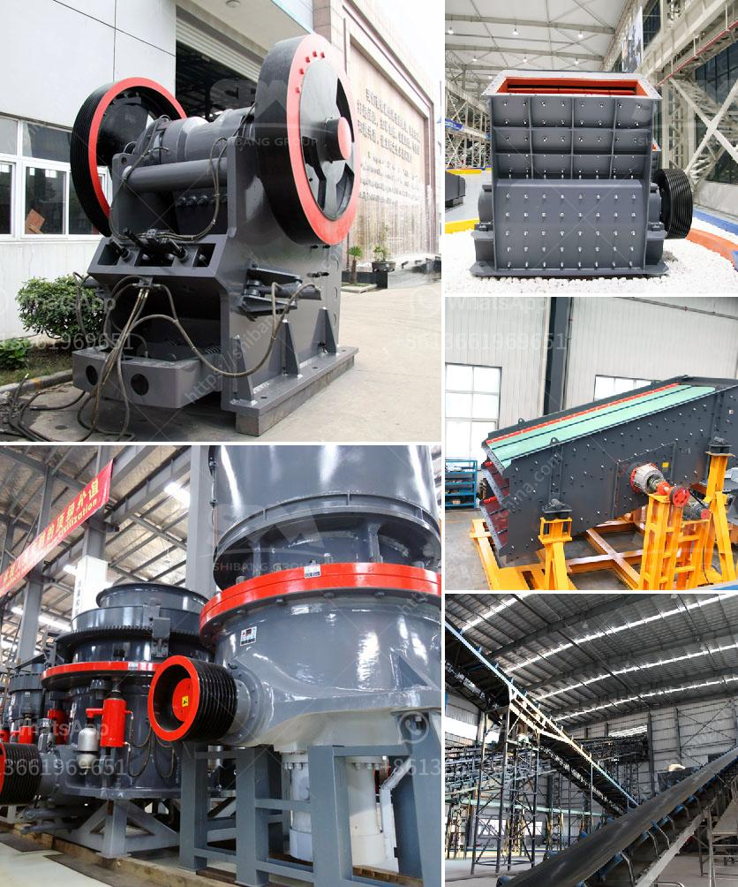

<h3>conveyor belt manufacturer in saudi arabia</h3>
Conveyor belts are used in a wide range of industries, including mining, food processing, and pharmaceuticals. Saudi Arabia has a thriving manufacturing sector and it is one of the key players in the Middle East region. With the growing demand for conveyor belts, the country is an ideal hub for conveyor belt manufacturing.

Saudi Arabia, officially known as the Kingdom of Saudi Arabia, is located in the Middle East, on the Arabian Peninsula. It is the largest country by land area in the Middle East and the 13th largest in the world. The Kingdom has a well-established infrastructure and a strong economy, making it an attractive destination for businesses.

Saudi Arabia is rich in natural resources, including oil, gas, and minerals. The country's vast reserves of oil have helped it become one of the wealthiest nations in the world. The government has been investing heavily in diversifying the economy to reduce dependence on oil, and the manufacturing sector has seen significant growth as a result.

The demand for conveyor belts has been steadily increasing across various industries in Saudi Arabia. The mining sector, in particular, has witnessed substantial growth, driving the need for conveyor belt systems. Conveyor belts are used to transport raw materials, such as coal and iron ore, from mines to processing plants.

One of the major players in the conveyor belt market is Continental Belting Pvt. Ltd. The company offers a wide range of conveyor belts, including PVC/PVG, rubber, steel cord, and sidewall belts. Continental Belting has extensive experience in the industry and offers quality products to meet the diverse needs of customers.

Another prominent player in the market is Arabia Conveyor Belt Co. The company is a leading manufacturer of conveyor belts for various applications, such as mining, cement, and power plants. Arabia Conveyor Belt Co. strives to provide innovative solutions to enhance efficiency and productivity in the industries it serves.

Saudi Arabia is also home to a number of local conveyor belt manufacturers, who cater to the specific needs of regional industries. These manufacturers are trusted providers of high-quality conveyor belts and contribute to the growth of the manufacturing sector in the Kingdom.

Saudi Arabia has emerged as a major player in the conveyor belt manufacturing industry in the Middle East. The demand for conveyor belts across various industries, including mining, has driven the growth of the market in the country. With its strong economy, strategic location, and focus on diversification, Saudi Arabia continues to attract businesses in the manufacturing sector. As the demand for conveyor belts in the region continues to grow, Saudi Arabia is well-positioned to meet these needs. Whether it is through local manufacturers or international suppliers, the country plays a vital role in ensuring the smooth operation of industries that rely on conveyor belts.
<h3>Contact us</h3><ul><li><strong>Whatsapp:&nbsp;<a href="https://wa.me/8613661969651">+8613661969651</a></strong></li><li><a href="https://swt.shibang-china.com/?git&amp;zhl&amp;conveyor belt manufacturer in saudi arabia"><strong>Online Service(chat now)</strong></a></li></ul><h3>Related</h3><ul><li><a href='tracked crushers for sale south africa.md'>tracked crushers for sale south africa</a></li><li><a href='stone crushing business estimate.md'>stone crushing business estimate</a></li><li><a href='100tph stone crusher sale in south africa.md'>100tph stone crusher sale in south africa</a></li><li><a href='chain crusher chain crusher suppliers and.md'>chain crusher chain crusher suppliers and</a></li><li><a href='usa stone crushing machines manufacturers.md'>usa stone crushing machines manufacturers</a></li></ul>