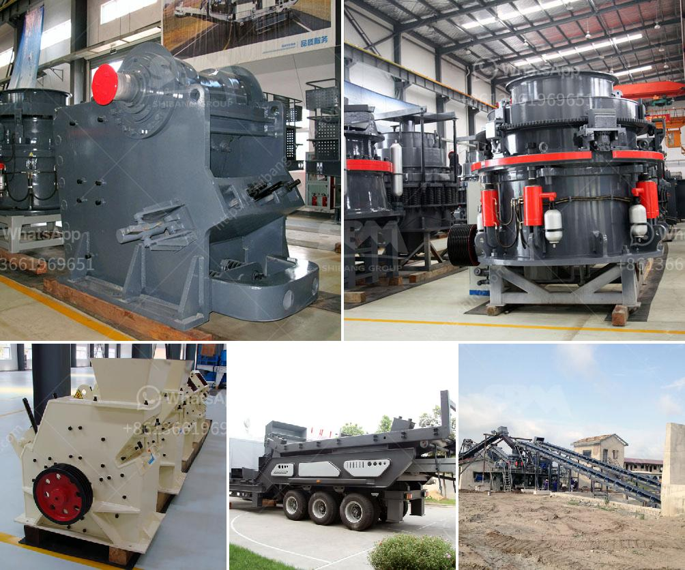

<h3>conveyor belt setup china</h3>
Conveyor belt systems play an essential role in various industries, automating the movement of goods in factories and warehouses. As one of the world's leading manufacturing hubs, China has seen a significant advancement in conveyor belt setup, revolutionizing efficiency and productivity.

China's conveyor belt market has experienced impressive growth over the years, driven by the country's booming manufacturing sector. The setup of conveyor belts in China has become highly advanced, incorporating cutting-edge technology, robust designs, and flexible configurations. These systems have transformed the way goods are moved within facilities, leading to increased efficiency and reduced labor costs.

With the development of a vast network of manufacturers specializing in conveyor belt setup, China has become a global leader in this industry. Chinese companies offer a wide range of conveyor belt solutions, catering to different industries' specific requirements. These systems are designed to handle various types of materials, including heavy-duty goods, delicate items, and even food products.

China's expertise in conveyor belt setup can be attributed to its investment in research and development. Chinese manufacturers constantly strive to improve the technology, making conveyor systems more reliable, energy-efficient, and safe. Advanced features such as automated sorting, integrated sensors, and real-time monitoring systems enable companies to maximize productivity and minimize the risk of errors or accidents.

Another key factor contributing to China's success in conveyor belt setup is the availability of skilled technicians and engineers. The country has a strong talent pool that can design, install, and maintain these complex systems effectively. Additionally, Chinese manufacturers offer comprehensive after-sales support, ensuring smooth operation and minimizing downtime.

The application of conveyor belt systems in China extends across various industries, including automotive, electronics, pharmaceuticals, agriculture, and logistics. In the automotive sector, conveyor belts facilitate assembly line production, bringing high efficiency and accuracy to the manufacturing process. In e-commerce warehouses, these systems enable seamless order fulfillment, optimizing inventory management and reducing order processing time.

Furthermore, Chinese manufacturers are also focused on sustainability and environmental protection when designing conveyor belt setups. Energy-efficient motors and materials, such as eco-friendly belts, are being used to minimize the ecological impact. This trend aligns with the global push for sustainable manufacturing practices.

Conveyor belt setup in China has not only transformed the efficiency of internal operations but also contributed to the country's export prowess. Chinese manufacturers are exporting their conveyor belt solutions worldwide, supplying industries globally with reliable and cost-effective systems.

As China's manufacturing industry continues to evolve and expand, the conveyor belt setup is poised to play an even more crucial role. The ongoing advancements in technology, innovation, and integration with other automated systems promise to bring unprecedented levels of efficiency, reliability, and safety.

In conclusion, China's conveyor belt setup is revolutionizing efficiency in industries worldwide. Chinese manufacturers have invested in advanced technology, research, and skilled labor, resulting in cutting-edge systems that optimize production, reduce costs, and improve overall productivity. The continued growth and innovation of conveyor belt setup in China will undoubtedly shape the industry's future, further solidifying China's position as a global leader.
<h3>Contact us</h3><ul><li><strong>Whatsapp:&nbsp;<a href="https://wa.me/8613661969651">+8613661969651</a></strong></li><li><a href="https://swt.shibang-china.com/?git&amp;zhl&amp;conveyor belt setup china"><strong>Online Service(chat now)</strong></a></li></ul><h3>Related</h3><ul><li><a href='marbel grinding machine.md'>marbel grinding machine</a></li><li><a href='calcium carbonate making machinery in germany.md'>calcium carbonate making machinery in germany</a></li><li><a href='vertical mill for sale.md'>vertical mill for sale</a></li><li><a href='manufacturing process of kaolin crusher.md'>manufacturing process of kaolin crusher</a></li><li><a href='silicon wafer crusher.md'>silicon wafer crusher</a></li></ul>