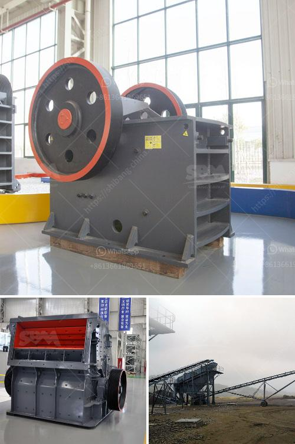

<h3>conveyor belts china</h3>
China has unquestionably emerged as a global manufacturing powerhouse, producing a wide range of goods that are exported to numerous countries worldwide. Among the many industries that thrive in China, the conveyor belt industry stands out for its tremendous growth and significant contribution to the country's economy.

Conveyor belts, the mechanical devices used to transport goods and materials in industrial settings, are in high demand across various sectors such as mining, manufacturing, agriculture, and logistics. China, with its expertise in manufacturing and cost-competitiveness, has become a leading player in the global conveyor belt market.

The rise of the conveyor belt industry in China can be attributed to several factors. Firstly, the country enjoys abundant resources, including raw materials such as rubber and steel, which are crucial in conveyor belt production. China's access to these resources ensures a steady supply and helps manufacturers to keep production costs low.

Furthermore, the Chinese government has implemented policies and initiatives that support the growth of the manufacturing industry. For instance, the "Made in China 2025" plan aims to upgrade the country's manufacturing capabilities, focusing on high-tech industries, including automation and robotics. This initiative has fueled the development of advanced conveyor belt technologies, making Chinese manufacturers more competitive in the global market.

Chinese conveyor belt manufacturers have invested heavily in research and development to improve the quality and performance of their products. They have introduced innovative materials and coatings, enhancing the durability and strength of conveyor belts. Moreover, Chinese manufacturers have adopted advanced production techniques, such as automated assembly lines, to improve productivity and ensure consistent quality.

The cost advantage of Chinese conveyor belts cannot be understated. China's low labor costs and economies of scale enable manufacturers to offer highly competitive prices. This has made Chinese conveyor belts more attractive to international buyers who seek cost-effective solutions without compromising on quality.

Chinese manufacturers have also expanded their global reach through strategic partnerships and investments. They have established manufacturing facilities and distribution networks in various countries, allowing them to provide efficient customer service and prompt deliveries. With a strong presence across the globe, Chinese conveyor belt manufacturers have gained a solid reputation for reliability and customer satisfaction.

However, it is essential to acknowledge that the rapid growth of the Chinese conveyor belt industry has not been without challenges. In recent years, environmental concerns and stricter regulations have motivated manufacturers to adopt sustainable practices. Chinese conveyor belt manufacturers have made efforts to reduce their carbon footprint by implementing energy-efficient technologies and recycling programs.

In conclusion, China's conveyor belt industry has experienced remarkable growth and plays a significant role in the global market. Its competitive pricing, extensive manufacturing capabilities, and commitment to innovation have made Chinese conveyor belts highly sought after worldwide. As China continues to invest in research and development and sustainable practices, it is poised to maintain its position as a leading conveyor belt manufacturer for years to come.
<h3>Contact us</h3><ul><li><strong>Whatsapp:&nbsp;<a href="https://wa.me/8613661969651">+8613661969651</a></strong></li><li><a href="https://swt.shibang-china.com/?git&amp;zhl&amp;conveyor belts china"><strong>Online Service(chat now)</strong></a></li></ul><h3>Related</h3><ul><li><a href='chrome mining equipment and machinery.md'>chrome mining equipment and machinery</a></li><li><a href='method statement of installation conveyor belt.md'>method statement of installation conveyor belt</a></li><li><a href='mobile stone crusher price in zimbabwe.md'>mobile stone crusher price in zimbabwe</a></li><li><a href='silica water washing plant price.md'>silica water washing plant price</a></li><li><a href='list mines and quarry owners of malaysia.md'>list mines and quarry owners of malaysia</a></li></ul>