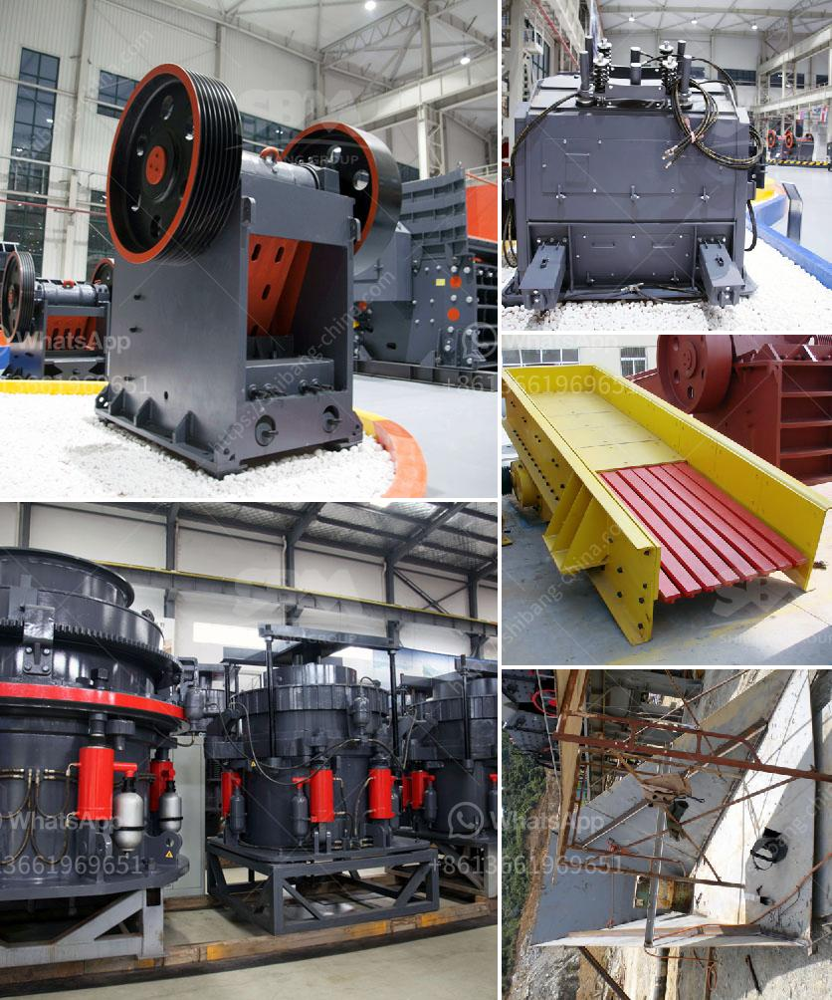

<h3>conveyor belts for aggregates</h3>
Conveyor belts are essential tools in the construction and mining industries. They are responsible for moving large volumes of heavy materials, like crushed stone, gravel, and sand, from one location to another. Historically, this task would have been arduous and costly for workers. However, thanks to the development of conveyor belts for aggregates, this process has become much more efficient and less physically demanding.

The use of conveyor belts for aggregates has revolutionized the way materials are transported on job sites. Traditionally, workers would manually transport heavy materials, such as gravel or crushed stone, from one location to another using wheelbarrows or other manual tools. This method was not only time-consuming but also physically demanding for the workers. The introduction of conveyor belts has drastically reduced the need for manual labor while improving overall productivity on construction sites.

One of the key advantages of using conveyor belts for aggregates is the speed at which materials can be transported. These belts are designed to move materials at a steady and efficient pace, which significantly improves workflow and reduces downtime. As a result, construction projects can be completed more quickly, saving both time and money.

Conveyor belts for aggregates are also highly versatile, as they can be used in a variety of applications. Whether it is moving materials across a construction site, to an aggregate processing plant, or between different stages of the production process, conveyor belts can handle the job efficiently. This versatility makes them an essential tool for many industries, including mining, construction, and manufacturing.

Furthermore, conveyor belts for aggregates are designed to handle heavy loads with ease. They are constructed from durable materials that can withstand the weight and impact of heavy materials like stone or gravel. This durability not only ensures the longevity of the belts but also minimizes the need for costly repairs or replacements.

Another significant advantage of using conveyor belts for aggregates is the enhanced safety they offer. By automating the transportation process, workers are less likely to be injured or fatigued from manual handling. Conveyor belts also reduce the risk of spills or accidents caused by manual errors, improving overall site safety. Additionally, the convenience and efficiency of these belts allow workers to focus on more critical tasks, ensuring quality control and reducing potential workplace hazards.

In conclusion, conveyor belts for aggregates have revolutionized the way heavy materials are transported in various industries. The speed, versatility, durability, and safety benefits they offer are unmatched by traditional manual handling methods. With these belts, construction and mining professionals can significantly improve productivity, reduce costs, and enhance workplace safety. As technology continues to advance, we can expect to see even more efficient and innovative conveyor belt solutions for handling aggregates in the future.
<h3>Contact us</h3><ul><li><strong>Whatsapp:&nbsp;<a href="https://wa.me/8613661969651">+8613661969651</a></strong></li><li><a href="https://swt.shibang-china.com/?git&amp;zhl&amp;conveyor belts for aggregates"><strong>Online Service(chat now)</strong></a></li></ul><h3>Related</h3><ul><li><a href='harga stone crusher kapasitas 50 ton jam.md'>harga stone crusher kapasitas 50 ton jam</a></li><li><a href='vibrating screen consumption.md'>vibrating screen consumption</a></li><li><a href='crusher for stone stone.md'>crusher for stone stone</a></li><li><a href='price on a jaw crusher in south africa.md'>price on a jaw crusher in south africa</a></li><li><a href='products hpc cone crusher.md'>products hpc cone crusher</a></li></ul>