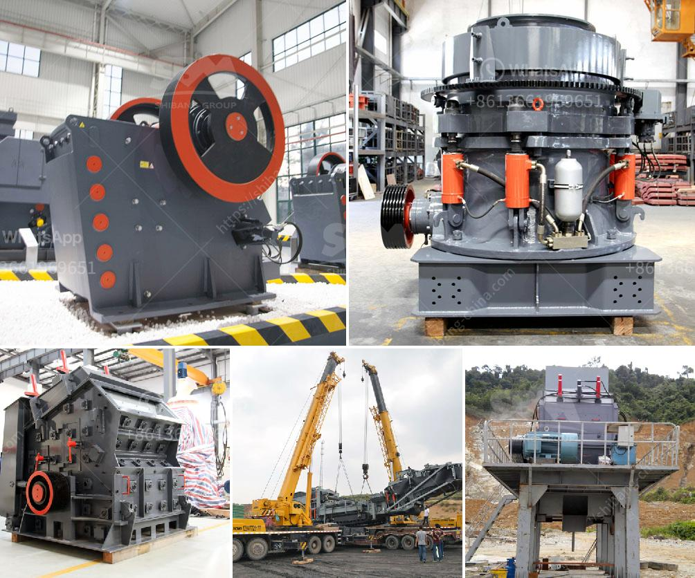

<h3>conveyor belts in coal transport sizing</h3>
Conveyor belts are a critical component in coal transportation, as they are responsible for transferring the mined coal from the extraction point to the storage and processing facilities. Sizing of conveyor belts plays a crucial role in determining the efficiency and productivity of coal transportation, as it directly impacts the loading capacity of the conveyor and reduces the need for multiple conveyor systems.

The sizing of conveyor belts in coal transport can vary based on the volume, distance, and type of coal being transported. Usually, the width of the conveyor belt is determined by the capacity required and the material's lump size. For instance, for coal transportation with larger lump size, wider belts are preferred to prevent spillage and damage to the conveyor system.

The length of the conveyor belt is determined by the distance between the extraction point and the storage or processing facility. Longer conveyor belts may require additional support systems and power to ensure efficient coal transport. Furthermore, longer belts increase the potential for belt sag, which can impact the operational performance and longevity of the conveyor system.

Another important consideration in sizing conveyor belts for coal transport is the load capacity required. The load capacity depends on factors such as the coal density, belt speed, and the desired tonnage per hour. Calculating the load capacity helps determine the necessary horsepower and belt tension required to efficiently transport coal.

In addition to load capacity, the sizing of conveyor belts should also consider the coal's characteristics, such as moisture content and abrasiveness. Moisture content affects the coal's flowability and can lead to belt slippage or material buildup. Abrasive coal may require more robust belt materials and conveyor components to withstand wear and tear.

Proper sizing of conveyor belts in coal transport can bring several advantages. Firstly, it increases the efficiency of the coal transportation process by allowing higher volumes of coal to be moved in a single operation. This reduces the need for multiple conveyor systems, thus optimizing energy consumption and operational costs.

Furthermore, correctly sized conveyor belts minimize spillage and material loss during transportation. Effective belt sizing ensures that the coal remains securely on the belt without falling or scattering, resulting in improved safety and reduced environmental impact.

Lastly, appropriately sized conveyor belts can enhance the overall productivity of coal transportation. By maximizing the loading capacity, the coal extraction and processing facilities can operate at their full potential, meeting the demand and ensuring timely delivery of coal to its intended destination.

In conclusion, the sizing of conveyor belts in coal transport is a fundamental aspect of the coal mining industry. Proper belt sizing enhances efficiency, reduces material spillage, and optimizes productivity. Factors such as lump size, distance, load capacity, and coal characteristics must be considered during belt sizing to ensure smooth and safe coal transportation. With the proper belt sizing, the coal mining industry can continue to efficiently deliver this vital energy resource to meet global demands.
<h3>Contact us</h3><ul><li><strong>Whatsapp:&nbsp;<a href="https://wa.me/8613661969651">+8613661969651</a></strong></li><li><a href="https://swt.shibang-china.com/?git&amp;zhl&amp;conveyor belts in coal transport sizing"><strong>Online Service(chat now)</strong></a></li></ul><h3>Related</h3><ul><li><a href='used korean made stone crusher.md'>used korean made stone crusher</a></li><li><a href='silica sand washing plant china.md'>silica sand washing plant china</a></li><li><a href='cost of 200tph stage bmw crushing plant.md'>cost of 200tph stage bmw crushing plant</a></li><li><a href='talcum powder grinding machine in kerala.md'>talcum powder grinding machine in kerala</a></li><li><a href='hammer crusher buhler miag titan.md'>hammer crusher buhler miag titan</a></li></ul>