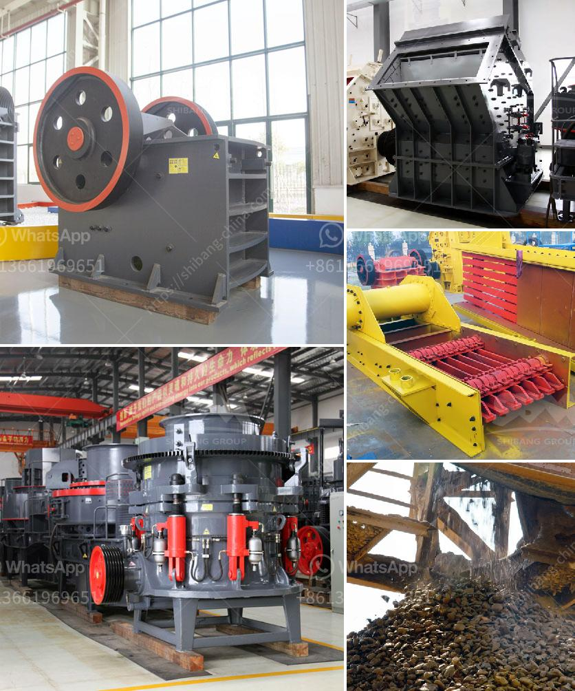

<h3>conveyor belts in port system</h3>
The use of conveyor belts in port systems has revolutionized the way goods are moved, improving efficiency and safety in the process. These belts have become an integral part of port operations, facilitating the seamless transport of cargo from one point to another.

One of the key advantages of conveyor belts in port systems is their ability to handle large volumes of cargo with minimal human intervention. An automated conveyor system ensures a continuous flow of goods, eliminating the need for manual handling and reducing the risk of injuries to workers. This not only saves time but also improves productivity in port operations.

Conveyor belts also allow for the efficient sorting and distribution of cargo. By implementing different conveyor lines for various types of goods, ports can streamline the process of loading and unloading vessels. This segregation of cargo based on type reduces the risk of damage and ensures that goods are transported to their designated locations without delay.

Furthermore, conveyor belts enable ports to handle a wide range of cargo, including bulk and heavy items. The versatility of these belts allows for the transportation of products such as coal, ore, and cement, which would be otherwise challenging to move manually. By providing a reliable and efficient means of transport, conveyor belts contribute to the overall productivity and profitability of port systems.

In addition to efficiency enhancements, conveyor belts also play a crucial role in enhancing safety in port operations. With the implementation of automated systems, the risk of accidents and injuries is significantly reduced. Workers are no longer exposed to hazardous environments, such as loading and unloading heavy cargo manually. This advanced technology ensures that operations run smoothly while minimizing the potential for human errors.

Moreover, conveyor belts are equipped with safety features that prevent accidents and damage to goods. Sensors and monitoring systems are integrated along the belt to detect any potential problems, such as jams or misalignments. These early warning systems allow for prompt intervention, ensuring the smooth operation of the conveyor system and preventing costly disruptions.

Another key safety aspect of conveyor belts is their ability to handle hazardous cargo. Ports regularly handle goods that pose risks to human health and the environment, such as chemicals and flammable materials. Conveyor belts equipped with proper containment measures and safety protocols ensure the secure transportation of these substances, mitigating the potential for accidents or environmental hazards.

In summary, the integration of conveyor belts in port systems has proven to be a game-changer. The use of these automated systems has revolutionized the movement of goods, enhancing efficiency, productivity, and safety in port operations. From handling large volumes of cargo to facilitating the sorting and distribution process, conveyor belts have become an indispensable component of modern-day ports. As technology continues to advance, so does the potential for further developments in conveyor belt systems, leading to continuous improvements in port operations worldwide.
<h3>Contact us</h3><ul><li><strong>Whatsapp:&nbsp;<a href="https://wa.me/8613661969651">+8613661969651</a></strong></li><li><a href="https://swt.shibang-china.com/?git&amp;zhl&amp;conveyor belts in port system"><strong>Online Service(chat now)</strong></a></li></ul><h3>Related</h3><ul><li><a href='price of marble grinder mill.md'>price of marble grinder mill</a></li><li><a href='jaw crusher price capacity.md'>jaw crusher price capacity</a></li><li><a href='density of conveyor belts for mining.md'>density of conveyor belts for mining</a></li><li><a href='stone crusher price of 30 tons per hour.md'>stone crusher price of 30 tons per hour</a></li><li><a href='wet and dry ball mill.md'>wet and dry ball mill</a></li></ul>