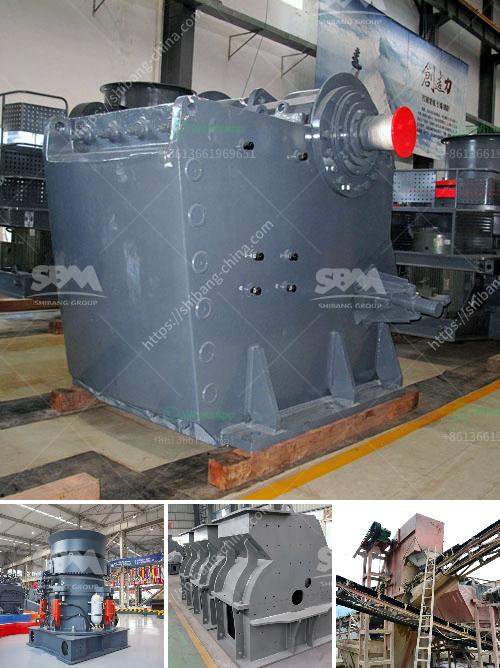

<h3>copper concentrate sellers suppliers manufacturers</h3>
Copper concentrate is a form of copper ore that is widely used in the manufacturing industry for the production of metal goods. In recent years, the global demand for copper has increased dramatically, making it an essential commodity for industrial nations.

There are several key players in the copper concentrate market, including sellers, suppliers, and manufacturers. These players play a crucial role in ensuring the adequate supply of copper concentrate to meet the global demand.

Sellers act as intermediaries between the suppliers and manufacturers. They are responsible for sourcing copper concentrate from reliable suppliers and selling it to manufacturers. These sellers often have a vast network of contacts in the industry and are well-versed in the intricacies of the copper concentrate market. They ensure a smooth flow of the product from the supplier to the manufacturer, facilitating the efficient production of metal goods.

Suppliers, on the other hand, are responsible for the production and extraction of copper concentrate. They operate mines or mining facilities where copper ore is extracted and processed to obtain copper concentrate. These suppliers play a critical role in ensuring a constant supply of copper concentrate to meet the demand. They must adhere to strict quality standards to ensure that the copper concentrate they produce meets the specifications required by manufacturers.

Manufacturers are the end-users of copper concentrate. They use the copper concentrate as a raw material for various applications, including the production of copper cathodes, wires, pipes, and other metal goods. These manufacturers play a vital role in the overall economic development of a country, as copper is a key component in many essential industries.

In recent years, the copper concentrate market has witnessed significant changes. The increased demand for copper, particularly in emerging economies, has led to a rise in the number of sellers, suppliers, and manufacturers. This surge in market players has also increased competition, resulting in more competitive pricing and improved quality standards.

To ensure a reliable supply of copper concentrate, manufacturers often establish long-term contracts with sellers or suppliers. These contracts guarantee the supply of copper concentrate over an extended period, ensuring the smooth operation of their production processes. Manufacturers also collaborate closely with sellers and suppliers to manage logistics and ensure timely deliveries to minimize downtime and maximize efficiency.

The copper concentrate market is also subject to various market forces, including fluctuations in supply and demand, changes in government regulations and policies, and currency fluctuations. These factors can significantly impact the pricing and availability of copper concentrate. Sellers, suppliers, and manufacturers must closely monitor these market forces to make informed decisions and mitigate any potential risks.

In conclusion, copper concentrate sellers, suppliers, and manufacturers play a crucial role in the global copper industry. They ensure a reliable supply of copper concentrate to meet the growing demand from various industries. Collaboration and partnerships between these market players are essential to ensure efficient production processes and sustain the overall growth of the copper market.
<h3>Contact us</h3><ul><li><strong>Whatsapp:&nbsp;<a href="https://wa.me/8613661969651">+8613661969651</a></strong></li><li><a href="https://swt.shibang-china.com/?git&amp;zhl&amp;copper concentrate sellers suppliers manufacturers"><strong>Online Service(chat now)</strong></a></li></ul><h3>Related</h3><ul><li><a href='kaolin portable crusher provider in nigeria.md'>kaolin portable crusher provider in nigeria</a></li><li><a href='ball mill grinding micronizer.md'>ball mill grinding micronizer</a></li><li><a href='mobile crushing machine sales in south africa.md'>mobile crushing machine sales in south africa</a></li><li><a href='crushing plant in pakistan.md'>crushing plant in pakistan</a></li><li><a href='sand washinng plant makers in srilanka.md'>sand washinng plant makers in srilanka</a></li></ul>