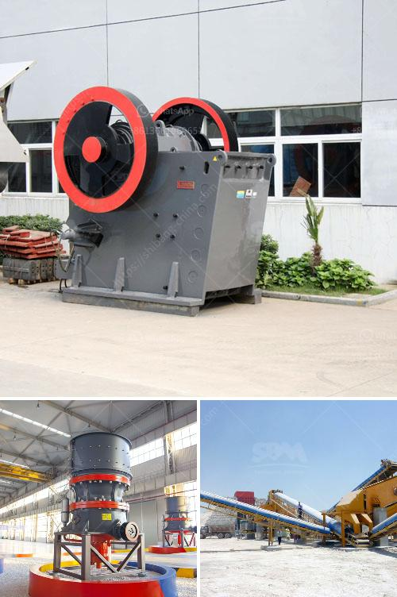

<h3>copper crusher price</h3>
Copper is one of the essential and widely used metals in various industries. Its excellent electrical conductivity, high thermal conductivity, corrosion resistance, and aesthetic appeal make it a valuable material for applications such as wiring, plumbing, electrical appliances, and construction. As a result, the demand for copper remains consistently high, affecting its market price.

The price of copper crushers, which are machines used to crush copper ores into smaller particles, is primarily determined by the economic conditions and global supply and demand factors. Economic indicators such as GDP growth, inflation, and interest rates play a significant role in shaping the market dynamics and ultimately impacting the copper crusher price.

When the economy is flourishing, with robust industrial and construction activities and increasing consumer spending, the demand for copper increases. This surge in demand puts upward pressure on the price of copper crushers. As manufacturers and construction companies require more copper for their operations, they are willing to pay higher prices to secure the necessary equipment.

Conversely, during economic downturns or when industries experience a slowdown, the demand for copper decreases. This results in a decrease in copper crusher prices as manufacturers adjust their production levels to match the reduced demand. In such cases, suppliers may also reduce prices to encourage potential buyers and stimulate market demand.

Additionally, the copper crusher prices are affected by the global supply and demand balance. China, being the largest consumer of copper globally, significantly influences the copper market. Any changes in China's economic growth or industrial policies can have a substantial impact on copper prices worldwide. For instance, if China increases its copper imports, the demand rises, leading to higher prices.

Furthermore, the cost of copper crushers is also influenced by the availability of copper ores. Copper is primarily obtained from mines, and any disruptions in mining activities can affect the supply and, subsequently, the price. Factors such as labor strikes, geopolitical tensions, environmental regulations, and natural disasters can interrupt mining operations, leading to a temporary shortage of copper ores and potential price spikes.

It is essential to consider that fluctuations in copper crusher prices can also be influenced by speculation in the commodities market. Traders and investors sometimes take positions in copper futures, betting on future price movements. These speculative activities can create short-term price volatility that might not be reflective of the true supply and demand fundamentals.

In conclusion, the price of copper crushers is determined by various factors, including economic conditions, global supply and demand dynamics, availability of copper ores, and speculative activities. As the demand for copper fluctuates with economic growth and industrial activities, the price of copper crushers follows suit. Understanding these factors is crucial for businesses operating in industries that rely on copper and can help them make informed decisions regarding their equipment investments.
<h3>Contact us</h3><ul><li><strong>Whatsapp:&nbsp;<a href="https://wa.me/8613661969651">+8613661969651</a></strong></li><li><a href="https://swt.shibang-china.com/?git&amp;zhl&amp;copper crusher price"><strong>Online Service(chat now)</strong></a></li></ul><h3>Related</h3><ul><li><a href='small jaw crusher supplier.md'>small jaw crusher supplier</a></li><li><a href='silica sand machinery manufacture.md'>silica sand machinery manufacture</a></li><li><a href='ballast crusher cost.md'>ballast crusher cost</a></li><li><a href='vibrating screen for silica sand.md'>vibrating screen for silica sand</a></li><li><a href='stone crushing sample business plan.md'>stone crushing sample business plan</a></li></ul>