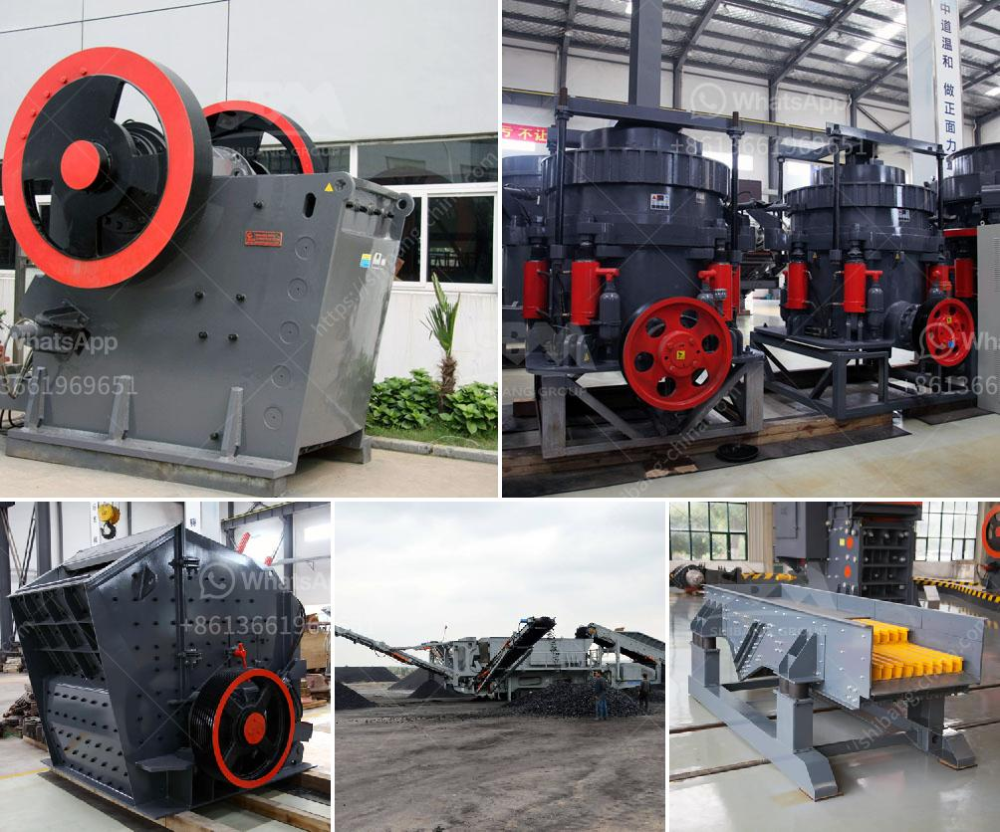

<h3>copper ore concentrator suppliers india</h3>
India is steadily becoming a significant consumer of copper in the global market. As various industries, such as construction, electronics, and transportation, continue to grow, the demand for copper is also on the rise. To meet this increasing demand, copper ore concentrator suppliers in India play a crucial role in the production and distribution of copper ore.

Copper ore concentrators are facilities that extract copper from copper ore. They come in various forms, such as flotation plants, which separate copper minerals from waste rock through the use of chemicals and physical actions. These concentrators are essential as they increase the concentration of copper in the ore, making it easier and more cost-effective to extract and process.

India's rich mineral resources have made it one of the top producers and consumers of copper ore in the world. However, despite having significant copper deposits, the country faces challenges in meeting its demand due to a lack of sufficient copper ore concentrator suppliers. Many of the existing concentrators are outdated or unable to handle the rising demand.

To address this issue, several companies in India have invested in modernizing their copper ore concentrator facilities. These upgrades include the installation of advanced equipment and technology, ensuring efficient extraction and processing operations. Additionally, efforts are being made to enhance the overall capacity of these facilities to meet the growing demand.

Furthermore, to cater to the increasing demand for copper, new concentrators are being constructed in different parts of the country. These new facilities will not only increase the production capacity but also boost employment opportunities and contribute to the overall economic growth in the region.

Collaborations with international copper ore concentrator suppliers have also been established to exchange knowledge and expertise. This collaboration enables Indian companies to integrate advanced technologies and best practices into their operations, enhancing efficiency and productivity.

However, challenges remain in the sector. One major issue is environmental concerns associated with copper extraction and processing. As the demand for copper increases, the environmental impact of mining and concentrate production becomes a more pressing issue. It is essential for copper ore concentrator suppliers to adopt sustainable practices, including minimizing waste production and implementing effective waste management strategies.

Additionally, the fluctuating global copper prices pose challenges for both suppliers and consumers. The copper market is influenced by various factors, such as global demand, geopolitical events, and supply disruptions. Suppliers need to stay updated with market trends and adapt their operations accordingly to ensure stability and profitability.

In conclusion, copper ore concentrator suppliers in India are playing a crucial role in meeting the growing demand for copper. Through investments in modernization, collaboration with international suppliers, and the construction of new facilities, the Indian copper industry aims to enhance its extraction and processing capabilities. However, it is crucial for these suppliers to address environmental concerns and adapt to market fluctuations to ensure sustainable growth in the long run.
<h3>Contact us</h3><ul><li><strong>Whatsapp:&nbsp;<a href="https://wa.me/8613661969651">+8613661969651</a></strong></li><li><a href="https://swt.shibang-china.com/?git&amp;zhl&amp;copper ore concentrator suppliers india"><strong>Online Service(chat now)</strong></a></li></ul><h3>Related</h3><ul><li><a href='double roller stone cracher.md'>double roller stone cracher</a></li><li><a href='hammer mill for sale ebay.md'>hammer mill for sale ebay</a></li><li><a href='raymond mill for sale second hand.md'>raymond mill for sale second hand</a></li><li><a href='limestone powder making plant ireland.md'>limestone powder making plant ireland</a></li><li><a href='manganese crushing machine in china.md'>manganese crushing machine in china</a></li></ul>