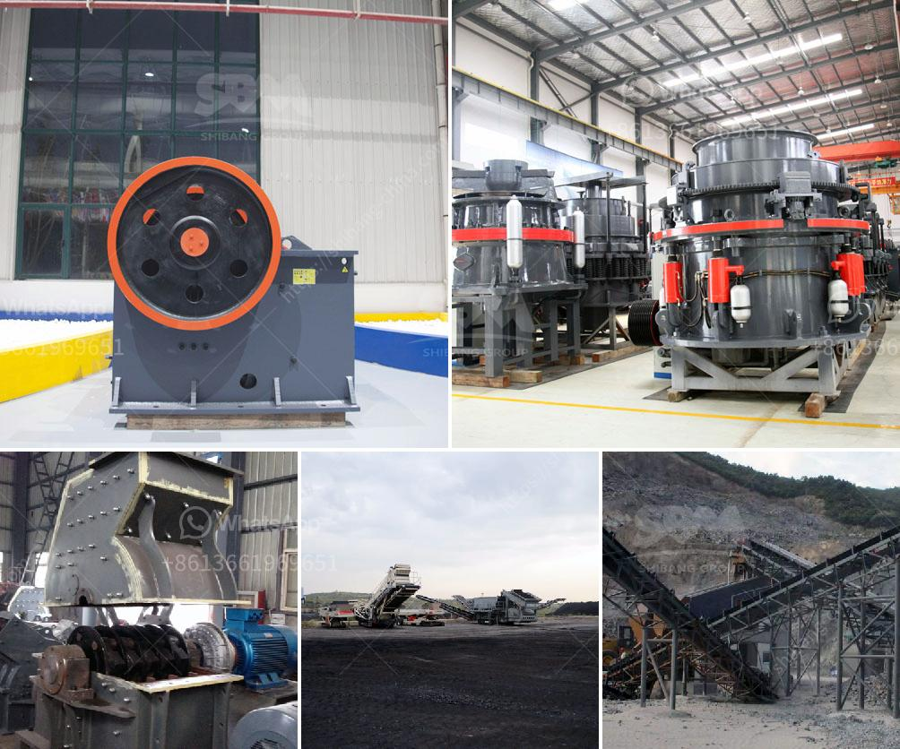

<h3>copper ore crushing plant brazil</h3>
Mining is one of the most essential industries worldwide, and copper is utilized for various applications. Copper is the third most used metal worldwide, after iron and aluminum, and is a vital component in infrastructure and machinery. Brazil has a rich history in copper mining and is currently one of the largest producers of this precious metal.

Copper ore is typically found in large deposits and must be extracted from the ground before it can be processed. The crushing stage is an important part of the mining process, as it reduces the size of the ore into smaller particles. This allows for easier extraction and facilitates the separation of valuable copper from the waste rock.

Brazil is home to several copper mining projects, such as the Carajás mine, which is one of the world's largest copper mines. In order to meet the increasing demand for copper, Brazil has invested heavily in developing efficient and sustainable copper ore crushing plants.

Copper ore crushing plants in Brazil can not only be used for crushing copper ore, but also for dolomite, granite, quartzite, and other hard stones. These crushing plants are efficient, cost-effective, and environmentally friendly, making them the ideal choice for any copper mining operation.

The use of advanced crushing machinery ensures higher efficiency and productivity in copper ore crushing plants. The machines are designed to handle large volumes of ore and reduce it to the desired size. This not only saves time but also cuts down on operational costs.

Furthermore, these plants employ environmentally friendly technologies to minimize the impact on the environment. They incorporate dust control systems, water recycling systems, and noise reduction measures, ensuring that the crushing process has minimal impact on the surrounding ecosystem.

In conclusion, Brazil has established itself as a hotspot for copper mining, with an increasing focus on developing efficient and sustainable copper ore crushing plants. These plants offer not only high efficiency and productivity but also prioritization of environmental sustainability. With further investments in this sector, Brazil is poised to become a global leader in copper mining and processing.
<h3>Contact us</h3><ul><li><strong>Whatsapp:&nbsp;<a href="https://wa.me/8613661969651">+8613661969651</a></strong></li><li><a href="https://swt.shibang-china.com/?git&amp;zhl&amp;copper ore crushing plant brazil"><strong>Online Service(chat now)</strong></a></li></ul><h3>Related</h3><ul><li><a href='india jaw crusher of small capacity.md'>india jaw crusher of small capacity</a></li><li><a href='scale copper ore processing equipment for sale congo.md'>scale copper ore processing equipment for sale congo</a></li><li><a href='fine grinding equipment.md'>fine grinding equipment</a></li><li><a href='manganese ore mining processing process equipment.md'>manganese ore mining processing process equipment</a></li><li><a href='petroleum coke process.md'>petroleum coke process</a></li></ul>