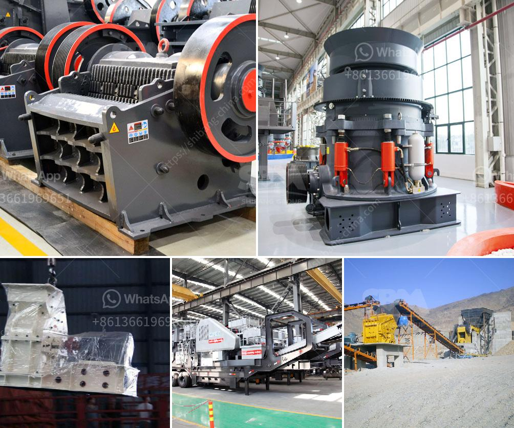

<h3>copper oxide beneficiation plant china</h3>
China is one of the leading producers of copper oxide, which is used for various purposes in industries such as electrical, electronics, and plumbing. Copper oxide beneficiation plants are crucial in the processing of copper oxide ores using hydrometallurgical techniques. The use of these plants ensures that copper oxide minerals are separated from the gangue and minerals, while impurities are removed, resulting in a high-grade copper concentrate suitable for further processing or export.

One such prominent copper oxide beneficiation plant in China is the Xiushan Copper Mine, which is strategically located in the Henan province. It has an extensive reserve base, covering an area of approximately 20 square kilometers, with estimated copper mineral reserves of over one billion tons. The Xiushan Copper Mine is operated by the China Copper Corporation, a state-owned enterprise, and serves as a key supplier of copper oxide globally.

The beneficiation process at the Xiushan Copper Mine involves the extraction of copper oxide minerals from the ore using a combination of crushing, milling, flotation, and leaching techniques. The ore is initially crushed into smaller particles and then ground into a fine powder using a ball mill. This fine powder is then mixed with water and chemicals, such as collectors and frothers, to create a slurry.

The slurry is subjected to the flotation process, where air bubbles are introduced to the slurry, causing the copper oxide minerals to adhere to the air bubbles, while the gangue minerals sink. The resulting froth, rich in copper oxide minerals, is skimmed off and further processed to obtain a copper concentrate with high copper content.

The copper concentrate is then subjected to leaching, where it is mixed with a suitable acid solution, such as sulfuric acid, to dissolve the copper oxide minerals. This process helps remove impurities and further concentrate the copper content. The leached solution is then treated to recover the dissolved copper, which can be subsequently refined and used for various industrial applications.

The beneficiation plant at Xiushan Copper Mine is equipped with state-of-the-art equipment and machinery, ensuring efficient and environmentally friendly operations. Continuous monitoring and control systems are in place to optimize the production process and minimize the impact on the environment. The plant also has advanced waste management systems to handle the byproducts and residues generated during the beneficiation process.

China's copper oxide beneficiation plants, such as the one at Xiushan Copper Mine, play a vital role in meeting the growing demand for copper oxide, both domestically and globally. These plants ensure efficient extraction and processing of copper oxide ores, resulting in high-quality copper concentrates that can be used to produce various copper products. With continuous advancements in technology and increasing environmental regulations, China's copper oxide beneficiation plants are committed to sustainable practices and making significant contributions to the copper industry.
<h3>Contact us</h3><ul><li><strong>Whatsapp:&nbsp;<a href="https://wa.me/8613661969651">+8613661969651</a></strong></li><li><a href="https://swt.shibang-china.com/?git&amp;zhl&amp;copper oxide beneficiation plant china"><strong>Online Service(chat now)</strong></a></li></ul><h3>Related</h3><ul><li><a href='cost of stone crusher in nigeria.md'>cost of stone crusher in nigeria</a></li><li><a href='grinding grinding equipment grinding.md'>grinding grinding equipment grinding</a></li><li><a href='china gold processing plant.md'>china gold processing plant</a></li><li><a href='iron ore crusher units in orissa.md'>iron ore crusher units in orissa</a></li><li><a href='silica powder grinding machine.md'>silica powder grinding machine</a></li></ul>