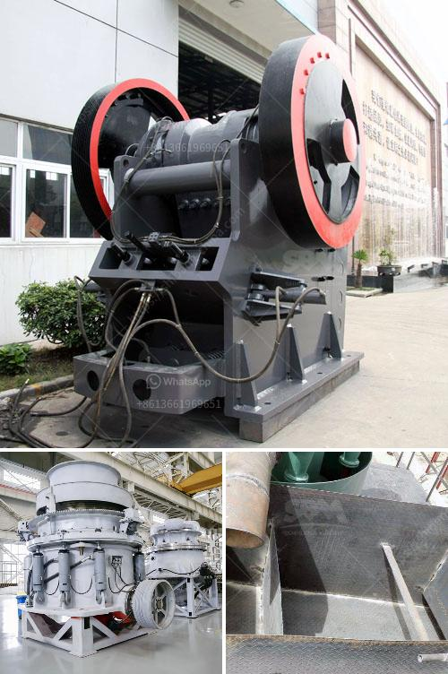

<h3>copper oxide processing plant</h3>
Copper oxide, also known as cupric oxide or black copper oxide, is an important compound in various industries. It is widely used in the production of pigments, batteries, electronics, and other applications. To meet the rising demand for copper oxide, processing plants are established to extract copper oxide from copper ores.

A copper oxide processing plant is a vital part of processing copper ores. Copper oxide ores are commonly found in difficult-to-mine and complex ore bodies. These ores require extensive processing to break them down into a usable form and extract the valuable copper oxide. 

The primary steps involved in a copper oxide processing plant include crushing, grinding, leaching, and flotation. Crushing and grinding are necessary to break down the large rocks and particles, making it easier to extract the copper oxide. The crushed ore is then further ground into a finer powder to increase the surface area for better leaching.

Leaching is a significant step in the copper oxide processing plant. It involves dissolving the copper oxide from the ore using a leaching solution. The leaching solution may consist of acidified water or specific chemicals that facilitate the copper oxide dissolution. This process extracts the copper oxide from the ore and transfers it into the leaching solution.

The leaching solution, now containing dissolved copper oxide, undergoes further processing to separate the copper oxide from impurities. This is usually done through a process called solvent extraction-electrowinning (SX-EW). In this process, the leaching solution is mixed with an organic solvent that selectively binds with the copper oxide, separating it from other components in the solution. The copper oxide is then extracted from the organic solvent through electrowinning, which involves applying an electric current to the solution. The electric current causes the copper oxide to deposit onto electrodes, forming pure copper cathodes.

The final step in a copper oxide processing plant is the filtration and drying of the copper oxide product. The extracted copper oxide undergoes filtration to remove any remaining impurities and excess moisture. The filtered copper oxide is then dried to optimize its handling and storage properties.

A well-designed copper oxide processing plant takes into account factors like ore quality, processing efficiency, and environmental impact. Efficiency and cost-effectiveness are essential considerations to ensure a profitable operation. This includes optimizing the process parameters, using modern equipment, and implementing process automation to maximize production and minimize downtime.

Moreover, sustainability and environmental responsibility play a crucial role in copper oxide processing plants. Measures such as efficient waste management, water recycling, and emissions control are implemented to minimize the plant's environmental footprint and comply with regulatory requirements.

In conclusion, a copper oxide processing plant is an integral part of turning copper oxide ores into usable copper products. The extraction and processing steps involved in a copper oxide processing plant are crucial in producing high-quality copper oxide with optimal efficiency and sustainability. With the increasing demand for copper oxide in various industries, these processing plants play a vital role in meeting the market's needs.
<h3>Contact us</h3><ul><li><strong>Whatsapp:&nbsp;<a href="https://wa.me/8613661969651">+8613661969651</a></strong></li><li><a href="https://swt.shibang-china.com/?git&amp;zhl&amp;copper oxide processing plant"><strong>Online Service(chat now)</strong></a></li></ul><h3>Related</h3><ul><li><a href='limestone crusher in cement plant for environmental.md'>limestone crusher in cement plant for environmental</a></li><li><a href='granite crusher in kenya.md'>granite crusher in kenya</a></li><li><a href='sell 150 tph stone crusher.md'>sell 150 tph stone crusher</a></li><li><a href='silica sand import in europe.md'>silica sand import in europe</a></li><li><a href='impact crusher saudi.md'>impact crusher saudi</a></li></ul>