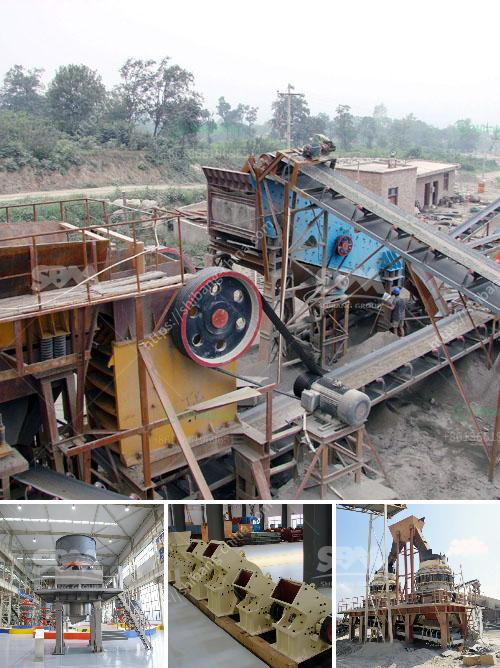

<h3>copper processing stages</h3>
Copper is a versatile metal that has been used by humans for thousands of years due to its excellent conductivity and durability. It is widely used in various industries, including electrical, automotive, plumbing, and construction. However, before copper can be used in these applications, it must go through several processing stages to obtain the desired purity and form. In this article, we will explore the stages involved in copper processing.

1. Mining: The first stage in copper processing is mining. Copper ores are extracted from mines using either underground or open-pit methods. Underground mining involves digging tunnels or shafts into the earth to reach the copper deposit, while open-pit mining entails removing the surface layer of soil and rock to access the ore.

2. Crushing and Grinding: Once the copper-bearing rocks are extracted, they are crushed into smaller pieces and then ground into a fine powder using various mechanical processes. This step helps increase the surface area of the ore, allowing for better exposure to the chemical reagents used in subsequent stages.

3. Froth Floatation: After the ore is ground, it undergoes froth floatation, a process that separates the valuable minerals from the gangue (unwanted materials). In this stage, a chemical reagent called a collector is added to the ore slurry. The collector selectively binds to the copper minerals, forming bubbles on their surface. These bubbles then float to the surface, where they are removed, leaving behind a concentrated copper-rich solution called concentrate.

4. Smelting: The concentrate obtained from froth floatation is then smelted in a furnace at high temperatures. During smelting, the copper concentrate is mixed with fluxes (such as limestone and silica) and heated to around 1200-1300 degrees Celsius. This process helps remove impurities, such as sulfur and iron, and produces molten copper, known as blister copper, which is about 98-99% pure.

5. Refining: To further purify the blister copper, it undergoes a refining process. The most common method is electrolytic refining, where an electric current is passed through the molten copper, causing impurities to migrate from the anode to the cathode. The impurities settle at the bottom, forming a layer known as anode sludge, while the pure copper accumulates at the cathode. This refined copper is then cast into various shapes, such as bars or ingots, for further processing or direct use.

6. Fabrication: Once the copper is in its pure form, it can be further processed into various products. This includes extrusion, where the copper is forced through a die to create long continuous shapes like pipes or wires, and rolling, where it is passed through a series of rollers to reduce its thickness and produce sheets or strips. Other fabrication methods include casting, forging, and machining, all of which help shape the copper into the desired final products.

In conclusion, copper processing involves several stages that transform copper ore from the ground into a pure, usable metal. From mining and crushing to smelting, refining, and fabrication, each stage plays a crucial role in extracting and processing copper for various applications. As the demand for copper continues to grow, it is essential to ensure sustainable and efficient processing techniques that minimize environmental impacts while maximizing the metal's potential.
<h3>Contact us</h3><ul><li><strong>Whatsapp:&nbsp;<a href="https://wa.me/8613661969651">+8613661969651</a></strong></li><li><a href="https://swt.shibang-china.com/?git&amp;zhl&amp;copper processing stages"><strong>Online Service(chat now)</strong></a></li></ul><h3>Related</h3><ul><li><a href='coal wash plant for sale in malaysia.md'>coal wash plant for sale in malaysia</a></li><li><a href='vertical ultra fine pulverizer.md'>vertical ultra fine pulverizer</a></li><li><a href='sand and gravel exploration equipment.md'>sand and gravel exploration equipment</a></li><li><a href='to ton hr rock crushers.md'>to ton hr rock crushers</a></li><li><a href='used portable roller crushers and screens scmmining.md'>used portable roller crushers and screens scmmining</a></li></ul>