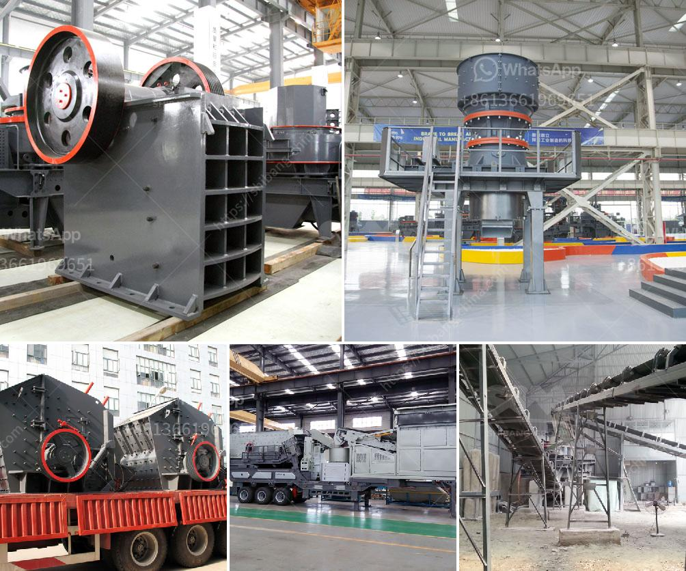

<h3>cost 100tph stone crusher in india</h3>
Stone crusher is one of the main types of primary crushers used in stone quarrying or mine ore crushing process and also is one of the most widely used crushing equipments in mining industry. The crushing ratio of this series of jaw crusher can reach 4-6 and the shape of final product is even and fineness is 10mm - 40 mm. Because it is primary crusher, Jaw crusher is designed for long life service with minimum maintenance for hard, tough, abrasive material and overload high capacity.

Jaw crusher parts are available for ZENITH, offer crusher parts (jaw plates, cone concave, crusher hammers, liner plates, Blow Bars), stone crusher and mobile crusher. We can help you to set complete crushing production line or sand making line for crusher cost solutions.

Jaw stone crusher machine manufacturer India means an essential role in the market. There are different jaw crusher types and models, they are widely used in the industrial sector such as mining, building materials, highway, railway, water conservancy, chemical industry, and other industries. Since Jaw crushers are used on the scale, production capacity has revitalized the high input of jaw crusher equipment energy, product grain shape, grinding performance, eccentric screening, and analysis efficiency are all leading.

A jaw crusher is a primary crusher in an ore processing plant or a mine. The jaw crusher has a square or rectangular designed feed opening. Through compression, jaw crusher reduces ore and large rocks into small rocks. For a successful rock crushing, the stone remains in the jaws until it is broken small enough to pass through the narrow opening at the bottom of the jaws.

The most common jaw crusher is the single toggle jaw crusher, which is usually used for primary crushing of large stones and breaking various ores and lump materials into medium-grained gravel.

In conclusion, the cost 100tph stone crusher in India is relatively affordable. It is worth considering for small or medium-sized investors. The equipment is designed to achieve maximum output and minimum cost. It is easy to use and maintain. Zenith will provide the best pre-sales and after-sales service for customers. In addition, we also provide other types and models of crushers and grinding mills for different materials and product requirements. It is recommended to consult us directly for professional advice and guidance.
<h3>Contact us</h3><ul><li><strong>Whatsapp:&nbsp;<a href="https://wa.me/8613661969651">+8613661969651</a></strong></li><li><a href="https://swt.shibang-china.com/?git&amp;zhl&amp;cost 100tph stone crusher in india"><strong>Online Service(chat now)</strong></a></li></ul><h3>Related</h3><ul><li><a href='pulverizers bauxite.md'>pulverizers bauxite</a></li><li><a href='secondary zinc production equipment.md'>secondary zinc production equipment</a></li><li><a href='mobile quarry plant.md'>mobile quarry plant</a></li><li><a href='tonnes aggregate crusher in south africa crusher.md'>tonnes aggregate crusher in south africa crusher</a></li><li><a href='hammer mill diagram.md'>hammer mill diagram</a></li></ul>