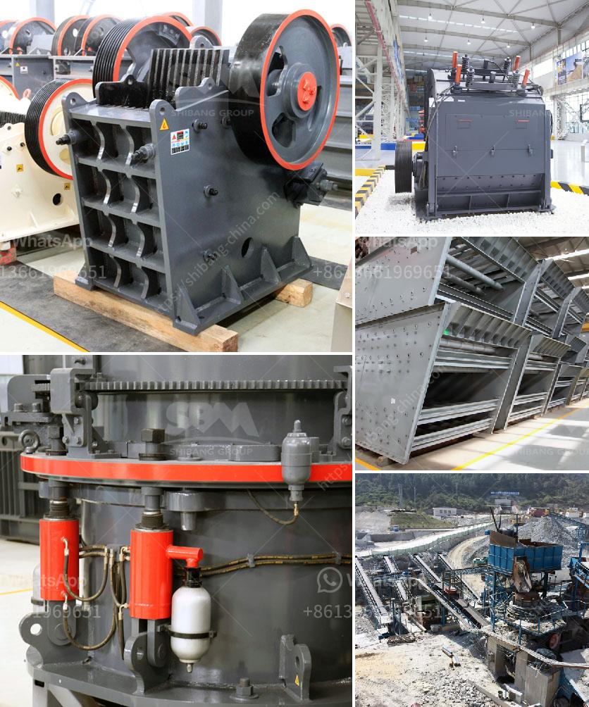

<h3>cost a stone crusher</h3>
Stone crushing industry is an important industrial sector in many countries, engaged in producing crushed stone of various sizes depending upon the requirement which acts as raw material for various construction activities such as construction of roads, highways, bridges, buildings, canals etc. It is estimated that there are over 12,000 stone crusher units in India. The number is expected to grow further keeping in view the future plans for development of infrastructure of roads, canals and buildings that are required for the overall development of the country. In India, the Stone Crushing Industry sector is estimated to have an annual turnover of Rs. 5000 crore (equivalent to over US$ 1 billion) and is therefore an economically important sector.

Stone crushing operations have been a major cause of pollution in many areas. The dust generated during stone crushing can lead to respiratory problems and other health-related issues. The cost of a stone crusher crushing equipment also affects the overall initial cost of the project. Installing a stone crusher will have high initial investment cost compared with the bare machine of the same specifications.

Let's analyze the cost of purchasing stone crushing equipment in the market at present. How much does it cost to establish a stone crushing production line? The key to the configuration of the production line is the attention to that it does not require material transportation, which is convenient.

The price of a complete set of stone crushing production line is affected by various factors, such as capacity, market competition, regional differences, raw materials, brands, etc. Therefore, the specific configuration plan of the selected production line should be carefully evaluated. The cost of different equipment in the equipment configuration is different, affecting the production cost. At present, the equipment commonly used in stone crushing production lines includes jaw crusher, impact crusher, cone crusher, hammer crusher, VSI crusher, etc.

Part of the equipment cost includes the necessary accessories for each type of equipment, such as jaw plates, hammers, counter linings, etc., which also need to be replaced regularly. The high cost of equipment accessories directly affects the overall equipment operation cost, which should not be ignored.

Another important factor affecting the cost of a stone crusher is transportation. Transportation cost is mainly manifested in the transportation of raw materials, that is, the cost of transportation from the place where the raw material is produced to the production site of the stone crushing production line and the transportation of finished products. Transportation cost is directly related to the intensity of regional infrastructure construction and the distance between the production site and the raw material mining site.

In conclusion, the cost of a stone crusher includes the initial cost, cost of equipment accessories, transportation cost, and other related costs. It is recommended to conduct a comprehensive cost analysis before purchasing stone crushing equipment to ensure that the investment is reasonable and profitable. With the rapid development of the construction industry, the demand for stone crushers will continue to grow, making it a profitable venture for investment.
<h3>Contact us</h3><ul><li><strong>Whatsapp:&nbsp;<a href="https://wa.me/8613661969651">+8613661969651</a></strong></li><li><a href="https://swt.shibang-china.com/?git&amp;zhl&amp;cost a stone crusher"><strong>Online Service(chat now)</strong></a></li></ul><h3>Related</h3><ul><li><a href='rock crushing machine suppliers.md'>rock crushing machine suppliers</a></li><li><a href='cebu supplier of disposable jaw crusher.md'>cebu supplier of disposable jaw crusher</a></li><li><a href='mobile crusher sales in nairobi.md'>mobile crusher sales in nairobi</a></li><li><a href='bentonite crushing manufacturing process.md'>bentonite crushing manufacturing process</a></li><li><a href='small scale gold mining plant in zimbabwe.md'>small scale gold mining plant in zimbabwe</a></li></ul>