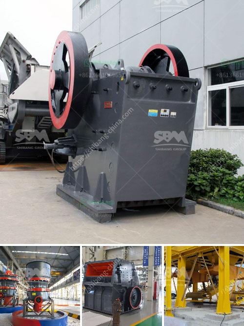

<h3>cost of 200tph stage bmw crushing plant</h3>
The cost of a 200tph stage BMW crushing plant can vary significantly depending on multiple factors. These factors include the location of the plant, the quality of the equipment, the overall scope of the project, and the specific requirements and preferences of the customer. In this article, we will discuss these factors and provide a rough estimate of the cost range for a 200tph stage BMW crushing plant.

Location plays a crucial role in determining the cost of a crushing plant. Transportation costs can add up significantly if the plant needs to be shipped from a distant location. Additionally, the availability of skilled labor and raw materials can vary from one location to another, which can impact both the cost and the timeline of the project. Therefore, it is essential to consider these factors and choose a location that offers a favorable environment for the construction and operation of a crushing plant.

The quality of the equipment is another crucial aspect to consider when estimating the cost of a 200tph stage BMW crushing plant. High-quality equipment tends to be more expensive upfront but can often provide better performance, reliability, and longevity. Cheaper equipment may save money initially, but it could lead to higher maintenance costs and lower productivity in the long run. Therefore, it is important to strike a balance between the upfront cost and the long-term value provided by the equipment.

The overall scope of the project also affects the cost of a crushing plant. This includes the design, construction, and commissioning of the plant, as well as any additional features or customization required. Some customers may have specific preferences or regulatory requirements that need to be accounted for, which can add to the overall cost. Therefore, it is crucial to clearly define the scope of the project and ensure that all necessary aspects are considered in the cost estimation.

As for a rough cost estimation, a 200tph stage BMW crushing plant can range anywhere from $500,000 to $2,000,000. This figure includes the cost of equipment, design, construction, commissioning, and any additional features or customization. It is important to note that this is just an estimate, and the actual cost can vary significantly based on the individual factors mentioned earlier.

In conclusion, the cost of a 200tph stage BMW crushing plant can vary depending on factors such as location, equipment quality, project scope, and customer preferences. It is essential to carefully assess these factors and work with experienced professionals to develop an accurate cost estimation. Investing in a high-quality crushing plant can be a significant upfront cost, but it can provide long-term value, improved productivity, and an overall better return on investment.
<h3>Contact us</h3><ul><li><strong>Whatsapp:&nbsp;<a href="https://wa.me/8613661969651">+8613661969651</a></strong></li><li><a href="https://swt.shibang-china.com/?git&amp;zhl&amp;cost of 200tph stage bmw crushing plant"><strong>Online Service(chat now)</strong></a></li></ul><h3>Related</h3><ul><li><a href='coal conveyor manufacturer germany.md'>coal conveyor manufacturer germany</a></li><li><a href='crusher and screen for sale philippines.md'>crusher and screen for sale philippines</a></li><li><a href='crusher machine for feldspar.md'>crusher machine for feldspar</a></li><li><a href='stone crusher manufacturers.md'>stone crusher manufacturers</a></li><li><a href='screening machine for phosphate mineral processing zmy.md'>screening machine for phosphate mineral processing zmy</a></li></ul>