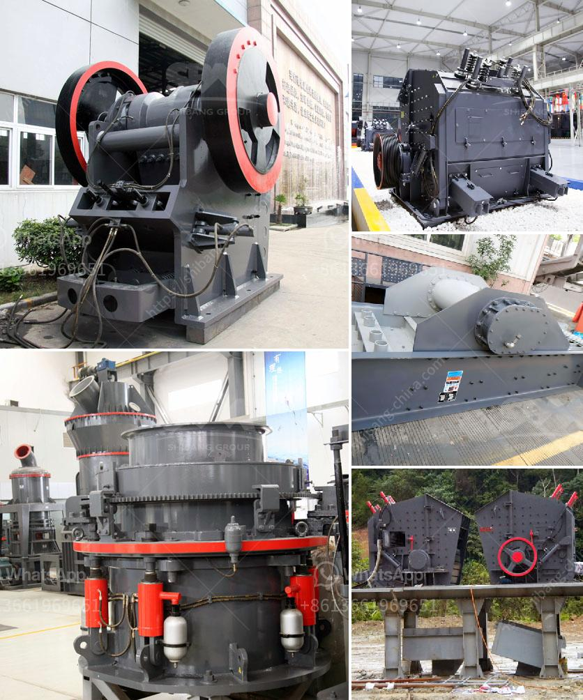

<h3>cost of a primairy crusher</h3>
When it comes to the mining industry, one of the most critical pieces of equipment is the primary crusher. This heavy-duty machine is responsible for reducing large rocks into smaller, more manageable sizes, making them easier to process further down the line. However, the cost of a primary crusher can vary depending on several factors.

First and foremost, the size and capacity of the crusher play a significant role in determining its cost. A primary crusher with a higher capacity will typically have a higher price tag, as it can handle larger rocks and process more material per hour. Conversely, a smaller capacity primary crusher will be more affordable but may not be able to handle larger rocks efficiently.

Another factor that influences the cost is the type of crusher itself. Primary crushers come in various types, including jaw crushers, gyratory crushers, and impact crushers. Each type has its pros and cons, and the specific needs of the mining operation will dictate which type is the most suitable. Generally, jaw crushers are more affordable but have a lower throughput capacity compared to gyratory or impact crushers.

Furthermore, the location and accessibility of the mining site can impact the cost of a primary crusher. If the site is remote or located in a challenging terrain, transporting a heavy crusher can be expensive. Additionally, if there are limited roads or infrastructure, the cost of installation and ongoing maintenance could be higher.

One should also consider the overall lifespan of the primary crusher. While the initial cost may seem significant, if the machine has a long lifespan and requires minimal maintenance, it can provide a good return on investment in the long run. A high-quality crusher with proven reliability and durability may cost more upfront but could save money on replacement parts and downtime in the future.

In conclusion, the cost of a primary crusher can vary depending on factors such as size, capacity, type, location, and longevity. It is crucial for mining companies to evaluate their specific needs and budget constraints before investing in this equipment. Choosing the right primary crusher that balances performance, cost, and longevity is essential for a successful mining operation.
<h3>Contact us</h3><ul><li><strong>Whatsapp:&nbsp;<a href="https://wa.me/8613661969651">+8613661969651</a></strong></li><li><a href="https://swt.shibang-china.com/?git&amp;zhl&amp;cost of a primairy crusher"><strong>Online Service(chat now)</strong></a></li></ul><h3>Related</h3><ul><li><a href='price of gypsum plant machines.md'>price of gypsum plant machines</a></li><li><a href='crusher manufacturers in south africa.md'>crusher manufacturers in south africa</a></li><li><a href='jaw crusher design handbook.md'>jaw crusher design handbook</a></li><li><a href='silica sand washing plant china.md'>silica sand washing plant china</a></li><li><a href='how to make coal in process.md'>how to make coal in process</a></li></ul>