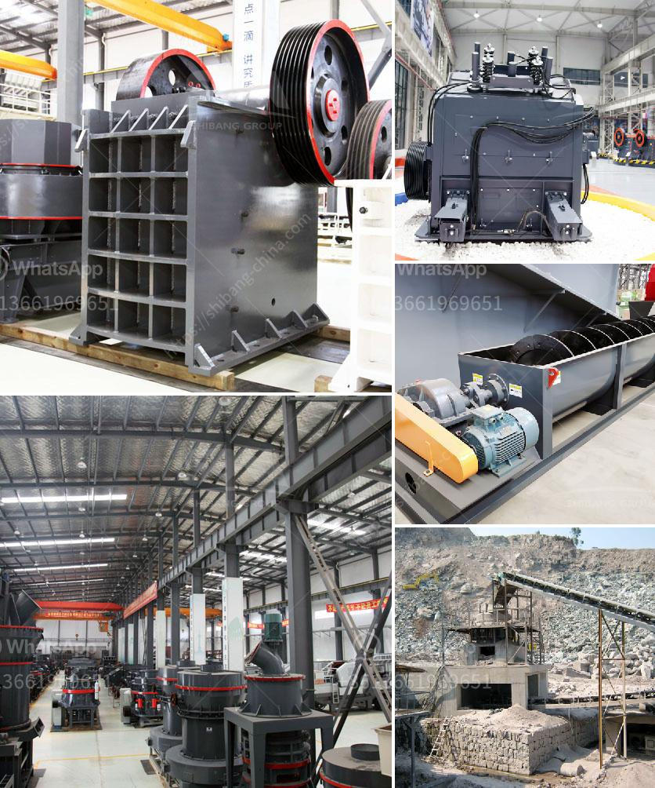

<h3>cost of a small scale cement plant in india</h3>
The cement industry is one of the most prominent industries in India. In recent years, the demand for cement has been increasing due to government initiatives to develop infrastructure projects. However, starting a cement plant is not an easy task as it requires substantial capital investment.

India is known for its low-cost and high-quality cement production. The country has abundant resources of limestone, a key raw material used in cement manufacturing. As per the recent estimates, the total reserves of limestone in India are about 93 billion tons. However, the quality of the limestone is not uniform, and maintaining consistent quality is a challenge for cement manufacturers.

To set up a cement plant in India, with an investment of around INR 1.5 to 2 billion, industry experts suggest starting with a smaller capacity plant of around 200-300 TPD. They advise that this capacity is sufficient to cater to regional markets with total cost of ownership of around INR 15-20 million.

The total cost of the project depends on your capacity of the cement plant. Larger capacity plants will have a higher capital cost per ton of cement produced. This is because some of the technologies that are commonly used in large-scale plants are not feasible in the low-cost market.

The scale of a cement plant determines its profitability and return on investment. Companies have to balance the initial investment with the long-term potential. A small-scale cement plant in India can be profitable even with lean cement production practices. This is due to the cost-effective machinery and equipment that they are able to utilize, which is cheaper than what is typically used in large-scale plants.

The key to setting up a profitable small-scale cement plant in India is high-quality limestone, which can provide consistent quality to the cement production process. However, limestone mining and procurement is an expensive and challenging process as it requires substantial capital investment and detailed feasibility studies.

Another cost factor in establishing a small-scale cement plant is the availability of raw materials, specifically clinker, which is a key component in cement production. Currently, most of the clinker is imported from countries such as China, Vietnam, and Bangladesh. Therefore, the availability and cost of clinker play a crucial role in determining the overall cost of a cement plant.

In conclusion, setting up a small-scale cement plant in India is highly profitable and requires minimal capital investment. However, it is essential to consider several factors such as availability of high-quality limestone and clinker, machinery and equipment cost, and total cost of ownership. With careful planning and execution, a small-scale cement plant can be a lucrative business opportunity in India.
<h3>Contact us</h3><ul><li><strong>Whatsapp:&nbsp;<a href="https://wa.me/8613661969651">+8613661969651</a></strong></li><li><a href="https://swt.shibang-china.com/?git&amp;zhl&amp;cost of a small scale cement plant in india"><strong>Online Service(chat now)</strong></a></li></ul><h3>Related</h3><ul><li><a href='used roller mills for sale.md'>used roller mills for sale</a></li><li><a href='mini cement plant capacity of 5 ton per day.md'>mini cement plant capacity of 5 ton per day</a></li><li><a href='ball mill price supplier.md'>ball mill price supplier</a></li><li><a href='mobile stone crusher 100 tph bangalore.md'>mobile stone crusher 100 tph bangalore</a></li><li><a href='chain crusher chain crusher suppliers and.md'>chain crusher chain crusher suppliers and</a></li></ul>