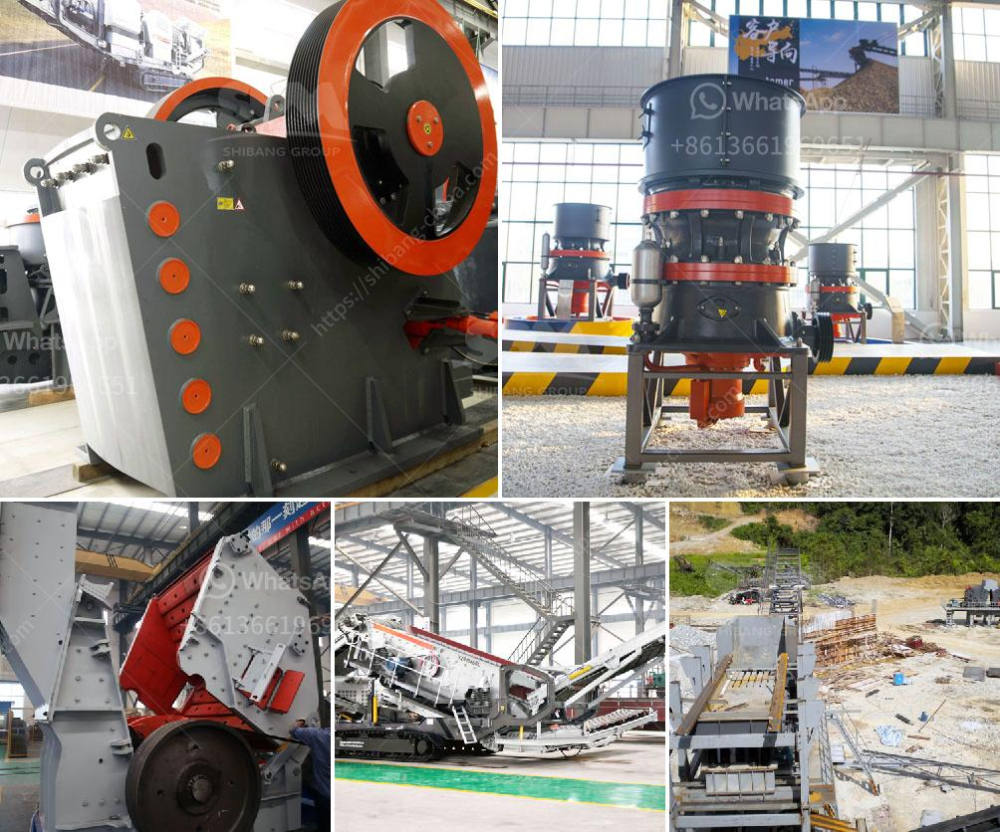

<h3>cost of a stone crusher machine</h3>
The cost of a stone crusher machine will vary based on the machine that you choose. As mentioned above, machines that are stationary are usually more expensive than portable ones. However, the overall price of a stone crusher machine depends on the capacity and brand.

1. Capacity – The bigger the machine’s capacity, the more expensive it will be. You may assume that bigger models are always more costly, but this is not always true. In fact, a larger capacity crusher can save money in the long run due to its efficiency and high productivity. Moreover, smaller sized machines require less maintenance and power consumption, leading to reduced operating costs.

2. Brand – The brand of the stone crusher machine also affects its final price. The top brands tend to be more expensive since they are established and have a reputation for producing high-quality machines. On the other hand, some brands tend to offer lower prices due to their budget-friendly manufacturing and distribution costs.

3. Type – Depending on your needs, you may have to choose between stone crushers that are fixed, portable, or mobile. This choice will be based on the nature of the quarry where your stones are located, as well as the space constraints and budget considerations. Portable and mobile machines generally have the ability to be towed or driven off-site, making them more versatile and accessible.

4. Other costs – The stone crusher machine price doesn’t just factor in upfront costs. It also includes additional costs such as freight, labor, and installation costs. While these costs may seem minor, they can quickly add up and significantly increase the overall cost of the machine.

In conclusion, the cost of a stone crusher machine depends on various factors such as the type of machine, capacity, brand, and additional costs involved. To get the best deal on a stone crusher machine, consider shopping around and comparing various machines from different manufacturers.
<h3>Contact us</h3><ul><li><strong>Whatsapp:&nbsp;<a href="https://wa.me/8613661969651">+8613661969651</a></strong></li><li><a href="https://swt.shibang-china.com/?git&amp;zhl&amp;cost of a stone crusher machine"><strong>Online Service(chat now)</strong></a></li></ul><h3>Related</h3><ul><li><a href='stone crusher punjab ropar.md'>stone crusher punjab ropar</a></li><li><a href='raymond mill for grinding gypsum.md'>raymond mill for grinding gypsum</a></li><li><a href='stone crusher plant list odisha.md'>stone crusher plant list odisha</a></li><li><a href='jaw crusher specification for activated carbon.md'>jaw crusher specification for activated carbon</a></li><li><a href='nigeria jaw crusher.md'>nigeria jaw crusher</a></li></ul>