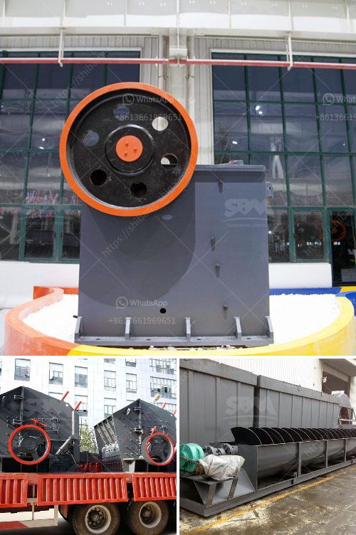

<h3>cost of concrete batch plant</h3>
A concrete batch plant, also known as a concrete batching plant, is a facility that combines various ingredients to form concrete. Some of the ingredients include water, sand, aggregate (rocks, gravel, etc.), cement, fly ash, and additives. This process is carried out using specialized equipment, such as a concrete mixer, which ensures that the overall mixture is properly blended.

If you are considering investing in a concrete batch plant, it is essential to understand the cost implications associated with such an endeavor. Several factors can affect the cost of a concrete batch plant, and in this article, we will explore them in detail.

1. Size and Capacity: One of the primary factors influencing the cost of a concrete batch plant is its size and capacity. Different plants are available in various sizes, which can range from small portable units to large stationary batching plants. Generally, larger plants with a higher capacity will be more expensive than smaller ones due to the additional materials and components required.

2. Technology and Features: With advances in technology, there are now various features and options available in concrete batch plants. These include computerized controls, automated weighing systems, and advanced mixing capabilities. While these features may increase the upfront cost, they can significantly improve efficiency and productivity in the long run.

3. Mobility and Installation: The mobility of a concrete batch plant refers to its ability to be moved from one location to another. Some plants are designed to be portable, meaning they can be easily transported to different job sites. However, portable plants tend to have a higher cost compared to stationary ones due to their mobility features. Additionally, installation costs should also be considered, especially for stationary plants that require foundations and additional infrastructure.

4. Quality and Reputation: The cost of a concrete batch plant can also be influenced by the quality of its components and the reputation of the manufacturer. Investing in a reputable manufacturer known for their high-quality equipment might come with a higher price tag, but it can provide peace of mind in terms of durability, reliability, and after-sales support.

5. Maintenance and Operational Costs: Apart from the initial investment, it is crucial to consider the long-term maintenance and operational costs associated with a concrete batch plant. Regular maintenance, component replacements, energy consumption, and labor costs should all be factored in when calculating the overall cost of a concrete batch plant.

In conclusion, the cost of a concrete batch plant can vary depending on several factors such as size, capacity, technology, mobility, quality, and maintenance. It is essential to carefully evaluate each factor and consider the specific requirements of your project before making a purchasing decision. Investing in a reliable and efficient concrete batch plant can significantly boost productivity and profitability in the construction industry.

Ultimately, it is worth investing in a quality batch plant that meets your project requirements while considering long-term operational costs. The initial investment can be significant but reimbursed promptly through increased productivity and reduced reliance on external suppliers.
<h3>Contact us</h3><ul><li><strong>Whatsapp:&nbsp;<a href="https://wa.me/8613661969651">+8613661969651</a></strong></li><li><a href="https://swt.shibang-china.com/?git&amp;zhl&amp;cost of concrete batch plant"><strong>Online Service(chat now)</strong></a></li></ul><h3>Related</h3><ul><li><a href='marble crusher price.md'>marble crusher price</a></li><li><a href='aggregate crushing cost analysis in india.md'>aggregate crushing cost analysis in india</a></li><li><a href='gold wash plant trommel for sale in dubai.md'>gold wash plant trommel for sale in dubai</a></li><li><a href='chain crusher chain crusher suppliers and.md'>chain crusher chain crusher suppliers and</a></li><li><a href='kenya roller mill.md'>kenya roller mill</a></li></ul>