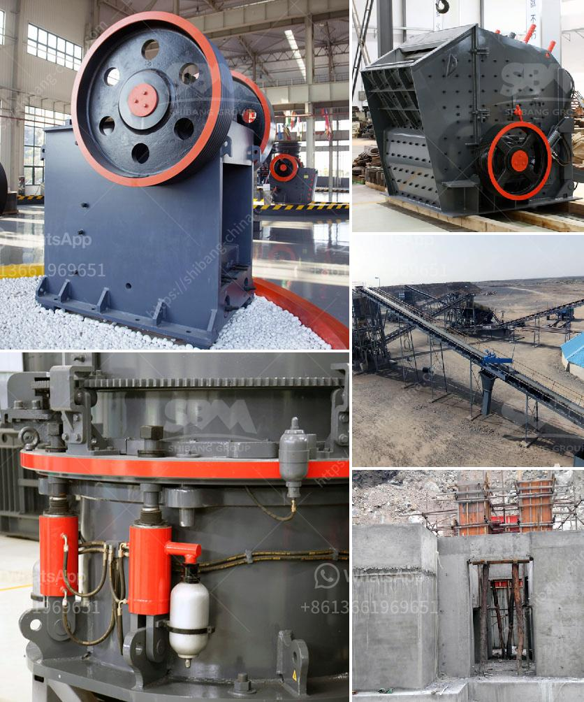

<h3>cost of conveyor belts</h3>
Conveyor belts are a crucial component in various industries, serving as a transportation medium for materials and products. They contribute to improving efficiency, reducing labor costs, and ensuring smooth operations. However, when implementing a conveyor belt system, it is essential to consider the associated costs, which can vary significantly based on several factors. In this article, we will delve into the different aspects that influence the cost of conveyor belts and provide a comprehensive analysis.

The first factor to consider is the type of conveyor belt required for a particular application. Conveyor belts are available in various styles and designs, including flat belts, modular belts, slat belts, and wire mesh belts. Each type comes with different specifications, performance characteristics, and costs. Flat belts are relatively standard and cost-effective, suitable for low to medium loads. On the other hand, modular belts offer greater versatility and durability, making them ideal for heavy loads or complex applications. Slat belts and wire mesh belts are commonly used in industries such as food processing and pharmaceuticals due to their ability to withstand high temperatures and promote efficient material handling. Consequently, the cost of conveyor belts can vary based on the type selected.

Another crucial factor to consider is the material composition of the conveyor belt. Belts can be classified as either fabric-based or plastic-based, each having its advantages and associated costs. Fabric-based belts, typically made of nylon, polyester, or cotton, are affordable and offer good flexibility. However, they may be less durable and require frequent maintenance. In contrast, plastic-based belts, such as polyethylene or polypropylene, are more durable and often require less maintenance. They can resist chemicals, moisture, and extreme temperatures, making them suitable for demanding environments. Nevertheless, plastic-based belts tend to be more expensive due to their enhanced properties. Therefore, the material composition significantly influences the overall cost of the conveyor belt.

In addition to the type and material composition, the size and configuration of the conveyor belt system impact the cost. Longer belts and intricate designs with curves, inclines, or declines require additional components, such as extra rollers, power transmission units, and supporting structures, which increase the overall cost. It is crucial to accurately assess the layout and transport requirements of the facility to determine the optimal configuration that balances efficiency with cost-effectiveness.

Moreover, the cost of conveyor belts may include installation and maintenance expenses. Depending on the complexity and scale of the system, professional installation may be necessary, resulting in additional charges. Regular maintenance is also crucial to ensure optimal performance and prolong the lifespan of the conveyor belts. This involves inspections, cleaning, lubrication, and potential component replacements. While maintenance costs can vary depending on the belt type, material, and usage, they are essential to avoid unforeseen breakdowns and costly downtime.

Lastly, it is essential to consider the long-term costs associated with the chosen conveyor belt system. A cheaper initial investment may result in higher operational costs due to frequent repairs, replacement parts, or increased energy consumption. Conversely, investing in high-quality belts with longer lifespans and lower maintenance requirements can provide better cost-effectiveness in the long run.

In conclusion, the cost of conveyor belts varies based on several factors. The type, material composition, size, and configuration of the system, as well as installation and maintenance expenses, all contribute to the overall cost. It is crucial to carefully evaluate these factors to determine the most suitable conveyor belt solution that aligns with both operational requirements and budget constraints. By considering the long-term costs and investing in quality, businesses can optimize their material handling processes and achieve higher productivity, efficiency, and profitability.
<h3>Contact us</h3><ul><li><strong>Whatsapp:&nbsp;<a href="https://wa.me/8613661969651">+8613661969651</a></strong></li><li><a href="https://swt.shibang-china.com/?git&amp;zhl&amp;cost of conveyor belts"><strong>Online Service(chat now)</strong></a></li></ul><h3>Related</h3><ul><li><a href='granulator jaw crusher hadfield.md'>granulator jaw crusher hadfield</a></li><li><a href='crusher manufacturer in pune ie.md'>crusher manufacturer in pune ie</a></li><li><a href='impact crusher machine.md'>impact crusher machine</a></li><li><a href='mobile crusher rental indonesia.md'>mobile crusher rental indonesia</a></li><li><a href='coal mining processes and machinary required.md'>coal mining processes and machinary required</a></li></ul>